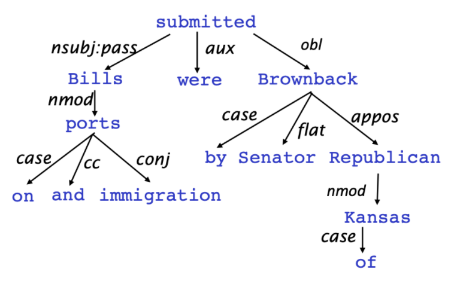
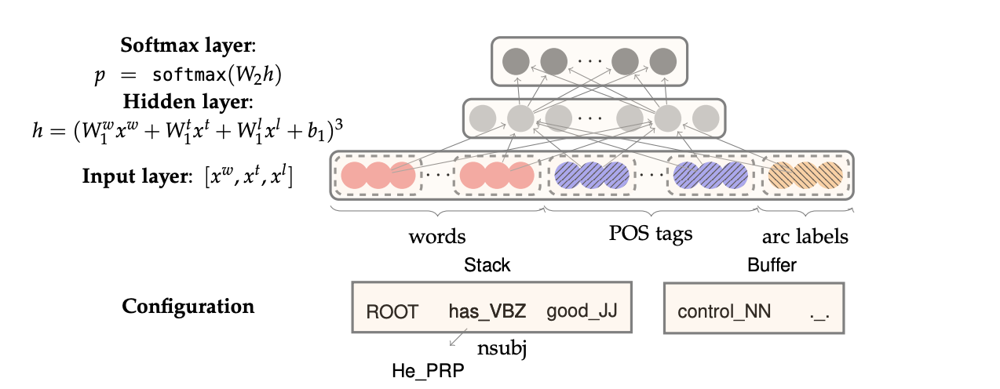

NLP03-依赖性解析Dependency Parsing
============================

依赖性关系
----------

语言结构有两种视角来看待，第一种是短语结构，是结构化的语法(上下文无关语法Context-free Grammars)，短语结构将单词组成一系列嵌套的成分，从单个单词组成短语，再组成完整的句子。第二种是依存关系结构，这种结构表明一个单词依赖于哪些单词。自然语言处理需要研究句子的结构才能分析出句子的真正含义。依赖关系是一种二元的非对称关系，这种关系也可以用树形的结构来表示：

{width="75%"}

依赖性分析最终输出的就是类似于上面的依赖语法树的结构，通过对输入的句子$s=w_0w_1w_2\dots w_n$进行分析来得到依赖语法树G（也叫做依赖图），而依赖性分析中还有两个子任务，分别是：

-   学习：通过给定的数据集D和给定的依赖图，生成一个依赖性的解析模型

-   分类：对于输入的测试句子，生成合适的依赖图

基于转换的依赖性解析
--------------------

这种依赖性分析方式依靠一个定义了可能转移过程的有限状态机来建立输入句子到依赖树的映射，这种策略下的学习过程就是训练一个可以通过状态转变的历史来预测下一个状态转变的有限状态机，解析的过程就是构建出最优的依赖树。常见的基于贪心的确定性转换的依赖性解析，这种解析方式的核心依然是一个有限状态机。

下面有段看不懂的，感觉是很玄学的计算理论，就是有限状态机那一套东西，没学过不太懂。

基于神经网络的依赖性解析
------------------------

基于神经网络的依赖性解析相比于传统的模型，主要的区别在于依赖稠密而不是稀疏的特征表示。最终，该模型的目标是预测一个从初始配置c到终端配置的转换序列，其中对依赖关系解析树进行了编码，每次尝试基于当前的配置$c=(\sigma,\beta, A)$中提取的特征预测一个转变过程T，其中三个参数分别表示栈，缓冲区和一系列的依赖关系构成的集合。

-   这里的栈应该是经过语法分析后确定的单词解析顺序构成的栈，而缓冲区里存放了这些单词可能依赖的词

对于一个给定的句子S，其特征包括以下内容的子集：

-   word：句子S中的一些位于栈顶和buffer中的词向量

-   tag：词性的标记

-   label：弧线标记S中的一些单词，弧线标记集合包含了一些小规模的关系样本来描述特定的关系

一个简单的神经网络的例子
------------------------

{width="75%"}

这里使用了$f(x)=x^3$作为非线性的激活函数，并将word，tag和label三种特征作为输入，在隐层进行矩阵计算而在输出层进行softmax

本文总阅读量次