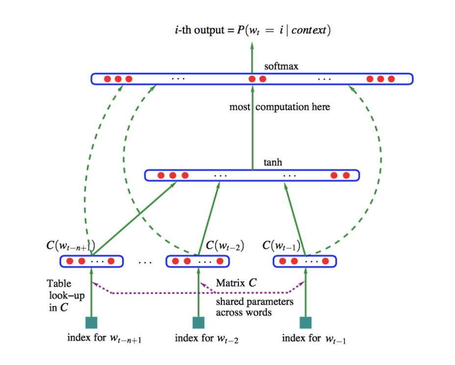
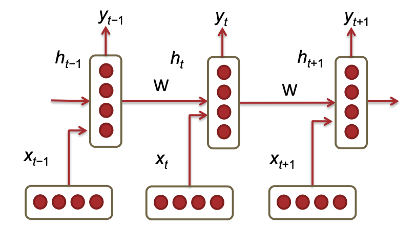
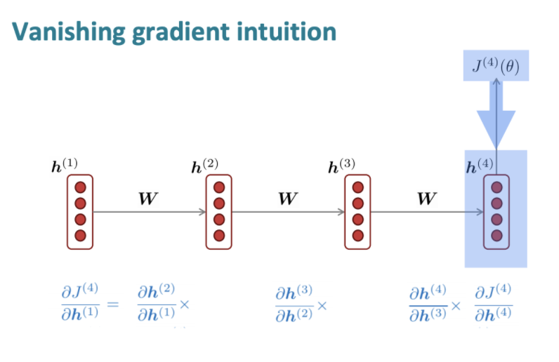
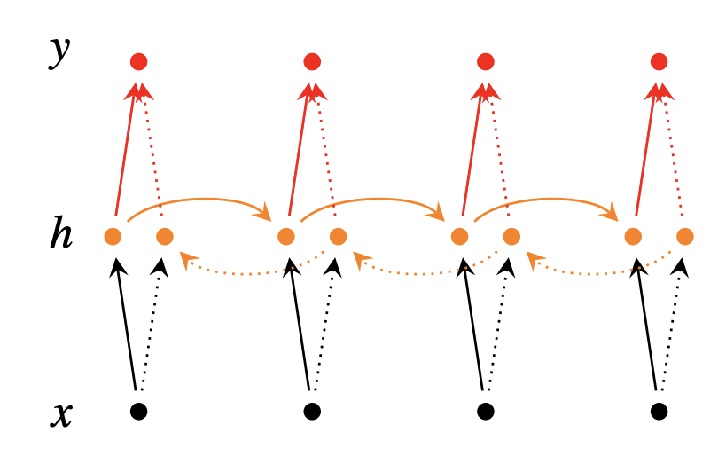
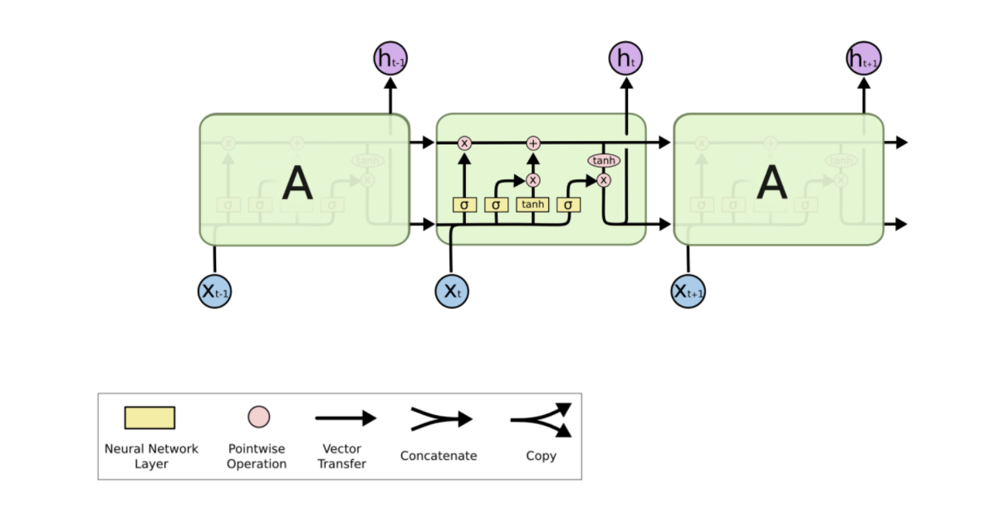
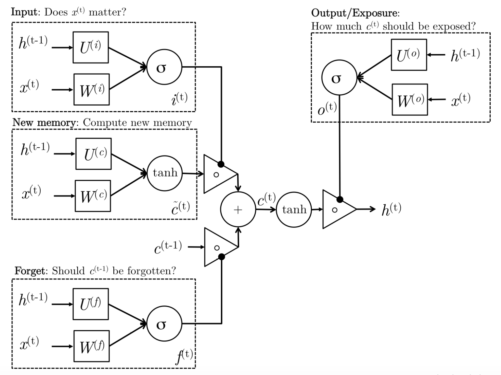

语言模型，RNN和LSTM
===================

语言模型
--------

语言模型是一种计算在一个特定序列出现的概率的模型，对于m个单词$w_i$，它们同时出现并且连成一句话的概率是$P(w_1,\dots,w_n)$，很明显单词之间出现的概率不是完全独立的，也就是说一些单词的出现会和句子中的其他单词有关，因此这个概率是比较难计算的，根据条件概率公式可以表示为：

$$
P(x^{(1)},\dots,x^{(t)})=P(x^{(1)})\times P(x^{(2)}|x^{(1)})\times\dots\times P(x^{(t)}|x^{(1)},\dots,x^{(t-1)})=\prod_{i=1}^tP(x^{(i)}|x^{(1)},\dots,x^{(i-1)})
$$

我们可以做出这样一个简化问题假设(也叫做马尔可夫假设)：一个单词出现的概率依赖于出现在它前面的n个单词，这样一来这个概率可以表示为：

$$
P\left(w_{1}, \ldots, w_{m}\right)=\prod_{i=1}^{i=m} P\left(w_{i} \mid w_{1}, \ldots, w_{i-1}\right) \approx \prod_{i=1}^{i=m} P\left(w_{i} \mid w_{i-n}, \ldots, w_{i-1}\right)
$$

这个表达式在机器翻译中有比较大的作用，翻译系统在完成句子的翻译之后实际上会生成多种不同的结果，这个时候就可以使用语言模型来对每一种结果进行评估，一般来说语义不通顺的句子计算出的概率会比较低，而语义通顺的句子计算出的概率会比较高，这样一来就可以选择概率最高的一个作为翻译的结果。

### n-gram语言模型

因此要获得一个语言模型，我们需要对**每一组连续n个单词**进行出现频率的计算，这就是n-gram语言模型，比如说对于一个2-gram的语言模型，我们可以这样计算：

$$
p(w_2|w_1)=\frac{\mathrm{count}(w_1, w_2)}{\mathrm{count}(w_1)}
$$

通过大量文本获得了统计信息之后，n-gram就可以根据前n个单词来预测出当前位置单词的出现概率分布，并选择出现概率最大的作为预测结果，这样一来就导致了语言模型存在的两个问题：

-   n-gram语言模型可能会非常稀疏，因为一些单词组合可能永远也不会在训练样本中出现，我们可以用smoothing的方法来解决这一问题，也就是说不管有没有出现过我们都算这个组合至少出现了$\delta$次

-   随着n的增长，n-gram语言模型需要的存储空间也会越来越大，并且这一复杂度是指数规模的

### 基于窗口的神经语言模型

基于窗口的神经网络语言模型可以学习出单词的分布式表示和计算序列出现概率的函数，它的基本结构如下所示：\

{width="75%"}

这个模型可以用下面这个表达式来表示：

$$
\hat{y}=\operatorname{softmax}\left(W^{(2)} \tanh \left(W^{(1)} x+b^{(1)}\right)+W^{(3)} x+b^{(3)}\right)
$$

其中第一个矩阵作用在词向量上(图中的绿色实线)，第二个矩阵作用在隐层，第三个矩阵作用在词向量上(图中的绿色虚线)，这个模型虽然简单但是也能够起到比较好的performance，

上面提到的这些语言模型实际上只是**基于有限长度的滑动窗口的卷积模型**，但事实上，窗口比较小的时候模型预测的准确度也是无法保证的，而窗口大了又会导致参数的规模急剧增长，因此我们需要**一个可以处理任意长度的输入，并且参数规模维持在一定范围内**的新模型。

循环神经网络RNN
---------------

### RNN的架构

和只能给予一个有限长度的滑动窗口不同，卷积翻译模型不同，循环神经网络(Recurrent
Neural Networks)是可以根据语料库中所有之前出现过的额单词来调整模型，RNN的基本组成单元如下图所示：

{width="75%"}

每个神经网络单元(也称为timestep)会对输入的词嵌入向量$x_t$进行一个矩阵运算，并且对上一个位置的单元传递下来的$h_{t-1}$进行运算以后相加得到$h_t$传递给下一个单元，然后对$h_t$使用非线性函数激活和sotfmax函数之后输出一个概率分布$\hat y_t$作为当前单元的输出：

$$
\begin{array}{c}
        h_{t}=\sigma\left(W^{(h h)} h_{t-1}+W^{(h x)} x_{t}\right) \\
        \hat{y}_{t}=\operatorname{softmax}\left(W^{(S)} h_{t}\right)
\end{array}
$$

并且权重矩阵$W^{(hh)},W^{(hx)}$在不同的timestep之间时共享的，这样一来**一个RNN模型需要学习的参数数量是比较少的，并且和输入语料库的长度是没有无关的**，不仅避免了参数的维度爆炸，而且可以处理任意长度的输入结果。

### RNN的损失函数

RNN的损失函数通常采用交叉熵来计算，对于第t个timestep，其交叉熵可以表示为：

$$
J^{(t)}(\theta)=-\sum_{j=1}^{|V|} y_{t, j} \times \log \left(\hat{y}_{t, j}\right)
$$

这样一来总的交叉熵就可以表示为：

$$
J(\theta)=\frac 1T \sum_{i=1}^{T}J^{(t)}(\theta)=-\frac 1T \sum_{i=1}^{T}\sum_{j=1}^{|V|} y_{t, j} \times \log \left(\hat{y}_{t, j}\right)
$$

根据损失函数就可以对RNN中的权重矩阵进行优化，这里采用的仍然是梯度下降和反向传播的方法，但是要注意的是，RNN的反向传播实际上是根据时间的反向传播，也就是按照timestep的顺序从后往前传播，具体的公式后面有空进一步推导。

### RNN的反向传播

我们可以对上面的RNN表达式进行一定的修改，并假设激活函数$\sigma(x)=\tanh(x)$，这样一来RNN中的一系列计算可以分解成如下几个步骤：

$$
\begin{aligned}
        s_t&=Uh_{t-1}+Wx_t\\
        h_t&=\tanh(s_t)\\
        z_t&=Vh_t\\
        \hat y_t&=\mathrm{softmax}(z_t)
\end{aligned}
$$

这里x是d维的词嵌入向量，而h是维度为$D_h$的隐藏状态，最终输出的结果z和y是维度为$|V|$的列向量，损失函数采用的就是上面提出的J，这样一来我们可以根据反向传播算法，通过J来更新$U,V,W,h_{t}$等等，推导的具体过程如下：

首先我们需要注意到，softmax函数可以写成：

$$
f=[f_1,f_2,\dots,f_{|V|}],\quad f_i=\frac{\exp ^{x_i}}{\sum_{j=1}^{|V|}\exp ^{x_j}}
$$

而softmax函数关于$x_j$的导数可以写成：

$$
\begin{aligned}
        \frac{\partial f_i}{\partial x_j}&=-f_if_j(j\not= i)\\
        \frac{\partial f_i}{\partial x_j}&=f_i(1-f_i)(j = i)
    \end{aligned}
$$

这样一来，可以先求出损失函数对于$z_t$的梯度：

$$
\begin{aligned}
        \frac{\partial J(\theta)}{\partial z_i}&=\sum_{j=1}^{|V|}\frac{\partial J(\theta)}{\partial \hat y_{t,j}}\frac{\partial \hat y_{t,j}}{\partial z_i}\\
        &=-\sum_{j=1}^{|V|}\frac{y_{t,j}}{\hat y_{t,j}}\frac{\partial\hat y_{t,j}}{\partial z_i} \\
        &=-\sum_{j=1}^{|V|}\frac{y_{t,j}}{\hat y_{t,j}}(\hat y_{t,j}\hat y_{t,i})+\frac{y_{t,i}}{\hat y_{t,i}}(\hat y_{t,j}\hat y_{t,i}+(1-\hat y_{t,i})\hat y_{t,i})\\
        &=\hat y_{t,i}\sum_{j=1}^{|V|}y_{t,j}-y_{t,j}\\
        &=\hat y_{t,i}-y_{t,i}
    \end{aligned}
$$

这样一来E对于z的梯度就是一个$|V|$维的向量并且每一项都是上面这样的形式(随着下标的变化而变化)，这里$\hat y_{t,i}$表示预测结果，是一个概率分布，而$y_{t,i}$则是正确结果的one-hot向量，因此上述步骤可以成立，这样一来，V的梯度更新可以表示为：

$$
\frac{\partial J(\theta)}{\partial V}=(\hat y_{t,i}-y_{t,i})\otimes h_t
$$

同样类似地可以得到：

$$
\frac{\partial J(\theta)}{U}=\sum_{i=1}^{t}\delta_{i}\otimes h_{i-1}
$$

$$
\frac{\partial J(\theta)}{W}=\sum_{i=1}^{t}\delta_{i}\otimes x_{i}
$$

其中

$$
\delta_k=(U^T(\hat y_t-y_t))\times (1-h_t^2)(k\le t)
$$

并且

$$
\delta_t=(V^T(\hat y_t-y_t))\times (1-h_t^2)(k\le t)
$$

### RNN的优缺点

RNN的优点主要有如下几个：

-   RNN可以处理任意长度的输入

-   RNN模型的size不会随着输入的语料库长度变化而变化

-   某个timestep计算得到的结果理论上可以在后面的很多timestep中被用到

-   因为每个timestep的权重是相同的，因此RNN模型具有一定的对称性

但是同时，RNN的缺点也是很明显的：

-   RNN是一个序列化的模型，因此**RNN不能进行并行的训练**

-   事实上随着timestep的推移，前面的信息越来越难以被保留下来，可能存在梯度消失和梯度爆炸的问题

### 梯度消失Vanishing Gradient

{width="75%"}

在RNN的反向传播过程中，参数需要根据其梯度来更新，而梯度需要用链式求导法则来进行计算，如果其中的一部分梯度非常小，可能会导致最终要求的梯度累积越来越小，造成梯度的消失。

$$
\begin{aligned}
        h^{(t)}&=\sigma (W_h h^{(t-1)}+W_ee^{(t)}+b_1)\\
        \frac{\partial h^{(t)}}{\partial h^{(t-1)}}&=\mathrm {diag(\sigma' (W_h h^{(t-1)}+W_ee^{(t)}+b_1))}W_h\\
        &=IW_h=W_h\\
        \frac{\partial J^{(i)}(\theta)}{\partial h^{(j)}}&=\frac{\partial J^{(i)}(\theta)}{\partial h^{(i)}}\prod _{j<t\le i}\frac{\partial h^{(t)}}{\partial h^{(t-1)}}\\
        &=\frac{\partial J^{(i)}(\theta)}{\partial h^{(i)}}\prod _{j<t\le i}W_h=\frac{\partial J^{(i)}(\theta)}{\partial h^{(i)}}W_h^{i-j}
    \end{aligned}
$$

而我们发现根据上面的推导，如果矩阵$W_h$的所有特征值都比较小的话可能会导致最终计算的结果非常小，而这就导致了梯度消失。梯度消失会导致反向传播算法失效，参数无法再更新下去。对于RNN来说通过多个timestep以后学习到持续的信息是比较困难的，因此一种新的模型LSTM被提出，这种模型使得神经网络拥有短暂的记忆能力。

### 梯度爆炸Exploding Gradient

同样的如果梯度过大也会使得参数的更新出现问题，因为梯度值过大导致反向传播更新的时候容易出现参数大幅度的更新，引起波动，这称之为bad update，可能会导致最终的计算结果是INF或者NAN

解决办法：**Gradient Clipping**，当梯度g的大小超过一个固定的阈值的时候，对g进行一定的压缩，防止梯度爆炸。因此LSTM被踢出用来解决梯度消失和梯度爆炸的问题。

### 双向RNN

前面介绍的RNN模型实际上只能把前面的单词信息传递给后面，信息的传递是单向的，而双向RNN则可以进行双向的信息传递，实现的方式也很简单，就是通过在隐层增加一系列神经元来进行反向的信息传递，如下图所示：\

{width="75%"}

而这一架构用公式可以表示为： 

$$
\begin{array}{c}
        \vec{h}_{t}=f\left(\vec{W} x_{t}+\vec{V} \vec{h}_{t-1}+\vec{b}\right) \\
        \overleftarrow{h}_{t}=f\left(\overleftarrow{W} x_{t}+\overleftarrow{V} \overleftarrow{h}_{t+1}+\overleftarrow{b}\right) \\
        \hat{y}_{t}=g\left(U h_{t}+c\right)=g\left(U\left[\vec{h}_{t} ; \overleftarrow{h}_{t}\right]+c\right)
    \end{array}
$$

同时RNN也可以有多层架构，这样的架构下，RNN的信息交互会更多，预测结果会更加准确。

长短期记忆模型LSTM
------------------

### 门控循环单元

虽然理论上来说，RNN可以提取长期的，距离较远的单词依赖关系，但是实际训练过程中其实是难以实现的，因为计算机数值计算的有限精度导致了RNN存在梯度消失和梯度爆炸等问题，而门控循环单元(Gated recurrent units，GRU)的目的就是实现更加长持久性的对长依赖关系的记忆，在这种门控循环单元的作用下，使用$h_{t}=f(h_{t-1},x_t)$的这一个过程可以表示为：

$$
\begin{array}{rlr}
        z_{t} & =\sigma\left(W^{(z)} x_{t}+U^{(z)} h_{t-1}\right) & \text { (Update gate) } \\
        r_{t} & =\sigma\left(W^{(r)} x_{t}+U^{(r)} h_{t-1}\right) & \text { (Reset gate) } \\
        \tilde{h}_{t} & =\tanh \left(r_{t} \circ U h_{t-1}+W x_{t}\right) & \text { (New memory) } \\
        h_{t} & =\left(1-z_{t}\right) \circ \tilde{h}_{t}+z_{t} \circ h_{t-1} & \text { (Hidden state) }
    \end{array}
$$

以上四个公式就是GRU的四个基本步骤，它们有着比较直观的解释性并且可以让模型对持久性信息和长依赖关系的解析更加到位，这四个步骤可以分别理解为：

-   重置门：重置信号$r_t$可以决定$h_{t-1}$对于$\tilde{h}_{t}$的重要性，如果发现没有啥关系，重置门有权利彻底消除过去的隐藏状态

-   更新门：更新信号$z_t$可以决定$h_{t-1}$对当前层究竟有多高的权重，以此来决定隐藏状态的最后结果相对于上一层的信息和这一层新的meemory的权重

-   新记忆生成：根据当前单元输入的$x_t,h_{t-1}$生成新的$\tilde{h}_{t}$

-   隐藏状态：最终按一定权重将新的记忆和上个单元传递下来的$h_{t-1}$组合

上面的这些过程可以用下面的这幅图来表示：\

{width="65%"}

不得不说CS224N的插图对于GRU的讲解还是非常清楚的，而GRU中我们主要需要学习的参数有6个矩阵，同样的也是用反向传播的算法来进行训练。

### 长短期记忆LSTM

长短期记忆模型(Long-Short-Term-Memories,LSTM)和门控循环单元略有区别，但也是用于保存长期记忆的一种复杂激活单元架构，如下图所示：\

{width="65%"}

{width="65%"}

这种架构下，隐藏层中主要进行的数学运算有： 

$$
\begin{aligned}
        &i_{t}=\sigma\left(W^{(i)} x_{t}+U^{(i)} h_{t-1}\right) \quad \text { (Input gate) }\\
        &f_{t}=\sigma\left(W^{(f)} x_{t}+U^{(f)} h_{t-1}\right) \quad \text { (Forget gate) }\\
        &o_{t}=\sigma\left(W^{(o)} x_{t}+U^{(o)} h_{t-1}\right) \quad \text { (Output/Exposure gate) }\\
        &\tilde{c}_{t}=\tanh \left(W^{(c)} x_{t}+U^{(c)} h_{t-1}\right) \quad \text { (New memory cell) }\\
        &c_{t}=f_{t} \circ c_{t-1}+i_{t} \circ \tilde{c}_{t} \quad \text { (Final memory cell) }\\
        &h_{t}=o_{t} \circ \tanh \left(c_{t}\right)
    \end{aligned}
$$

LSTM中有若干个门，分别叫做输入门，输出门和遗忘门，起到一定的判断作用，用来判断LSTM中的一些信息是否值得保留，LSTM的计算过程可以描述为：

-   生成新记忆：根据上一个单元传入的$h_{t-1}$和当前位置的词向量$x_t$计算出一个结果$\tilde{c}_{t}$

-   输入门：根据上一个单元传入的$h_{t-1}$和当前位置的词向量$x_t$计算出一个结果$i_t$，并评估当前位置的单词$x_t$是否有用，并有必要在之后的计算中使用

-   遗忘门：根据上一个单元传入的$h_{t-1}$和当前位置的词向量$x_t$计算出一个结果$f_t$，并且评估上一个隐藏状态$h_{t-1}$是否有价值用在当前层的计算中

-   生成最终记忆：根据输入门和遗忘门的判断，并结合新的记忆单元和上一个传递过来的记忆单元的信息生成最终记忆

-   输出门：这是一个GRU中不存在的门，其目的是将最终的记忆单元和隐藏状态分开，因为最终生成的记忆单元有很多前文的信息是没有必要保存在当前隐藏状态中的，因此这一个单元决定了最终记忆$c_t$有多少内容需要暴露给$h_t$，根据这个权重来产生最终的隐藏状态

事实上LSTM相比于前面提到的GRU主要多出了一个输出门用来控制信息暴露给当前隐藏状态的程度，可以用下面一张图来表示LSTM的各个门之间的关系：\

{width="65%"}

### LSTM如何解决梯度问题

LSTM的架构使得神经网络可以在许多timestep之后依然保存一些持久化的信息，可以通过改变门的开关达到保存信息的目的，但事实上，并没有彻底解决梯度消失和梯度爆炸的问题，但是让模型更容易学习到长距离的依赖关系，事实上梯度的消失和爆炸是所有神经网络架构都存在的问题，不仅仅是RNN

