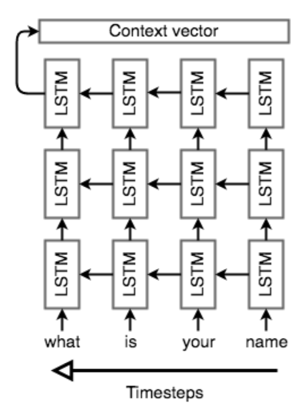
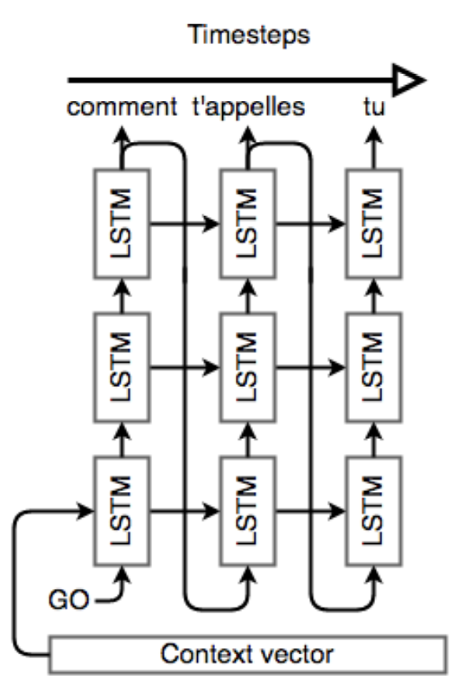
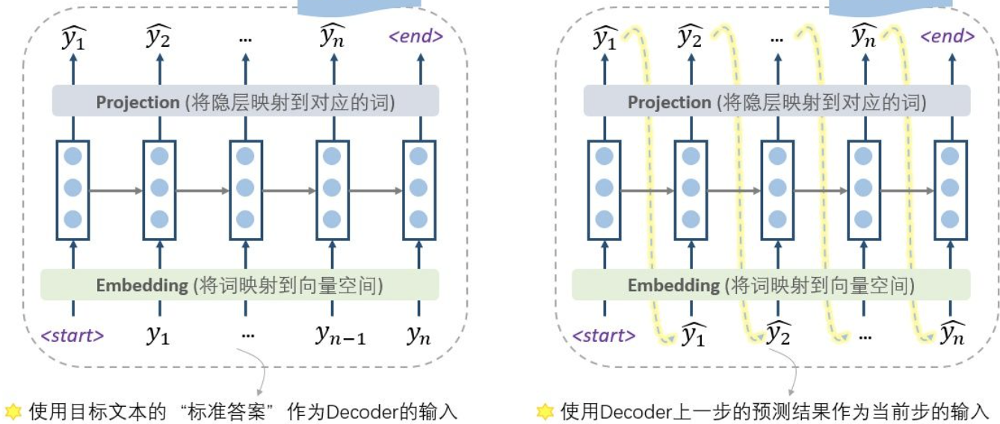
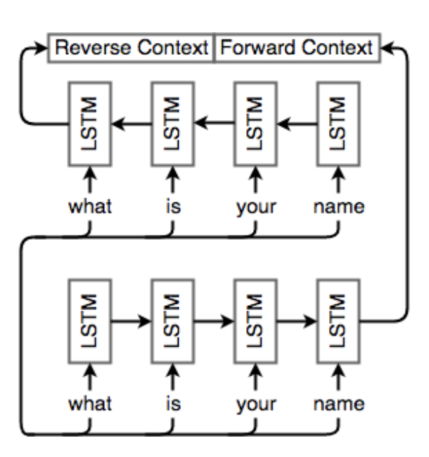

机器翻译与Seq2Seq模型
=====================

词向量和RNN解决的主要是单词预测和命名实体识别(Named Entity Recognization)的问题，而这一节内容主要研究翻译、回答和概括等NLP子问题，并且重点介绍Seq2Seq模型。

传统翻译模型
------------

机器翻译任务是将句子从一种语言翻译成另一种语言，1990年代到二十一世纪初的机器翻译主要运用的还是基于统计学习的机器翻译方法(SMT，Statical Machine Translation)，使用贝叶斯方法来构建模型，需要用大量的数据分别训练翻译模型和语言模型

为了将大量数据用于模型的并行训练，需要引入一个对齐变量，使得原文和译文要是对应的，否则可能导致翻译结果的不准确。alignment是一种隐变量，没有显式地出现在数据中，因此**可以使用EM算法来进行优化**。

早起的翻译模型主要依赖于统计和概率的传统方法，这种模型分成两个部分，分别是一个翻译模型和一个语言模型，翻译模型用来预测文本中的一个句子最有可能翻译成什么，而语言模型来判断当前的句子是否对于全文而言是最合适的。

这种系统的构建主要基于单词或者短语，但是基于单词的翻译系统难以捕捉到语句中单词位置导致的差异，比如否定词的位置，句子中主语和动词的关系，而基于短语的翻译系统可以看成是Seq2Seq的前身，这种模型将输入和输出都看成是一系列短语并且可以构建更复杂的语法，但是这种模型下，长依赖关系依然难以提取，

Seq2Seq模型
-----------

### 简介

Sequence-to-sequence(简称为Seq2Seq，中文翻译是序列到序列)是一种相对比较新的**端到端的翻译模型**，Seq2Seq使用两个RNN模型构成的，分别是：

-   编码器：将输入序列编码成一个上下文向量(context vector)

-   解码器：根据编码器生成的上下文向量生成对应的输出序列

因此Seq2Seq也被称为"编码器-解码器"模型。无论是编码器还是解码器，都需要先用一个嵌入层将输入的单词序列转化成词向量作为编码器和解码器的输入。

### 编码器

Seq2Seq中的编码器用于将输入的单词序列编码成一个定长的上下文向量，因此编码器的组成单元通常是用LSTM的RNN，这样的解码器在提取长依赖关系的时候效果更好，最终的隐藏状态就是C，但将任意长度的输入压缩到一个固定长度的向量中是比较困难的，并且解码器往往有若干个LSTM层，称为LSTM栈(stacked LSTM)，是一层接一层的LSTM,也可以叫做LSTM网络，每一层的输入是上一层的输出，最上层是隐藏状态层，**输出的结果就是定长的向量上下文向量C**

Seq2Seq会对输入的训练进行反向的处理，也就是从序列的末尾从后向前处理，这样一来编码器读取到的最后一个单词将会对应输出结果中的第一个单词，这样可以方便解码器更快生成准确度更高的前面一部分译文，而译文最前面的一小部分的正确性对于译文整体的正确性的影响是非常大的，下面的图可以用来表示解码器的工作过程：

{width="80%"}

### 解码器

Seq2Seq的解码器也是一个LSTM网络，当时相比于编码器的网络架构更复杂，首先要明确，**解码器的输入不是编码器中生成的上下文向量C**，解码器的输入依然是一系列由序列转化过来的单词向量，并且在训练和测试的时候的内容是不同的，而上下文向量C是一个用于预测结果的参数，而不是解码器的输入。\

{width="50%"}

-   在训练阶段，解码器中输入的是**真实的目标文本**，并且第一步使用一个特殊的\<start\>标记表明这是句子的开头，每一步根据当前正确的输出词，上一步的隐状态来预测下一步的输出

-   在训练的时候，因为没有"参考答案"了，所以只能把上一步的输出作为下一步的输入，一步步慢慢预测出最终结果

这样两种训练方式，分别称为teacher forcing和free running，事实上训练阶段也可以free
running，但是这样训练出来的模型的performance非常糟糕，容易出现误差爆炸的问题，使用"参考答案"(实际上也可以看成是当前输入序列的一个标签)可以提高准确度。同时训练的时候可以采用更好的办法，也就是计划采样(Scheduled Sampling)，

当我们获得了一个输出序列的时候，我们可以使用同样的学习策略，定义损失函数(比如使用交叉熵)，然后用梯度下降的算法来反向传播优化参数，编码器和解码器是同时训练的，因此它们会学习到同样的上下文向量表示。

### Seq2Seq的损失函数

如果说词汇表V的容量是$|V|$，那么显而易见，Seq2Seq模型输出的结果就是一个V维度的向量代表单词作为可能结果的一个概率分布，Seq2Seq最后的映射过程就是找出出现概率最高的单词作为最后的输出，我们在计算损失的时候可以使用交叉熵作为损失函数，假设解码器运行了T个步骤，那么最后的损失函数可以表示为：
$$
J=-\frac 1T\sum_{i=1}^T\log (P(\hat y_i))
$$

### 双向RNN

我们知道单词之间的依赖关系可能是双向的，目前所提到的Seq2Seq模型只能提取单个方向的依赖关系，而双向RNN的提出解决了这一问题，这种模型将输入的序列分别按正向和反向分别处理了一次，最后生成两个上下文向量分别对应正序处理和逆序处理的结果，将这两个向量组合到一起来表示预测的结果。双向RNN可以用下面的图来表示：\

注意力机制
----------

### 什么是注意力机制

事实上当我们听到或者读写一个句子的时候，我们并不是平等的看待每一个单词，而是会把注意力集中在一些单词上，同样的，Seq2Seq模型中，不同的部分输入也可以有不同级别的重要性，而不同部分的输入也可以用不一样的重要程度来看待不同部分的输入，比如在翻译问题中，输出的第一个单词往往是基于前几个输入单词，但是最后一个输出的单词往往取决于最后几个输入的单词。

注意力机制(Attention Mechanisms)可以给解码器网络在每个解码步骤中**提供查看整个输入序列的机会**，然后解码器可以决定哪部分输入单词是重要的，使得解码器可以了解到的原文信息不再局限于一个上下文向量。

### 注意力机制的一种approach

我们假设输入的序列是$(x_1,x_2,\dots,x_n)$，目标结果(也就是正确答案)是$(y_1,y_2,\dots,y_m)$，这样一来，实现注意力机制需要如下几个步骤：

#### 编码器

假设隐层生成的隐状态向量是$(h_1,h_2,\dots,h_n)$，其中$h_t$表示解码器在第t个编码步骤中的隐藏状态，按照传统的Seq2Seq，最后输出的上下文向量实际上就是$h_n$，并且编码器使用一个双向的LSTM并且提取了输入的每一个单词的上下文特征并用向量表示。

#### 解码器

在解码器中，计算下一个隐藏状态$s_i$的过程可以表示为：
$$
s_i=f(s_{i-1},y_{i},c_i)
$$
其中$c_i$表示一个**上下文向量**，这个向量提取了第i步解码过程中的相关信息(经典的Seq2Seq中只有一个上下文向量，而注意力机制中有若干个,实际上Seq2Seq模型中的**注意力机制就是为解码器中每个特定的位置，使用解码器中生成的所有隐状态向量生成了一个特定的上下文向量**)，我们需要计算的就是这个$c_i$，首先需要对于每一个隐藏向量，计算一个\"分数\"：
$$
e_{i,j}=a(s_{i-1},h_j)
$$
这样一来就得到了一个分数序列，然后将其通过softmax函数进行标准化：
$$
\alpha_{i,j}=\frac{\exp(e_{i,j})}{\sum_{k=1}^n\exp(e_{i,k})}
$$
这里计算出的向量$\alpha_i$被称为是注意力向量，然后可以计算新的上下文向量$c_i$，用隐藏向量的加权和来表示：
$$
c_i=\sum_{j=1}^n\alpha_{i,j}h_j
$$
这样的向量$c_i$就从原文中提取了上下文的相关信息。注意力机制相当于保留了编码器在每一个timestep之后产生的上下文向量，并在解码器中通过加权的方式对原本每个timestep中产生的上下文向量进行一个加权求和，达到"集中注意力"的目的。

### 对齐Alignment

基于注意力机制的模型可以学习到不同部分的重要性，这在机器翻译问题中可以理解成是一种对齐(alignment)，注意力分数$\alpha_{i,j}$起到了将原句子中的单词与目标句子中的单词I对齐的作用，这样一来我们可以用注意力分数$\alpha_{i,j}$来构建一个对齐表，来表明原句子和翻译得到的句子的单词之间的对应关系。

值得一提的是，基于注意力机制的Seq2Seq模型在长句子和文章的翻译中表现效果相比于传统统计翻译模型和无注意力的Seq2Seq有了很大的提高。

序列模型解码器
--------------

除了Seq2Seq之外，还有一种从统计翻译方法演变而来的**序列模型解码器方法**，这种模型的通过最大化$\mathbb{P}(\hat s | s)$来获得对于原句子s而言最好的翻译结果$\hat s$，即：
$$
\bar{s} *=\operatorname{argmax}_{\bar{s}}(\mathbb{P}(\bar{s} \mid s))
$$
为此需要进行一系列单词空间中的搜索，找出使得概率最大化的结果，常见的搜索方法有：

-   贪婪解码(Greedy
    Decoding)的方式(其实就是极大似然的思想，每一步选择出最有可能的单词)，但是这种编码方式是又问题的，贪婪解码没有办法撤回已经作出的决策，也就是说后面的可能会被前面的带偏，概率最高的也不一定就是最好的

-   穷举搜索(Exhaustive
    search)：计算所有可能的翻译结果选择概率最大的作为翻译结果，而这样的方法计算量是非常大的，是一个NP-Complete的问题

-   定向搜索解码(Beam Search
    Decoding)：一种trade-off的解决方式，对于每一步，记录下k个最有可能的翻译结果(叫做hypotheses假设)，这里的k称为定向长度，一般是5-10

机器翻译的效果评估
------------------

到这里为止我们已经对机器翻译系统的构建有了一定的了解，但在实际的生产环境中，需要翻译的样本可能充满了噪声(比如语法错误)，这会大大降低翻译结果的精确程度，因此我们需要对机器翻译的效果来作出评估，帮助我们改进翻译系统。

### 子任务评估

评估翻译的效果的常见方法包括通过人类进行评估和使用其他子任务进行评估。但通过人类直接对翻译结果进行评估是非常低效而且高成本的，一般不会使用，我们可以使用一些常见的其他任务来评估一个翻译系统的翻译质量，比如使用一个对话系统的数据来评估翻译系统的表现。这样可以提高系统的泛化性能。

### BLEU算法

Bilingual Evaluation Understudy简称为BLEU算法，这种算法将一个训练好的机器翻译模型和人类的翻译结果进行比较，生成一个precision score，使用n-gram模型来评估机器翻译结果和人工翻译结果的相似度，也就是判断机器翻译结果的n-gram有没有出现在人工翻译的结果中，以此来衡量结果的好坏。

而precision score就可以定义为匹配的n-gram和n-gram总数的比值(当然这里的n是需要预先设定的)，这样一来可以定义：
$$
p_n=\frac{\text{# matched n-grams}}{\text {# total n-grams}}
$$
并且可以定义惩罚函数：

$$
\beta=e^{\min \left(0,1-\frac{\mathrm{len}_{\mathrm{ref}}}{\mathrm{len} \mathrm{MT}}\right)}
$$

两个len代表了机器翻译生成的句子和人工翻译结果的句子长度，并且规定几何权重$w=\frac 1{2^n}$，这样一来总的score可以写成是K个测试样本的score之和，即：
$$
\mathrm{BLEU}=\beta \prod_{i=1}^{k} p_{n}^{w_{n}}
$$
BLEU算法通过用人类翻译评估机器翻译的方式取得了非常好的效果，成为了机器翻译评估标准的一种基准，但也存在着很多问题，比如这种评估方式只在语料库层面表现很好

而对于单个句子，如果一旦出现了非常不准确的翻译就可能导致score为0，并且这种评估方式受人的影响很大，因为它只将翻译结果和一条人类翻译结果进行对比，这个过程的bias是非常大的。

本文总阅读量次