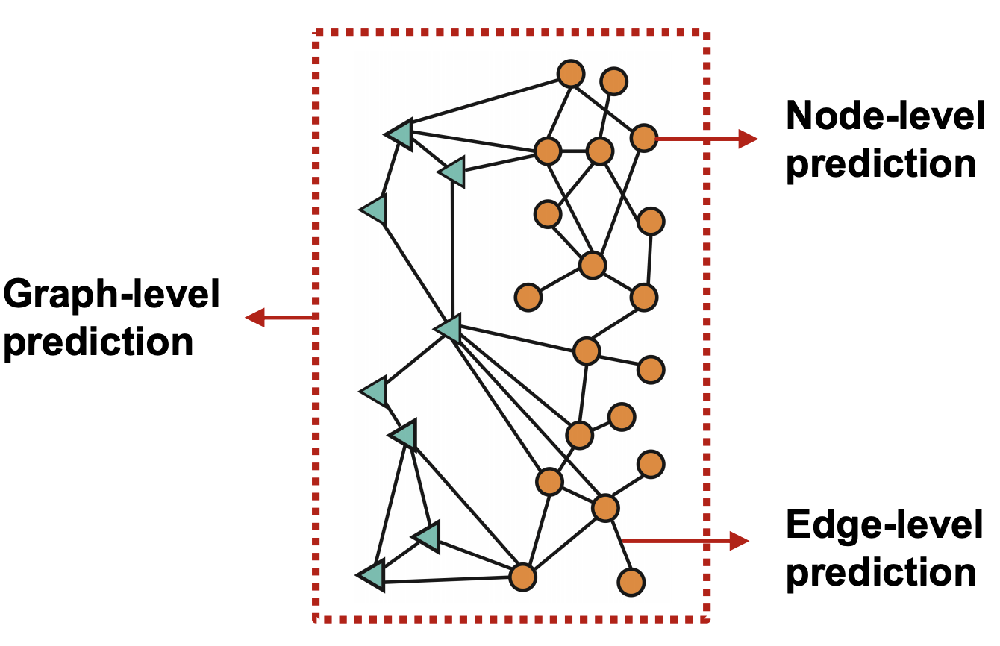
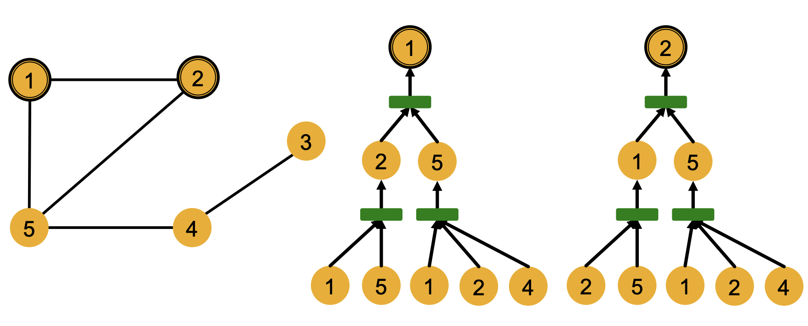

# CS224W：图机器学习5

## GNN的训练和应用

\section{}

### GNN面对的任务

- prediction head有多种类型，包括节点级别的，边级别的和图级别的任务

#### 节点级别的任务

​	 节点级别的任务可以直接使用节点嵌入来完成，假设我们通过GNN得到了d维的节点嵌入向量$h_v^{(l)}$，并且需要做k路的prediction(在分类问题中是k类的多分类任务，在回归问题中是k个目标的回归)，这个过程可以表示为：

$$
\widehat{\boldsymbol{y}}_{\boldsymbol{v}}=\operatorname{Head}_{\text {node }}\left(\mathbf{h}_{v}^{(L)}\right)=\mathbf{W}^{(H)} \mathbf{h}_{v}^{(L)}
$$

- 这里的W是一个$k\times d$的矩阵而$h_v$是一个d维的向量

#### 边级别的任务

​		边级别的任务可以使用2个节点的嵌入来进行k-way prediction，这个过程可以表示为$\widehat{\boldsymbol{y}}_{\boldsymbol{u} v}=\operatorname{Head}_{\text {edge }}\left(\mathbf{h}_{u}^{(L)}, \mathbf{h}_{v}^{(L)}\right)$,而head的选取有如下多种方式：

- Concatenation + Linear，将两个节点嵌入进行拼接再进行线性变换

$$
\widehat{\boldsymbol{y}}_{\boldsymbol{u} v}=\operatorname{Linear}\left(\operatorname{Concat}\left(\mathbf{h}_{u}^{(L)}, \mathbf{h}_{v}^{(L)}\right)\right)
$$

- 点积运算，即$\widehat{\boldsymbol{y}}_{\boldsymbol{u} v}=\left(\mathbf{h}_{u}^{(L)}\right)^{T} \mathbf{h}_{v}^{(L)}$ 不过只能用于1-way的prediction，可以使用multi-head的注意力机制来实现k-way prediction

#### 图级别的任务

​	  图级别的任务可以使用所有节点的嵌入向量来完成，$\widehat{\boldsymbol{y}}_{G}=\operatorname{Head}_{\text {graph }}\left(\left\{\mathbf{h}_{v}^{L)} \in \mathbb{R}^{d}, \forall v \in G\right\}\right)$ 这里的head和GNN中的聚合函数一样，可以使用max，mean和sum等函数将节点嵌入转化成图嵌入。这种操作也叫做图池化(Graph Pooling)，但是这种方法很容易丢失图中的信息。

​	  解决这个问题的方法是使用层级化的池化(Hierarchically pool)，也就是使用激活函数+聚合函数作为head，将节点划分成若干组进行池化之后再将所得结果进行池化，这一过程可以表示为：

### 监督学习和无监督学习

​	  图学习任务中，有监督的任务是有label的，这些label来自于外部，而无监督的学习任务只能使用节点自身的一些信号，很多时候二者的差别是很模糊的，比如我们如果使用GNN来预测节点的聚类系数，看起来是一个无监督的任务，实际上监督信息已经蕴含了图结构中(因为对于一个确定的图而言，其聚类系数已经可以确定，虽然没有直接计算这些聚类系数作为监督标签，但是聚类系数所带来的局部特性仍然表现在图结构中，很难说GNN有没有学到这些隐含的监督信息)，因此很多时候将无监督学习用“自监督学习”(self-supervised)来代替。

​	  监督学习中的label可以分为节点的label，边的label和图的label，因此最好将要解决的问题规约到这三类label的监督学习中，因为这三类任务最容易把握。

​	  无监督学习中没有标签，但是我们可以使用图中隐含的各类信息来帮助我们完成任务。

### 损失函数和评价标准的选取

#### 损失函数

​	  对于分类和回归任务，需要视情况选择不同的损失函数和评价标准，分类任务的label是离散的数值，而回归得到的是连续的数值，因此分类任务中常常使用交叉熵作为loss，即：

$$
\text { Loss }=\sum_{i=1}^{N} \operatorname{CE}\left(\boldsymbol{y}^{(i)}, \widehat{\boldsymbol{y}}^{(i)}\right)=\sum_{i=1}^{N}\sum_{j=1}^k y_j^{(i)}\log \hat y_j^{(i)}
$$

这里的$y_i,\hat y_i$分别代表真实的标签和预测得到的结果，真实的标签是一个one-hot的向量，而预测结果是一个softmax后的概率分布。

​	  而对于回归问题一般采用最小平方损失(MSE)作为损失函数，即：

$$
\text { Loss }=\sum_{i=1}^{N} \operatorname{MSE}\left(\boldsymbol{y}^{(i)}, \widehat{\boldsymbol{y}}^{(i)}\right)=\sum_{i=1}^{N}\sum_{j=1}^k (y_j^{(i)}-\hat y_j^{(i)})^2
$$

#### 评估标准

​	  GNN对于回归任务的评估标准往往采用RMSE和MAE，而对于分类任务，如果是分类任务可以使用准确率，对于二分类问题还可以使用查准率和召回率以及F1-Score

### 数据集的划分

​	  训练GNN的过程中，需要对数据集进行一定的划分，将数据集分成训练集，测试集和验证集在图像的任务中，而图数据集的划分是比较特殊的。在CNN处理图像的任务中，一张图像就是一个数据点，并且图像和图像之间是互相独立的，而在图任务中，以节点分类任务为例，每个节点是一个数据点，但是数据点之间不是完全独立的，因此图数据集在划分的过程中有一定的讲究。

## 图神经网络的表示能力

​	  我们已经了解了一系列经典的图神经网络的架构，比如GCN，GraphSAGE，GAT等等，这些图神经网络可以生成一系列的节点嵌入，但是我们应该怎么评估节点嵌入的表示效果(换句话说就是图神经网络的表示效果)呢？

### 局部结构和计算图

​	  图中存在一定的局部结构，比如下面的这张图中，节点1和2在局部结构中是对称的，而1和5就不是，因为1和2相互交换之后图的结构不会改变。

​	  而局部结构可以很好的反映出GNN的表达能力，**一个好的GNN应该要能表示出节点的局部结构**，可以区分对称的节点和不对称的节点，进一步，我们需要**理解GNN是如何捕捉局部的结构信息的**。

​	  计算图可以表示出GNN中的每个节点如何一步步聚合其他节点的信息形成自己的嵌入向量的过程，比如上图中1和2的计算图如下：

我们发现1和2的计算图的结构非常相似，因此最终得到的1和2的嵌入向量也是相同的，换句话说GNN无法区别节点1和2，而局部结构类似的节点往往会有相似的计算图。

​	  因此GNN的表示能力其实来自于对计算图中的一个子树结构的信息提取，一个好的GNN应该把不同的子树映射成不同的向量。如果一个GNN在每一步中都可以完全获取邻居节点的信息，那么生成的节点嵌入就可以区分不同的子树，也就是说一个表达能力强的GNN的聚合函数应该是一个injective function(单射函数)

### GNN的设计

#### 经典架构

​	  本节内容的目标是归纳总结出设计高效GNN的一些方法论。经典的GNN架构中，GCN采用了逐点的均值池化作为聚合函数，而GraphSAGE采用了逐点的最大池化，但是GCN无法区分一些数量不同但节点组成类型相同的局部结构，因为这样的不同结构在均值池化下得到的结果是相同的，与之类似的，GraphSAGE在碰到label集相同的子结构的时候也无法区分，因为这个时候最大池化的结果是相同的。

#### MLP和GIN

​	  一个GNN的聚合函数最好是一个单射函数，这种函数可以形式化的表示成非线性激活函数和线性函数的组合$\Phi(\sum_{x\in S}f(x))$，我们知道一个具有足够大维数的隐层和激活函数的多层感知机就可以逼近任何连续空间中的函数，因此GIN架构提出了使用MLP作为聚合函数，也就是：

$$
\mathrm{MLP}_\Phi(\sum_{x\in S}\mathrm{MLP}_f(x))
$$

这种GNN被认为是表达能力最强的消息传递类GNN，因为采用的MLP理论上可以拟合任何函数，这种GIN实际上是WL核函数的神经网络形式，WL核函数的形式如下：

$$
c^{(k+1)}(v)=\operatorname{HASH}\left(c^{(k)}(v),\left\{c^{(k)}(u)\right\}_{u \in N(v)}\right)
$$

而GIN就是使用神经网络作为其中的Hash函数，因此GIN模型可以表示为：

$$
\operatorname{MLP}_{\Phi}\left((1+\epsilon) \cdot \operatorname{MLP}_{f}\left(c^{(k)}(v)\right)\right)+\sum_{u \in N(v)} \operatorname{MLP}_{f}\left(c^{(k)}(u)\right)
$$

