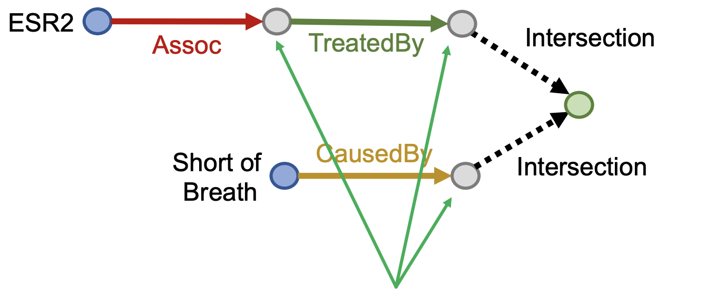
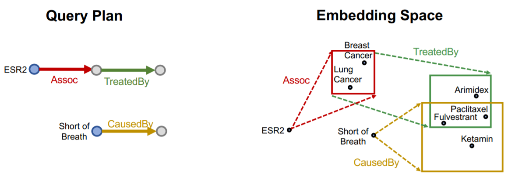
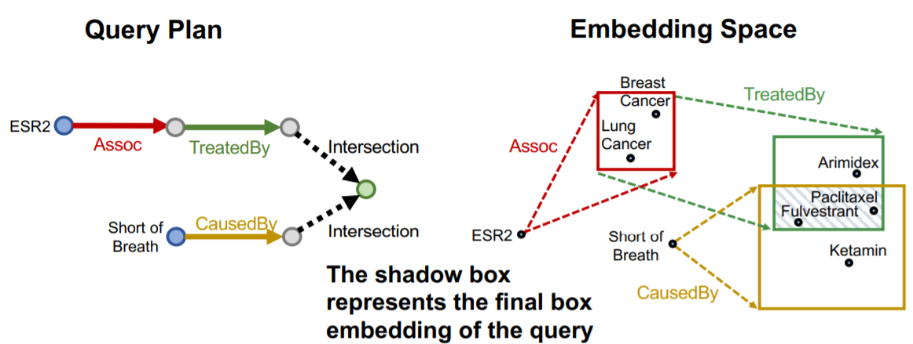
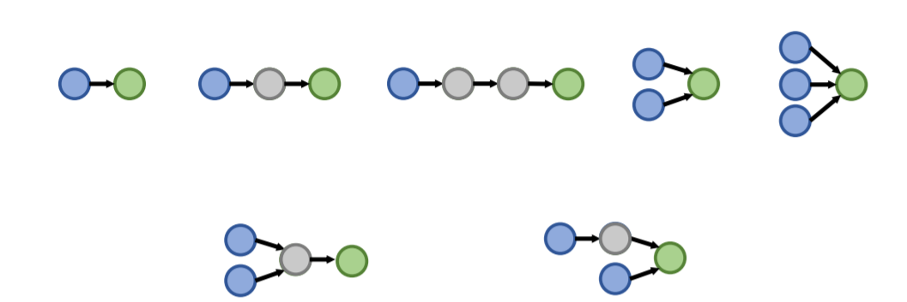

# CS224W：图机器学习6

## 知识图谱Knowledge Graph Embeddings

- 到目前为止图机器学习研究的对象的都还是只有一种类型边的图，而对于边的类型有很多种的图(也叫做异构图，Heterogeneous Graph，边代表了关系，多种边就代表了多种更复杂的关系)，常见的异构图有：
  - 关系型GCNs(RGCN)
  - 知识图谱，用于知识图谱补全的嵌入
- 一个异构图可以定义为$G=(V,E,R,T)$，其中V和E分别代表节点和边的集合，T和R分别代表节点和关系的类型

### 关系型图卷积网络RGCN

​		图卷积网络GCN可以在进行一定的扩展之后可以用来处理异构图，这样的网络叫做关系型图卷积网络RGCN，可以先回忆一下对于一个单层的GNN，有message和aggregation两个步骤来进行节点的表示，而当图中存在多种关系，变成异构图之后，RGCN仍然可以进行图节点嵌入的学习，处理的方式是：

- 对不同的关系类型使用不同的权重矩阵$W_{r_k}$，分成多种关系来收集message
  - GCN中的更新公式是：

$$
h_{v}^{(l+1)}=\sigma(\sum_{r\in R}\sum_{u\in N(v)}\frac 1{C_{v,r}}W_r^{(l)}h_u^{(l)}+W_0^{(l)}h_v^{(l)})
$$

- 上面的这个表达式也可以拆分成message和aggregation两个部分，还是比较容易看出来的，**每个关系都有L个对应的权重矩阵W**，因此参数数量随着关系的变多增长的很快，经常会出现过拟合的现象，可以采取对权重矩阵W进行正则化的方式来避免过拟合
  - 方法1:使用块对角矩阵block diagonal matrices来降低参数的维数
  - 方法2:基学习，在不同的关系之间共享权重，将W矩阵表示称一系列基础的transformations的组合，这样一来所有的关系
- 可以完成一系列实体识别，连接预测等任务

### 知识图谱

- 知识图谱是用图的形式来保存一些知识，用节点来表示实体，并且用实体的种类作为标签，用边来表示实体之间的关系。现实生活中有不少知识图谱的具体案例，知识图谱也是异构图的一种。
- 知识图谱中比较重要的一个任务是做图谱的补全，也就是找到知识图谱中缺失的连接关系。
  - 我们要注意到知识图谱中的关系也是有很多种类的，主要有对称的关系和可你关系
- 知识图谱的关键idea在于知识图谱的表示，知识图谱中的一条边可以表示为一个**三元组**$(h,r,t)$，分别表示头节点，关系和尾节点
  - 实体和关系可以建模成一个d维空间中的嵌入向量
  - 对于一个给定的三元组，我们的目标是$(h,r)$的嵌入向量必须要和$t$的嵌入向量尽可能接近，因此问题也就变成了如何对$(h,r)$进行嵌入与如何定义“接近”

#### TransE

- 一种最简单的评估接近程度的方式，评估函数是

$$
f_r(h,t)=-||\bold h+\bold r-\bold t||
$$

- TransE的学习方式为：

#### 关系模式

​	知识图谱中有一系列各式各样的关系，比如：

- 对称关系：$r(h,t)\rightarrow r(t,h)$，同样的还有**反对称关系**
- 可逆关系：$r_1(h,t)\rightarrow r_2(t,h)$
- 组合关系(可传递关系)：$r_1(x,y)\cap r_2(y,z)\rightarrow r_3(x,z)$
- 一对多关系，一个实体对应多个实体

#### TransR

- TransE模型可以将任意的关系转换到相同的嵌入空间，而TransR可以将节点转换成d维的嵌入向量，必将每个关系转换成k维的关系空间向量，并给出一个从实体空间到关系空间的投影空间M
  - 同样地也可以对对称关系，反对称关系，1对多关系，可逆关系进行建模
  - 但是TransR不能对组合关系(可传递关系)进行建模

#### Bilinear Modeling

- TransE和TransR的知识图谱建模方式都是用距离作为scoring function的，而Bilinear建模中，将实体和关系都表示称k维的向量，称为DistMult，并采用向量乘积来作为scoring function
  - 事实上这个score function类似于hr和t的cosine相似度

$$
h_r(h,t)=<h,r,t>=\sum_{i=1}^k h_ir_it_i
$$

- 这种建模方式支持：
  - 一对多模型的建模：向量的投影相等即可
  - 对称关系：向量的内积可以换
  - 问题是不能表示反对称关系、逆关系和组合关系

#### DisMult

- 一种使用语义匹配度作为打分函数的KGE方法，其打分函数为：

$$
f_{r}(h, t)=<\mathbf{h}, \mathbf{r}, \mathbf{t}>=\sum_{i} \mathbf{h}_{i} \cdot \mathbf{r}_{i} \cdot \mathbf{t}_{i}
$$

- 这种打分函数可以理解为cosine相似度，并且可以很好地刻画一对多的关系，但是不能刻画可逆的关系

#### ComplEx

- 基于DisMult方法，将嵌入向量表示在复数空间中，其打分函数为：

$$
f_{r}(h, t)=\operatorname{Re}\left(\sum_{i} \mathbf{h}_{i} \cdot \mathbf{r}_{i} \cdot \overline{\mathbf{t}}_{i}\right)
$$

- 这种方法可以很好地描述对称关系，反对称关系，可逆关系和一对多关系

#### KGE的总结

## 知识图谱推理

​	  知识图谱中一个很常见的任务是知识图谱补全，也就是给定一个head和realtion，我们预测出对应的tail，这是知识图谱推理中的推理任务(Reasoning)

### Reasoning和query	  

​	  知识图谱推理的任务就是在知识图谱上进行multi-hop的推理，也就是在图上的多条路径中进行连续的推理，比如下面的生物医学知识图谱中通过症状进行疾病的推理：

而知识图谱具体的推理任务需要根据一系列的query来表述，也就是说在给定的不完整并且大规模的知识图谱中对输入的自然语言形式的query进行推理并返回结果，而query可以分为One-hop Queries，Path Queries和Conjunctive Queries三种，分别是单次跳转的推理，多次跳转的推理和联合推理，可以用下面的图来表示三种query之间的关系：

### query的形式化表述

#### one-hop query

​	  one-hop query实际上就是一个head和一个relation组成的，可以写成$(h,(r))$，然后判断一个tail是否为答案，转化成知识图谱补全的问题就是判断一个三元组$(h,r,t)$是否存在于知识图谱中。

#### path query

​	  path query实际上就是一系列的one-hop query，可以写成$q=(v_a,(r_1,r_2,\dots,r_n))$，然后需要在知识图谱中进行遍历来得到最终的结果，比如输入的path query是What proteins are associated with adverse events caused by Fulvestrant，那么经过分析就可以得到$v_a$就是Fulvestrant，而caused，associated就是一系列关系，然后就可以开始在知识图谱中进行一步步的查询。

​	  虽然看起来很容易，然而知识图谱往往是不完整的，可能有很多实体和关系是缺失的，因此在推理的过程中我们很可能不能获得所有可能的结果实体。但是我们又不能把知识图谱补全之后再进行推理，因为完整的知识图谱是一个非常稠密的图，大部分三元组都会有一定概率存在，而知识图谱推理的复杂度是指数级别的，因此完整的知识图谱上的query的时间复杂度非常高。

​	  因此我们希望能在不完整的知识图谱上完成基于路径的查询，同时我们希望可以隐式地对知识图谱做出一定的解释，这实际上是一种泛化后的链接预测任务。

### 知识图谱推理和问答

​	  接下来就需要研究如何在知识图谱中进行query的问答，上一章的内容中已经提到知识图谱中的实体和关系都可以表示在向量空间中，也就是知识图谱嵌入，因此我们可以考虑将知识图谱上的问答转化到向量空间中进行，而具体的方法就是将query也转换成一个向量，并使用嵌入模型的打分函数来评估结果。一个查询 $q=(v_a,(r_1,r_2,\dots,r_n))$ 在向量空间中可以表示为：

​	  这样一来上一章提到的各种知识图谱嵌入方法，比如TransE，TransR，DisMult和ComplEx等等就可以使用到知识图谱的问答中，而上述方法中，只有TransE可以刻画传递关系(composition relations)其他几个方法都不行，因此最终用于知识图谱推理问答的只有TransE，而如果是更复杂的conjunctive query，比如“What are drugs that cause Short of Breath and treat diseases associated with protein ESR2?”，它可以表示为`((e:ESR2, (r:Assoc, r:TreatedBy)), (e:Short of Breath, (r:CausedBy))` 而查询的过程可以表示为：

### Query2Box

​	  这一节的内容将着重介绍一种新提出的知识图谱推理方式：使用Box Embedding进行推理。这种方法中，一系列的query被表示成了一系列超矩形(hyper-rectangles)，也叫做box，采用center和offset两个量来描述一个query，依然用上面那张生理医学知识图谱为例，我们可以将Fulvestrant(一种药)的所有不良反应都**嵌入到一片矩形的区域**内：

Box embedding使我们在遍历KG进行查询的时候，每一步都可以得到一系列reachable的实体组成的集合，并且box的交集(Intersection)是良好定义的。Box是一种很强的抽象，可以通过将中心节点进行投影并控制offset，将相关的实体包含在内，将无关的实体排除在外。在Query2Box中，

- 每个实体用d维的向量来表示，并且被视为一种没有容积(zero-volume)的box
- 每个关系用一个box来描述，包含center和offset两个量来描述
- 交集运算符f，可以计算一系列box的**交集**

#### 投影操作

​		利用已有的关系嵌入，将输入的一个box投影成另一个box，即$Box \times Relation\rightarrow Box$ 这个过程可以用下面的图来描述：

#### 取交集(Intersection)操作

​		求交集是Query2Box的另一种基本操作，这种操作可以求出输入的一系列box的交集，也是一个box，根据基本常识，这个新的box的中心应该接近于输入的box的中心，并且offset不能超过输入box中的最小值。新的交集box计算方式如下：
$$
\operatorname{Cen}\left(q_{\text {inter }}\right)=\sum \boldsymbol{w}_{i} \odot {\operatorname{Cen}\left(q_{i}\right)}
$$
这里的$w_i$是权重参数，可以通过如下方式计算得到，**本质上是一种注意力机制**：
$$
\boldsymbol{w}_{i}=\frac{\exp \left(f_{\text {cen }}\left(\operatorname{Cen}\left(q_{i}\right)\right)\right)}{\sum_{j} \exp \left(f_{\text {cen }}\left(\operatorname{Cen}\left(q_{j}\right)\right)\right)}
$$
而offset可以用如下方式计算：
$$
\text { Off } (q_\text{inter})=\min(\text{Off}(q_1),\dots,\text{Off}(q_n))\odot \sigma(f_{off}(\text{Off}(q_1),\dots,\text{Off}(q_n)))
$$
这里的函数f是一个神经网络，可以提取输入box的特征，增强表达能力，并用sigmoid函数归约到(0,1)区间内

#### Query2Box详解

​		依然用What are drugs that cause Short of Breath and treat diseases associated with protein ESR2?这样的一个query作为例子，我们可以先将这个query处理为：`((e:ESR2, (r:Assoc, r:TreatedBy)), (e:Short of Breath, (r:CausedBy))`，然后我们就可以使用投影，从head实体开始一步步投影进行投影，得到如下结果：

然后在进行求交集的操作，得到最终的结果(阴影部分)

#### 打分函数

​	  Query2Box的知识图谱推理框架中，使用实体到box的负距离来定义打分函数，对于一个查询q和一个嵌入空间中的实体v，我们定义其距离函数为：
$$
d_{\text {box }}(\mathbf{q}, \mathbf{v})=d_{\text {out }}(\mathbf{q}, \mathbf{v})+\alpha \cdot d_{\text {in }}(\mathbf{q}, \mathbf{v})
$$
这里的距离被分成了外部距离和内部距离两个部分，外部距离就是到box的边界的距离，而内部距离是box的边界到中心点的距离，而当一个实体在box内部的时候，其而内部距离应该定义成负权重的，因此打分函数可以定义为：
$$
f_q(v)=-d_{\mathrm{box}}(q,v)
$$
和知识图谱嵌入一样，我们希望这个打分函数对于正确的$(q,v)$而言分数更高，而对错误的分数更低，因此训练的时候需要用到负样本。

#### Union操作的扩展

​	  在Query2Box的框架下，交集的操作已经有了良好的定义，而并集操作是否也可以使用低维的向量来表示呢？一系列析取(disjunction)的连续查询又被叫做Existential Positive First-order (EPFO) queries，这类查询可以分解为一系列AND-OR操作。

​	  然而AND-OR查询不能用低维的向量来表示，比如有3个不同的query和对应的结果，可以使用2维空间表示，而如果有4个不同的query，当下面这种情况出现的时候就需要3维的空间：

这是为了保证任意两个query的并集中不能包含其他的query，而对于M个组合的query，表示出所有的OR操作至少需要$O(M)$规模的嵌入空间，因此数据规模一大就不能用低维向量来表示所有的并集操作。

​	  但这个问题也不是完全没有解决的办法，论文中提出的一个key idea就是**改变处理一个联合查询时候的顺序**，到最后一步再做union

​	  具体的做法是，任何一个AND-OR查询可以转变成一个等价的**析取范式(DNF)**，即$q=q_1\or q_2\or\dots q_m$，这样一来我们来处理一个查询的时候就可以先求出所有$q_i$的嵌入，到最后一步再进行union操作。在最后计算距离作为score的时候，容易得到有：
$$
d_{\text {box }}(\mathbf{q}, \mathbf{v})=\min \left(d_{\text {box }}\left(\mathbf{q}_{1}, \mathbf{v}\right), \ldots, d_{\text {box }}\left(\mathbf{q}_{m}, \mathbf{v}\right)\right)
$$

#### Query2Box的训练

​	  在Query2Box模型中，需要训练的参数主要有所有的实体的嵌入向量，所有的关系的嵌入向量和Intersection运算中的各种参数。

​	  一个很直观的想法是，在训练Qeury2Box模型的过程中，对于一个查询q的嵌入向量，我们要让属于q中的实体v对应的打分函数最大化，而要让不在其中的打分函数最小化，为此需要用到负采样，也就是在训练的过程中，对于每个正样本v随机选取一个负样本与之对应，具体的训练过程可以分为以下几个步骤：

- 对输入的样本进行负采样
- 计算查询q的box embedding
- 计算正负样本的打分函数$f_q(v),f_q(v')$
- 计算损失函数并进行优化，每个样本训练过程中的loss是

$$
\ell=-\log \sigma\left(f_{q}(v)\right)-\log \left(1-\sigma\left(f_{q}\left(v^{\prime}\right)\right)\right)
$$

#### query的生成

​	  在训练之前我们需要提取出一系列查询，而这个过程称为Query Generation，可以通过一系列模板生成：

