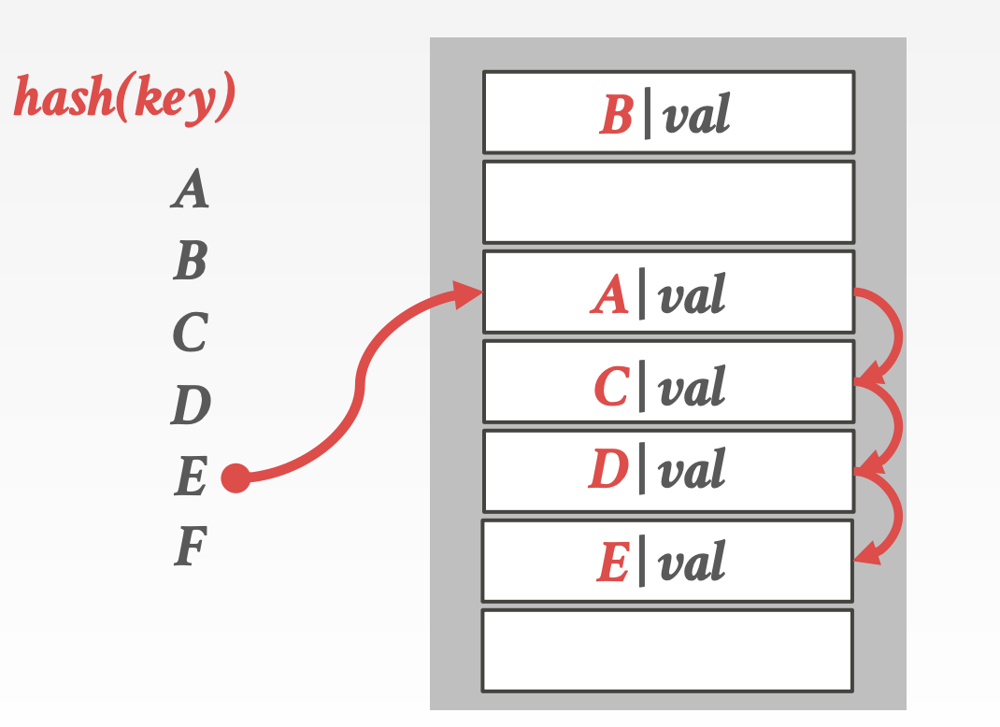
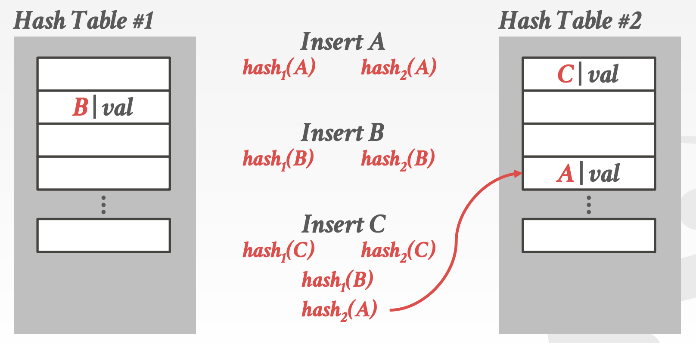
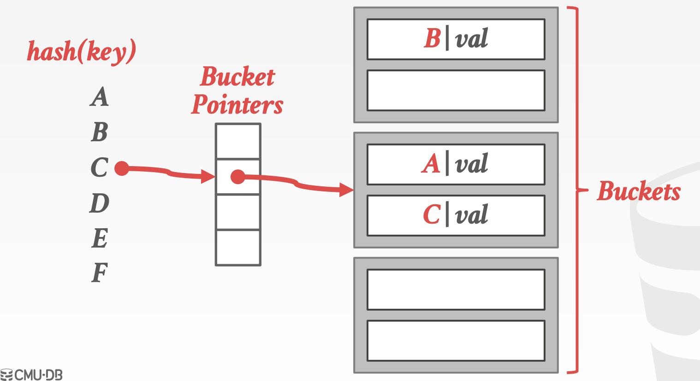
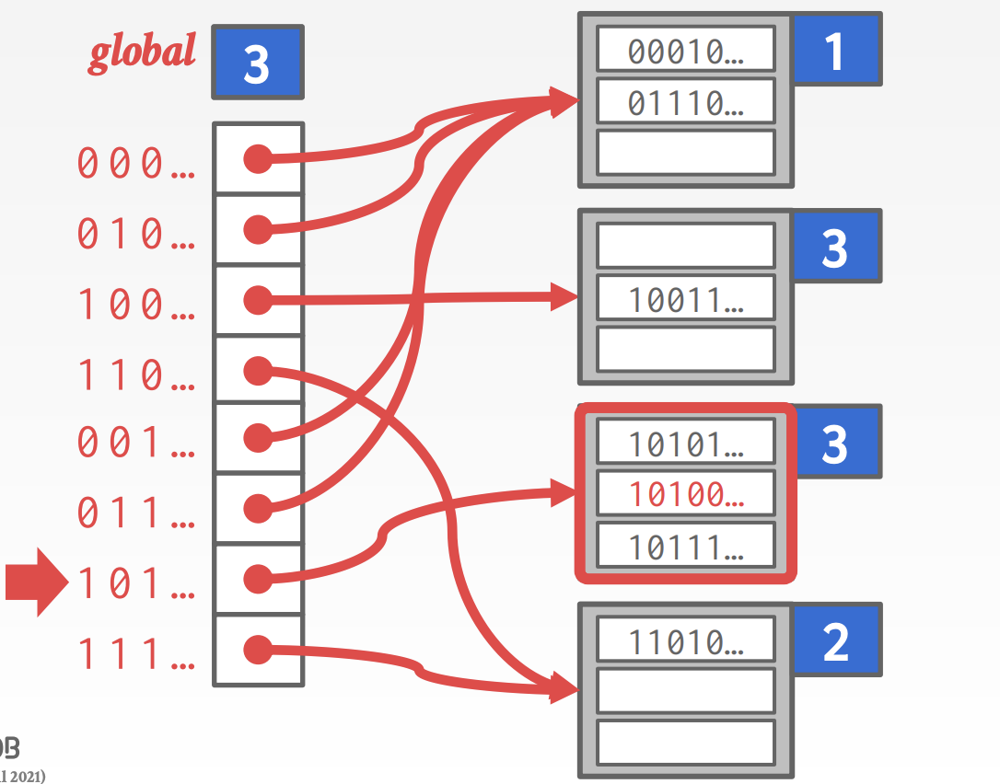
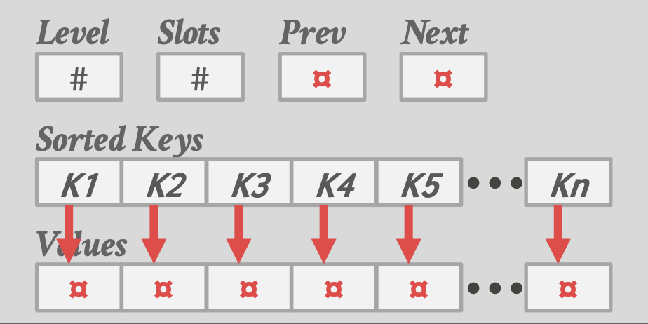
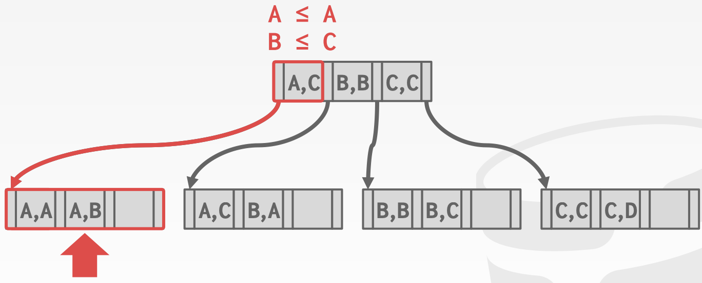
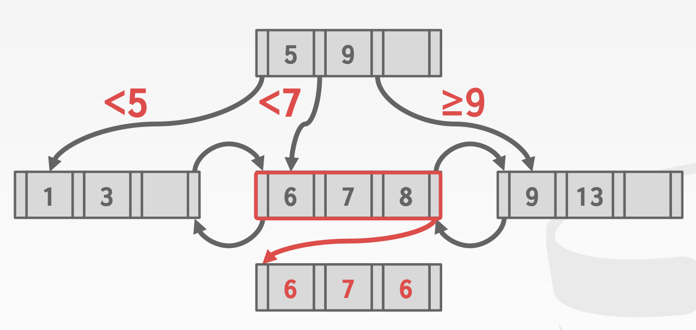
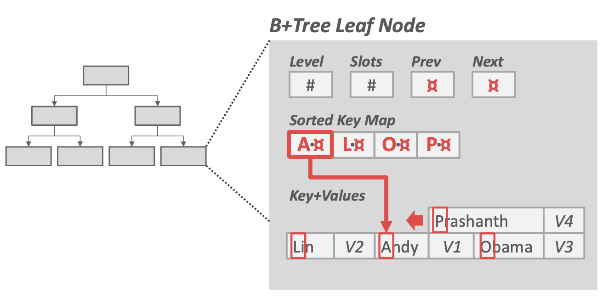

# CMU15-445-02：索引

> 这是CMU数据库课程15-445的第二个大的部分，主要讲数据库中的索引相关的内容，在2021秋的课程里应该对应Lecture06-Lecture08

## 索引

数据库中需要维护多种不同的数据结构用作系统内部的不同模块，包括：

- 内部的元数据信息，这一部分数据用来追踪数据库中存储信息本身的变化，比如页表
- 核心数据存储，用于存放元组的基本存储结构
- 临时数据结构，用在一些查询的处理和加速中，比如用于join操作的Hash table
- 表索引：用于加快元组查询的关键数据结构，通过查找索引快速得到元组本身包含的数据

而在设计数据库系统的数据结构的同时，我们需要重点关注：

- 数据的组织方式，如何对内存进行布局，数据结构中存储什么信息才能提高访问效率
- 并发性能，如何让数据结构支持多线程的访问并且不出现一致性问题

## Hash索引

### Hash表的结构

Hash表是一种将key映射到value的数组型数据结构，这种结构提供了常数级别的时间复杂度和线性级别的空间复杂度，一个hash表的有两个关键的组成要素：

- hash函数，即如何将key映射到value上的函数，但是需要把握好执行速度和冲突率的trade-off，二者往往不可兼得，如果冲突率低，那么hash函数的计算就复杂，执行速度就慢，而如果hash函数太简单会造成很高的冲突率
- hash机制，即解决可能发生的key冲突的方式，这里我们需要考虑的是在构建一个大hash表和执行额外操作二者之间找到一个平衡，因为hash表越大相对来说越难发生冲突，但是消耗的存储空间也越大

### 静态Hash

静态索引指的是哈希表的大小固定的索引方式，如果表中的位置被用完了就要从头开始重新构建一张表，这个时候往往会使用原本两倍大小的空间作为hash表，静态hash常见的解决冲突的方式有这样几种：

#### 线性探测Hash

最基本也是最有效的方法，当冲突发生的时候会用线性的方式搜索相邻的可以使用的槽来存放当前的key，在查找想要的key的时候，我们可以一直搜索直到找到想要的key为止，但是这也意味着我们要在槽中存储对应的key，而不是只存value就可以

这种策略下，删除就需要注意，比如以上面的图为例子，如果我们要删除D，那么在查询E的时候因为冲突需要进行平方探测，这个时候因为D被删除了所以在D的位置探测就结束了，但是并没有找到对应的E，因为E应该还在下一个位置，但是因为D缺失导致线性探测停止了，常用的解决办法有：

- 墓碑(TombStone)法：虽然删了，但是留一个记录表示这里以前有某个key-value放着，需要继续往下探测
- 另一种办法是在有删除操作之后改变其他数据的位置，保证删除之后能正常线性探测

如果使用的key并不是unique的，那么也有两种解决办法：

- 分离链表：使用一个链表来存储所有的值，并且key对应的value变成链表的指针
- 冗余key存储：直接在hash表中存储多个相同的key进行摆烂

#### 罗宾汉Hash

罗宾汉Hash(Robin Hood Hash)是对线性探测的一种优化，会对槽的分配采取劫富济贫的策略，在这种策略下，每一个条目还同时**记录了自己距离最优位置(即Hash直接运算的结果)的距离**，在每一次插入新的key的时候，如果一通线性探测之后，给待插入的key准备的槽到最佳位置的距离大于现在在这个槽上的key到最佳位置的距离，那么就会把这个位置让给新key，然后重新给老key找一个位置。

- 这张图就是PPT中一个例子，首先按顺序插入AB，插入C的时候发生了一次线性探测所以C在3号位，而D因为和C冲突所以在4号位，距离最佳位置的偏移量都是1，而插入E的和A，C都发生了冲突，探测到D这里的时候偏移量已经是2了，比D要大，所以根据罗宾汉的规则D让位给E，接下来再给D找一个新位置。

#### Cuckoo Hash

Cuckoo Hash采取的策略是使用多个Hash表和多个Hash函数，并且这些Hash函数使用相同的算法，但是使用不同的seed，使得同一个key可以产生不同的结果。

当需要插入新元素的时候，会检查每个表并且选择有空槽的一个，如果没有空的表，那么就随机选择一个并且踢掉那个位置上旧的条目，并将旧的条目重新hash到一个新的表里，如果发生了循环，那么就需要使用心得hash函数重新构建所有的hash表，虽然看起来变麻烦了，但是我们使用的仍然是常数个hash表，因此时间复杂度仍然控制在常数级别。

- 比如上面这个例子，首先插入A，发现hash函数的运算结果是1和3，假设放在表1的1号位，然后插入B，B的两个hash函数运算结果分别是1和0，为了不和A冲突所以插入表2的0号位，然后插入C发现C的hash函数运算结果是1和0，因此先替换B，B被替换之后只能去1号表抢了A的1号位，然后A就被调整到了2号表的3号位，这样一来就完成了三个元素的hash

### 动态Hash

动态hash机制可以在不重建hash表的基础上对hash表进行扩容(resize)，但是需要数据库系统能够过知道需要插入的元素的个数，否则就需要重建hash表，这种方式可以最大化利用hash表进行读和写。

#### 链式Hash

最常见的动态Hash机制，数据库系统会维护一系列桶(buckets)，hash表中的每个位置现在就对应到了一个桶中，具有相同hash结果的key就会被放入那个槽对应的桶中，同时一个槽可以有多个桶，桶和桶之间用链表的形式组织起来，一个桶的内部可以有多个key-value对。

这样一来查询的时候就变成了先hash再从桶中找对应的key，在极端情况下时间复杂度变成线性的，但是大部分情况下还是常数级别的复杂度。

#### 可伸长Hash

链式Hash可能会导致桶的不断扩增，而可伸长的hash方法允许**表中的多个槽指向同一个桶链中**

- 数据库系统维护一个**全局和局部的位置编码**来表示在槽数组中找到对应的桶所需要的位数(称为深度Depth)
- 当一个桶满了的时候，数据库系统会将这个桶重新划分并且如果局部的深度小于全局，那么就找空槽将分割了的槽重新安置，否则就对表进行扩容来收纳新的槽，同时增加全局的编码深度(多用一位进行表示)

#### 线性Hash

线性Hash不会在一个桶溢出的时候立马进行分割，而是维护一个**分割指针用来追踪下一个需要分割的桶**，无论这个指针是否指向溢出的桶，数据库系统都会对其进行分割：

- 如果任何桶溢出了，那么久将指针指向的桶进行分割并且加入新的槽，然后指针指向下一个位置
- 如果hash函数将key映射到了已经被指针指向的槽，那就使用心得hash函数
- 如果指针到达了最后一个槽，那么就删除最早的hash函数并用新的替换

其实就是不急着立马对满了的桶进行分割，而是按顺序一个个来，当有桶溢出的时候就对当前指向的槽对应的桶进行分割并扩展。

## B+树索引

### 表索引

**表索引(Table Index)**是用来快速访问数据表中的一些特定列索引结构，只对数据表中特定列构成的元组建立索引，在查询数据的时候就不再需要按照顺序扫描，而是通过表索引更快的查询元组数据，同时数据库要保证表索引和表中的数据始终保持一致性。

同时，每个数据库需要建立的索引数量需要合理规划，虽然更多的索引会让查询更加快速，但是索引也会消耗大量的存储空间，数据库系统需要找到最合适的索引数量。

### B+树

B+树是一种自平衡的树形数据结构，可以保证数据处于排好序的状态并且允许进行数据的搜索，顺序访问的插入删除，这些操作的时间复杂度都是$$\log(n)$$级别的。几乎所有支持顺序保留的索引的数据库系统都使用了B+树的数据结构。

而还有一种数据结构叫做B-树，这两者的主要区别是B树在所有的结点上都会存储key-value，而B+树将这些key和value**都存放在了叶结点**上，现代的B+树还会结合一些B-树中的特征，比如说同辈指针(Sibling Pointer)

B+树是一种M阶的搜索树(也可以叫M路)，并且具有如下特征：

- B+树是完美平衡的，所有叶结点的深度都相同
- B+树中，根以外的每个内部结点至少是半满的，即key的数量在$$[\frac M2-1, M-1]$$
- 每一个有k个key的内部结点有k+1个非空的子结点

同时B+树中的每一个结点都有一个key-value对组成的数组，这里的key的选择是根据索引对应的属性来决定的，而value会根据是内部结点还是叶结点有所区别，对于内部结点来说，这里的value是指向下一层结点的指针，而对于叶结点来说，value是对应记录的ID和元组的数据，记录的ID对应的是一个指向元组位置的指针，也有的叶结点会直接把元组的数据信息直接存储在叶结点中。同时，这些key-value数组都是按照key的大小进行排序的。

#### 选择条件

对于一个复杂的查询，B+树索引支持只使用其中一部分属性值进行查询，比如建立了一个关于(a, b, c)三个属性的索引，如果是B+树的索引，那么这个索引可以处理关于(a, b, c)的查询，也可以处理只查a或者查(a, b)的，但是对于hash索引来说，只能处理关于(a, b, c)的查询，这是B+树索引的一个巨大优势。

#### 插入操作

对于插入操作，B+树的处理流程包括下面几个步骤：

1. 找到正确的叶结点L
2. 在L中将新的条目按照排好序的顺序插入
   1. 如果L中位置足够，那么插入操作就结束了
   2. 否则L将被从中间分成两个结点L和L2，并且在L的父节点上把L2加进去，即父节点上多一个key-value对，其中value指向L2
3. 如果内部结点也需要分裂，也需要重新将条目进行分配，往上push up中间的key

#### 删除操作

在插入的时候我们要考虑结点中空间满了将其分裂，而如果一次删除造成了叶结点少于半满，那么我们必须将这个叶结点进行归并来达到树的重新平衡，具体的步骤包括：

1. 找到正确的叶结点L
2. 删除对应的条目，然后：
   1. 如果L依然满足半满，那么操作就结束了
   2. 否则需要尝试对条目进行重新分配，从旁边的叶结点中借若干个条目过来填充
   3. 如果不能满足重新分配，比如两个叶结点加起来还不够，那么就需要将两个叶结点进行merge
3. merge完成之后需要调节父节点中的指针

#### 非唯一索引

有的时候索引的key不是unique的，这个时候的解决办法有两种，一个是存储重复的key，另一个是存储一个相同key的value构成的链表

#### 重复的key

B+树中处理重复的key有两种办法，一种是将数据的record ID也作为key的一部分，构造出unique的key，另一种方法是允许结点可以存储过量的数据而不进行分割，存储重复的key，但是这种方法很麻烦。

### 数据库系统中的B+树的设计

#### 结点的大小

B+树索引中的结点大小的选取会受到存储介质的影响，**但一般选择和页的大小相同，方便存取**，比如存储在硬盘驱动器上面的结点的大小通常是几MB，为了减少磁盘访问和读取的次数，而内存数据库可能会使用512bytes的结点大小，为了将整个页都可以放入CPU的cache中，同时也减少内存中的碎片。

总的来说结点的大小选择取决于工作模式，对于点查询来说可能更偏向于小的页，因为小的页可以减少无效信息的读取，而一个大的顺序扫描可能会更喜欢大的页来减少存取的次数。

#### 归并阈值Merge Threshold

虽然B+树有一个合并删除之后“Underflow”的结点的规则，但是有的时候暂时违反这个规则可能会减少删除的次数，比如一连串交替的删除和插入操作可能会引起“Thrash”(抖动)的问题，即反复出现叶结点的分割和合并，这会造成很多不必要的性能开销。同时也可以允许批量合并，即多个合并操作同时进行，来减少对写锁的占有导致的不必要的性能消耗。

#### 变长的Key

目前为止讨论的都是用定长的key构建B+树，处理变长的Key的方法有以下几种：

- 指针：直接存储key的指针，但是用指针的效率会比较低，这种方法一般只会在嵌入式系统中使用，因为嵌入式系统的寄存器和cache都比较小，可以节约存储空间
- 变长结点：可以将B+树的结点也改成变长的，但是因为内存管理太麻烦，所以这种方法也不会被使用
- 填充(Padding)：设定一个允许的最大长度，所有的key的长度不得超过这个值，然后将所有长度不到最大长度的key都进行填充，强行让所有的key都变成等长的，这种方法看起来简单粗暴但是会极度浪费大量的存储空间，因此不会被使用
- 键值映射：最常用的方法还是用一个key-value对在一个单独字典中的索引来代替key，因为字典索引的规模比较小，因此有足够的空间在索引旁边放置key的前缀，并且可以允许索引的搜索和叶结点的扫描，避开指针的使用

## 索引的并发控制

对并发操作的控制协议是数据库系统中很重要的一个部分，一个并发控制协议的正确性需要通过以下两个方面来判断：

- 逻辑的正确性：要保证每个并发的线程可以读到它想读的数据，
- 物理上的正确性：在物理存储上，对象的内部表示是健全的，比如不能有空指针

而数据库的索引关注的是逻辑上的正确性，这一点和数据库的其他组成部分不同，因此我们可以单独考虑。

### 锁Lock和闩Latch

锁和闩都可以用于并发的控制，但是两者其实存在一定的区别，具体的区别如下图所示：

- 锁是一种高阶的逻辑原语，用来保护数据库中的内容不被其他事务所改变，事物会在它自己的整个持续过程中都持有锁，数据库可以在查询处理的过程中，将锁暴露给用户，而锁需要能够回滚更改。
- 闩是一种低级的保护原语，用在具体的内部数据结构中，闩只在对数据结构的操作进行的过程中才持有，并且不需要回滚更改，闩有两种不同的形式：
  - READ：多个线程允许同时对一块内容进行读操作，一个线程可以在其他线程持有某个item的读闩的时候再申请一个读闩。
  - WRITE：只允许一个线程对某块内容进行写的操作，当一个线程持有某块内容的写闩时，其他任何线程不能获得对这块区域的读锁和写锁

### Latch的实现

用于实现latch的底层原语往往都是CPU中的compare-and-swap (CAS)**原子指令**，在使用这个指令的时候，线程可以确认某块内存区域上是不是特定的值，如果是，就用新的值来替换旧的值，否则就不改变这块内存的内容。

- 上面这一串操作被封装成了原子行为

下面几种都是Latch的实现方式，区别在于对工程实现难度和运行时性能之间的考量和平衡：

- 操作系统内置的锁，比如C++中的`std::mutex`，优点是使用很方便不需要获取，缺点是时间开销大(因为是操作系统提供的，所以需要通过操作系统来调度，比较消耗时间)
- Test-And-Set Spin Latch(TAS)，自旋锁(Spin Latch)是一种由数据库系统控制的锁，数据库系统可以**自己决定获取锁失败的时候应该执行什么操作**，比如C++中的`std::atomic<T>`，这种方式的优点是效率比OS内置的锁要更高，而缺点是不能scalable并且cache-friendly
- 读者-写者(Reader-Writer)锁，上面两种锁在读写的不同操作下并没有什么区别，而读者-写者锁对于读和写两种操作提供了不同的管理方式(就是上面提到的)，优点是允许并发的读，但是缺点是容易出现starvation，需要数据库系统维护一个读队列和写队列

### Hash表的锁

对于静态的Hash表来说进行并发控制还是比较容易的，因为不同的线程访问hash表只有有限的方式，每个线程在一个时刻只能访问其中的一个页或者槽，这样一来就不容易发生死锁，因为没有两个线程会同时竞争一个锁，当我们需要重构hash表的时候只要在全局上一个锁就可以。

对于动态的Hash表来说锁的管理更加麻烦一点，目前常用的解决方式有以下两种，两种方法分别采用了不同粒度的锁来管理动态Hash上的并发访问：

- 页锁：在每个页上设置一个读者写者锁，这种方法减小了并发量，但是可以让线程更快访问一个页中的多个槽
- 槽锁：在每个槽中设置一个专门的锁(存储那一节我们讲过一个页有若干个槽)，这个时候使用的一般不是读者写者锁而是一个单状态的锁(为了减少对元数据的管理)，这种方法可以提高并发量，但是加大了对存储和算力的消耗。

### B+树的锁

B+树索引中的锁主要需要解决以下两个问题：

- 多个线程尝试同时修改某个节点的内容
- 一个线程在其他线程改变

因此，B+树中锁的设计主要思路是进行锁的耦合(Coupling)，具体的原则是：

- 先给父节点申请锁
- 再给子节点申请锁
- 如果父节点是**安全的(不需要进行分割和合并)，那么就释放父节点的锁**

对于不同的操作，最基本的锁协议的处理方式是：

- 搜索：从根节点开始搜索，重复“给子节点申请锁，给父节点释放锁”这一过程
- 插入和删除：从根节点开始搜索，直到找到要访问的叶结点位置一直申请锁，然后检验叶结点是不是安全的，如果是安全的，那么就释放所有它的祖先的锁

升级版的锁协议会在插入和删除的过程中使用读者-写者锁，

