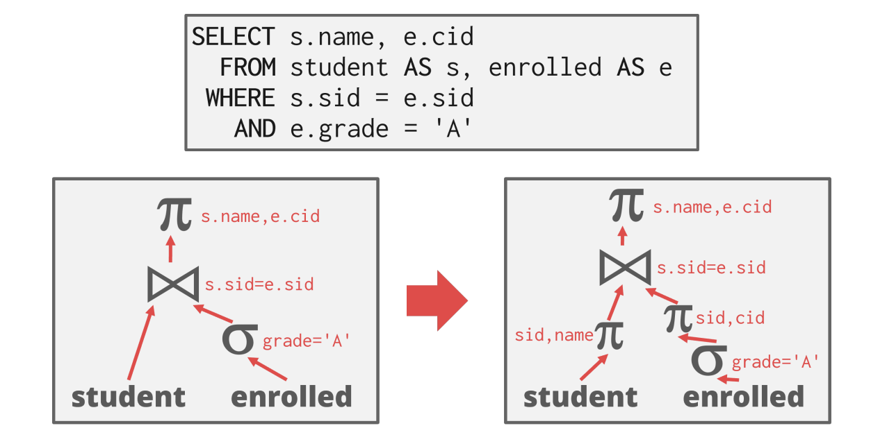

# CMU15-445-04：查询优化

> 这是CMU数据库课程15-445的第四个大的部分，主要讲查询优化相关的内容，在2021秋的课程里应该对应Lecture13-Lecture14，这一部分内容比较少

## 查询优化

SQL语句是声明式的语句，只告诉了数据库系统要做什么，而没有说过要怎么做，因此数据库系统需要自己将SQL语句转化成对应的查询计划，但是一个查询往往可以有多种不同的查询计划，即运算符可以用不同的顺序来执行，那么如何来选择执行效率最高的查询计划呢？这就是这一节需要讨论的问题——我们要对查询进行优化，找到最好的查询。

一般来说常见的查询优化策略有以下两种不同的方式：

- 使用静态规则，也叫做启发式的方法，即利用特定的规则对查询进行优化，移走查询中低效率的部分，这些规则可能需要通过catalog来了解数据库中数据存储的结构，但是不需要对数据本身进行检验
- 基于cost的搜索，将数据读出，并估计出执行不同的等效查询计划的cost，然后选择cost最低的方案执行

查询的优化是数据库中最难搞的一部分工作，数据库系统中通过优化器模块专门来负责对查询进行优化，也有一些数据库系统尝试用机器学习的方法去提高优化器的准确率和效率，但是现在还没有任何一款商业化产品使用这一项技术。

优化器的作用是生成逻辑代数表达式到最优的物理代数表达式之间的映射关系，即将查询转化成逻辑代数表达式，然后进行调优，生成最优的表达式。

## 基于静态规则的优化

### 关系代数的等价性

很多查询优化的方式依赖于等价的关系代数表达式之间的转换，对于同样的数据可以获得同样结果的两个代数表达式就可以认为是等价的，将关系代数表达式转化成等价的关系代数表达式的过程称为查询重写，下图就是一个很典型的例子，这种操作称为谓词下推(predicate pushdown)：

这里实际上就是对几个filter调整了顺序。

### 逻辑查询的优化

常见的查询优化中对于**谓词**有这样几条通用的规则：

- 尽早处理filter的操作(这个过程就叫做predicate pushdown)
- 重新对谓词进行排序，让数据库系统首先处理最具选择性的谓词
- 将一个复杂的谓词拆成多个并且下放

对于投影操作来说，有这样几种优化方式：

- 尽早进行投影操作来缩小操作数据的范围
- 只留下查询需要的，其他的都project out

另外一种常见的优化方式是删除查询条件中不必要的谓词或者对不可能的查询条件进行修改，比如下面这个例子中1=0很明显就是一个不可能的查询条件：

也可以对一些有重复的谓词进行合并：

其他查询优化方式还有：JOIN优化，嵌套子查询的优化等等，嵌套子查询的优化可以概括为：

- 对查询进行重写，把嵌套的子查询合并到主要的查询中
- 对嵌套的查询进行分解并将结果存储到一个临时的表中

## 基于Cost估计的优化

### 什么能算cost

数据库系统中有一个代价模型可以用来估计执行一个查询计划所需要的代价，帮助优化器从各种等价的查询计划中选择出最优的一个。一般来说需要一个查询计划的执行代价取决于以下几个元素：

- CPU的处理时间，虽然很小，但是难以估计
- 磁盘I/O的时间：等价于考虑block transfer的数量，即读取不同的磁盘块的次数
- 内存：使用的DRAM空间
- 网络：通过网络发送的消息的规模

如果采用穷举搜索，对于优化器来说是一个非常大的负担，因为随着查询复杂度的提高，可能的查询计划数量呈现指数级别的增长，因此我们需要控制搜索的空间。

一种方法是在数据库系统中维护一些关于表/属性/索引的统计信息，比如有多少元组，每个属性有多少个不同的值等等，这样一来就可以快速找到代价估计时候要用的关键数据，避免了边查边用，提高代价估计时候的效率。

### 查询基数和基本假设

从存储的这些统计信息中可以估计出一个查询的选择基数(Selection Cardinality)，我们假设关系R中有$N_R$个元组，并且R的属性A的不同取值个数是$V(A,R)$，并且这个查询的筛选条件是A属性，那么查询关于A的选择基数就是：
$$
SC(A,R)=\frac{N_R}{V(A,R)}
$$

- 选择基数代表了对这个关于A的查询**可能获得的结果数量的一个估计**

实际上这里就是**假设了A属性的每种取值情况是均匀分布的**，然后用概率来估计查询结果可能的数量，在代价估计的时候一般都要用到这样几个假设，否则问题太麻烦没法动：

- 数据均匀分布：即大量数据在每个属性上取得每个值的概率是等价的
- 独立性：每个属性之间是独立的，互相不影响
- 包容原则：主要是关于join操作的key的，即内部关系中key的值域和外部关系的key共享

### 其他的估计方式

上面的假设其实是非常强的条件，事实上绝大部分数据都不会满足这些假设，但是为了方便，我们只能做出这样的假设，带来的结果是，代价估计的结果可能不是那么准确，但是正如计算机中很多其他东西那样，只要大部分时候能work，我们就认为它是个好东西，因此也不能苛责这类强假设。

但是抛开这样的假设，依然有别的方法可以估计查询基数，比如基于采样的，和使用直方图反应统计规律等等，但总的来说都是想办法用少量代价来拟合大量数据的概率分布。

本文总阅读量次

