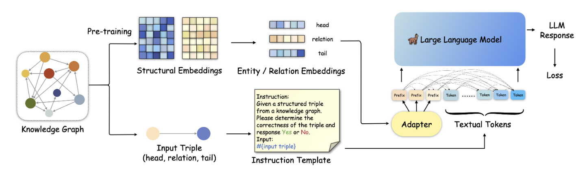
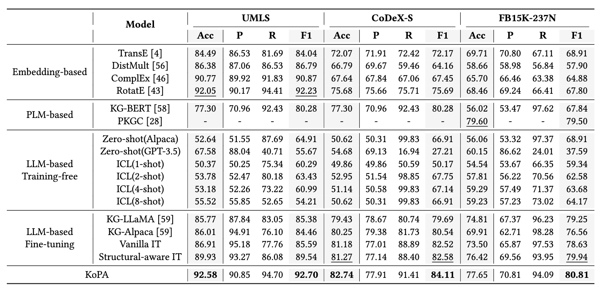

# 论文浅尝：如何大模型更好地完成知识图谱推理？

## 论文链接
Making Large Language Models Perform Better in Knowledge Graph Completion
https://arxiv.org/abs/2310.06671

## 动机
大语言模型凭借其强大的文本理解与生成能力在AI的各个领域中掀起了研究的热潮。大语言模型(LLM)与知识图谱(KG)的结合是未来大语言模型未来的重要发展方向之一。一方面，大模型凭借其丰富的文本理解和生成能力可以完成知识图谱的构建以及推理和补全，另一方面，知识图谱也可以为大模型提供可信的外部知识，缓解大模型中出现的幻觉现象。这篇论文着眼于基于大模型的知识图谱补全(LLM4KGC)，探索了如何才能更好地让大语言模型完成知识图谱补全这项任务。

## 贡献

已有的LLM4KGC的方法往往是通过指令微调的方式，构造提示词模版将一条条的三元组输入大模型中对大模型进行微调，来训练出能够完成KGC任务的LLM，但是这样的方法没有充分利用KG中存在的复杂结构信息，导致LLM无法充分地理解知识图谱中的结构信息，从而限制了LLM解决KGC问题的能力。围绕如何在LLM中引入KG结构信息这一个问题，该文章做出了如下几点贡献：
- 论文探究了在常见的LLM范式(不需要训练的In-Context Learning和需要训练的指令微调)基础上如何引入知识图谱的结构信息，分别提出了一种结构增强的上下文学习方法和结构增强的指令微调方法
- 论文提出了一种知识前缀适配器(Knowledge Prefix Adapter, KoPA)，将KG中提取的结构知识通过一个适配器映射到大模型的文本token表示空间中，并和三元组的文本一起进行指令微调，使得LLM能够充分理解KG中的结构信息，并在结构信息的辅助下完成知识图谱的推理。
- 论文进行了大量的实验，来验证了论文中提出的多种方法的性能，探索最合理的结构信息引入方案。

## 方法

论文首先提出了结构增强的上下文学习和指令微调方法，通过将输入的三元组的局部结构信息通过文本描述的方式添加到指令模版中，实现结构信息的注入。
 

另一方面，论文中提出的知识前缀适配器(KoPA)的主要设计方案如上图所示，首先KoPA通过结构特征的预训练提取知识图谱中实体和关系的结构信息，之后，KoPA通过一个设计好的适配器，将输入三元组对应的结构特征投影到大语言模型的文本表示空间中，然后放置于输入prompt的最前端，让输入的提示词模版中的每个token都能“看到”这些结构特征，然后通过微调的Next Word Prediction目标对LLM的训练。论文对不同的结构信息引入方案进行了对比，对比的结果如下：

 

## 实验

实现部分，该论文选取了三个数据集，进行了三元组分类的实验。三元组分类是一项重要的知识图谱补全任务，旨在判断给定三元组的正确性。论文的主要实验结果如下：
 
可以看到，相比于传统方法、基于大模型的方法和引入结构信息的方法来说，KoPA在三个数据集上的准确率、F1值等指标取得了一定的提升。此外论文还对KoPA中适配器的可迁移性、模块设计的合理性等进行了分析，感兴趣的读者可以通过阅读原论文了解进一步的内容。

## 总结

该论文探索了如何将知识图谱中的结构知识引入大语言模型中，以更好地完成知识图谱推理，同时提出了一个新的知识前缀适配器，将从知识图谱中提取到的向量化的结构知识注入到大模型中。在未来，作者将进一步探索基于大语言模型的复杂知识图谱推理，同时也将关注如何利用知识图谱使得大语言模型能够在知识感知的情况下完成更多下游任务比如问答、对话等等。
