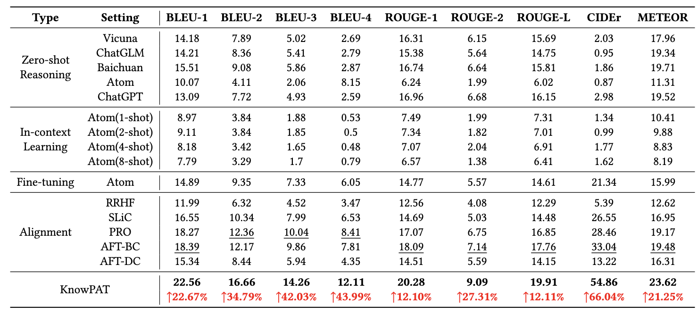

# KnowPAT: 大模型的知识偏好对齐与垂域应用
## 1. 前言
将大语言模型(LLM)用于垂直领域完成问答(QA)、对话(Dialogue)等任务是当前大语言模型研究和落地的重点。对于一些知识密集型的垂直场景，我们往往还拥有领域知识图谱(KG)作为辅助的外部知识源。如何利用好领域知识图谱来完成特定领域的大模型QA，是一个复杂而且充满挑战的问题。

传统的检索增强+有监督微调(SFT)的范式存在两项问题，一是作为特定领域的落地应用，LLM需要是用户友好的，需要用合适的语气和风格生成人类能够接受的回答。二是在检索外部知识的时候，检索召回的知识中可能存在一定的噪声，即对结果无意义的知识，模型需要有良好的判断能力才能避免“误用”检索得到的知识。

本文将介绍一个LLM的**知识偏好对齐**框架KnowPAT，用来同时解决上述两个问题。在KnowPAT中，上面两项问题都被定义成了LLM的偏好问题，一方面，大模型拥有特定的风格偏好(Style Preference)来生成特定的知识，另一方面，大模型拥有知识偏好(Knowledge Preference)来选择检索到的知识。而为了更好地落地应用于实际的场景，大模型的偏好应该与人类的偏好进行对齐，以提升生成回答的质量。KnowPAT统一了两种偏好的对齐，并将作为外部知识源的领域知识图谱引入到了对齐的过程中，以实现Knowledgeable的对齐。

- 论文标题：Knowledgeable Preference Alignment for LLMs in Domain-specific Question Answering
- 论文链接: arxiv.org/abs/2311.06503
- 项目主页: [https://github.com/zjukg/KnowPAT](https://github.com/zjukg/KnowPAT)

## 2. KnowPAT的具体设计
如图所示，KnowPAT的整个pipeline主要分成以下三个部分。

第一部分是无监督的三元组链接，这一部分的主要作用是基于输入的问题从知识图谱中检索出相关的三元组，但是由于输入问题和知识图谱之间没有非常有效的监督信号，所以这个过程中检索出来的多条知识不一定全部是对问题有用的。传统的检索增强方式会将这些检索到的知识包装成prompt并输入模型，这就需要模型能够有良好的判断能力，从检索上来的知识中选择有用的部分加以利用。这就需要后面提到的知识偏好的对齐。

第二部分是知识偏好集的构建，为了让模型的偏好和人类的偏好对齐，我们需要在原本的数据集基础上为每条QA对构建偏好集。偏好集中的每个问题将对应多个不同质量的回答，同时用人类的偏好对其进行排序。构建的偏好集又分为两个部分，分别是风格偏好集和知识偏好集。对于风格偏好集，KnowPAT采用不同的LLM生成不同质量的回答。对于知识偏好集，KnowPAT采用了不同质量的知识三元组作为背景知识输入LLM中以获得不同质量的答案。两种偏好集中，每个问题对应的多个答案将根据人工定义的偏好规则进行打分。

第三部分是模型的微调和对齐，KnowPAT在基础的有监督微调的基础上，增加了新设计的对齐损失，同时KnowPAT在对齐损失中增加了一项自适应的动态权重来控制偏好集中不同回答在对齐损失中的权重。

## 3. 实验探究

KnowPAT在华为提供的云产品领域问答数据集上进行了实验，选取了15种不同的LLM模型以及微调和对齐的方法作为基线模型，并通过自动化指标测评、人工测评等多种方式对模型的结果进行了评估。可以看到，模型相比于基线方法而言，在华为的领域问答场景中取得了明显的提升。

同时也进行了消融实验验证每个模块设计的有消息，此外，KnowPAT设计了通用能力保留实验来验证了模型在领域外的各项能力的保留情况。

可以看到，相比于其他基线模型而言，KnowPAT方法进行对齐的模型在各种通用能力上的保留程度也总体更好一些。