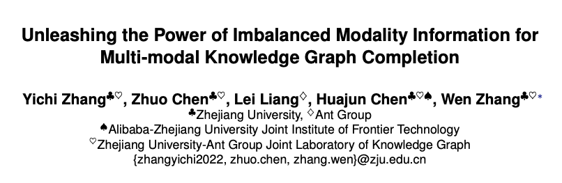
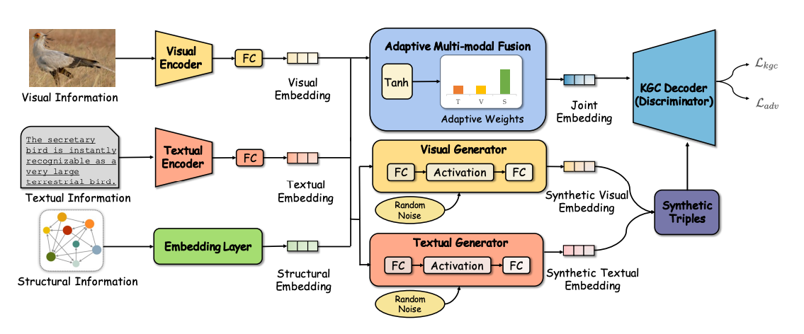
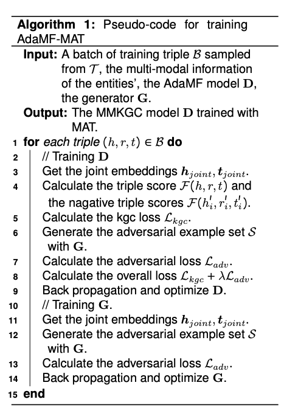
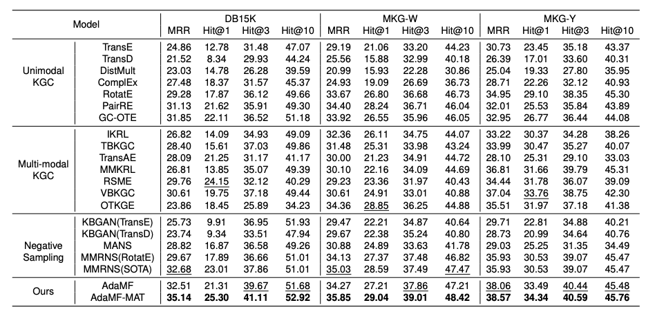

# 不平衡场景下的多模态知识图谱补全

论文题目：Unleashing the Power of Imbalanced Modality Information for Multi-modal Knowledge Graph Completion

本文作者：张溢弛（浙江大学）、陈卓（浙江大学）、梁磊（蚂蚁集团）、陈华钧（浙江大学）、张文（浙江大学）

发表会议：COLING 2024

论文链接：https://arxiv.org/abs/2402.15444

代码链接：https://github.com/zjukg/AdaMF-MAT

## 引言
多模态知识图谱补全（MMKGC）通过将实体的结构、视觉和文本信息纳入知识图谱的表示学习模型中，来预测多模态知识图谱中缺失的三元组。在这个过程中，来自不同模态的信息将共同用于度量一个三元组的合理性。现有的MMKGC方法往往默认MMKG上的模态信息是完整的，或者采用简单的方法完成缺失模态信息的补全，忽视了实体之间模态信息的不平衡问题，导致模态信息融合不充分以及原始模态信息的低效利用。
模态信息的不平衡性主要体现在两个方面，首先，在知识图谱推理时，不同的模态信息发挥着独特的作用，应该被自适应地考虑。然而，现有方法未能充分解决模态融合问题，因为模态信息通常被不灵活地统一地融入到结构信息的表示空间中。其次，在图像和文本描述中，有效的特征通常是有限的且难以提取。在实际场景中，从多个异构数据源构建的知识图谱甚至可能存在模态缺失，这进一步限制了MMKGC中模态信息的使用。为了实现更好的MMKGC性能，关键是有效利用基本信息以及获取更高质量的多模态信息。这种需求可以总结为释放不平衡模态信息的力量以用于MMKGC。
为解决上述问题，我们提出了自适应多模态融合和模态对抗训练（AdaMF-MAT）来释放不平衡模态信息的力量以用于MMKGC。AdaMF-MAT通过自适应模态权重实现多模态融合，并通过模态对抗训练进一步生成对抗样本以增强不平衡模态信息。我们的方法是MMKGC模型和训练策略的共同设计，可以优于19个最近的MMKGC方法，并在三个公共MMKGC基准测试上取得了新的最先进结果。

## 方法
论文中提出的方法的总体框架如下图所示。特征编码器被设计用于分别编码不同的模态特征（视觉/文本/结构）。每个FC代表一个全连接的投影层。自适应多模态融合模块被设计用于自适应地获取融合的联合嵌入。模态对抗训练模块采用生成器生成合成的多模态嵌入以构建对抗样本。KGC解码器充当对抗训练过程中的判别器，在训练过程中将通过这些对抗样本得到增强。

在模态对抗训练的过程中，论文采用了一个两层的MLP作为生成器，针对输入的实体结构信息生成其视觉和文本的特征，并进一步讲这些特征组合成一个个"人造实体"，再进一步组合成"人造三元组"，然后通过在这些人造三元组和真实的三元组之间进行对抗式的训练，来达到增强实体的多模态信息，缓解其不平衡分布的问题。整个算法流程的伪代码如下：

## 实验与分析

实验部分，论文采用了三个MMKG基准数据集DB15K, MKG-W和MKG-Y来进行连接预测的实验，同时选取了19个不同的知识图谱补全方法(含单模态方法、多模态方法、负采样方法等三类)。主要的实验结果如下：

从实验结果中可以看到本论文提出的方法相比于基线模型有非常大的提升，在MRR和Hit@1等指标上分别提升了6%和8%，同时实验进行了更多的实验来验证了该方法在不同程度的模态缺失场景下的能力，结果表明相比于其他baseline模型，本文提出的模型有明显的性能提升，同时，模态对抗训练可以作为一个通用的模块，在不同的MMKGC模型中都起到增强有限模态信息的作用。

## 总结

在这篇论文主要讨论了在多模态知识图谱补全（MMKGC）中利用模态信息的问题，并提出了一个名为AdaMF-MAT的新颖多模态知识图谱补全框架，以解决现有方法的局限性。现有利用模态特征的方法相对粗糙，以一种通用的方式对待模态信息。论文中的方法AdaMF-MAT采用自适应模态融合来多样化利用多模态信息，并通过模态对抗训练来增强多模态嵌入。实验表明，AdaMF-MAT能够胜过所有现有的基线方法，并在MMKGC任务中达到最佳状态（SOTA）结果。