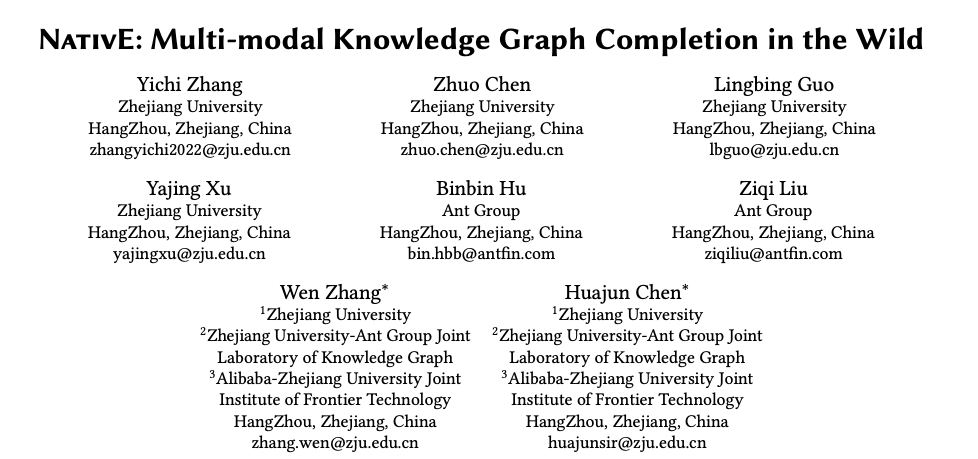
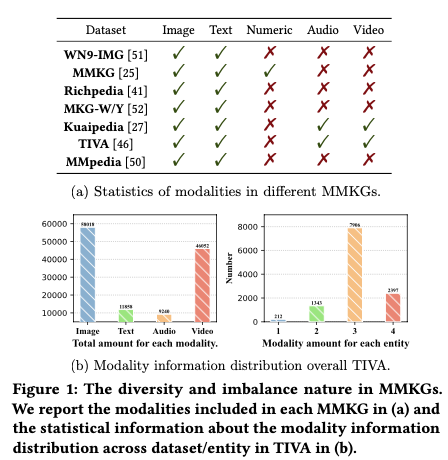
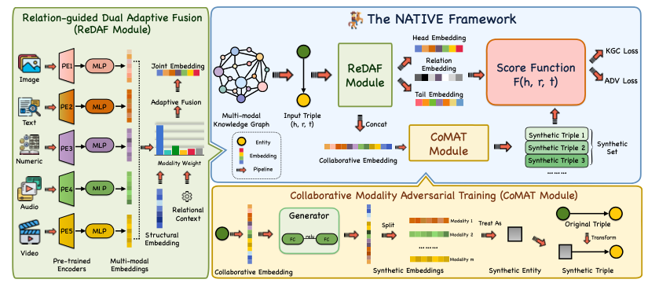
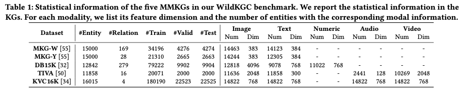
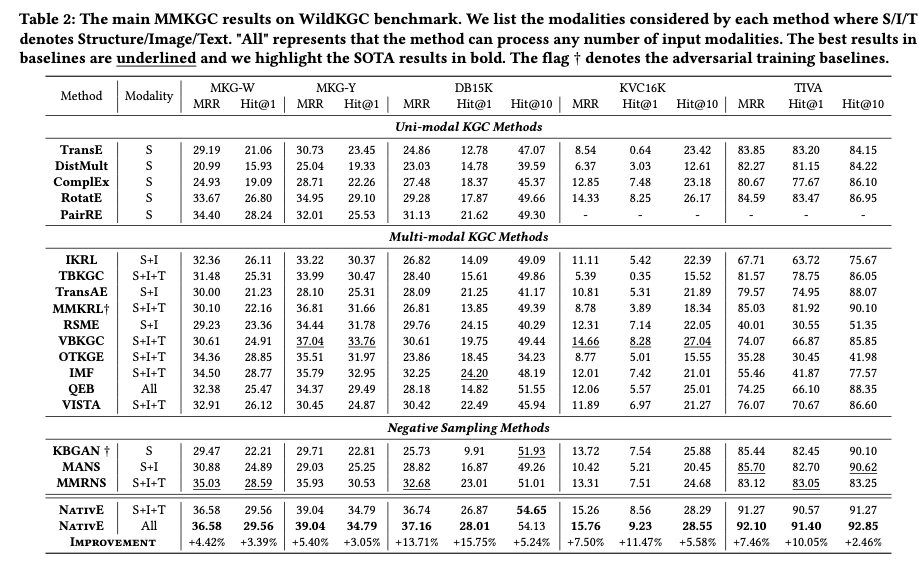
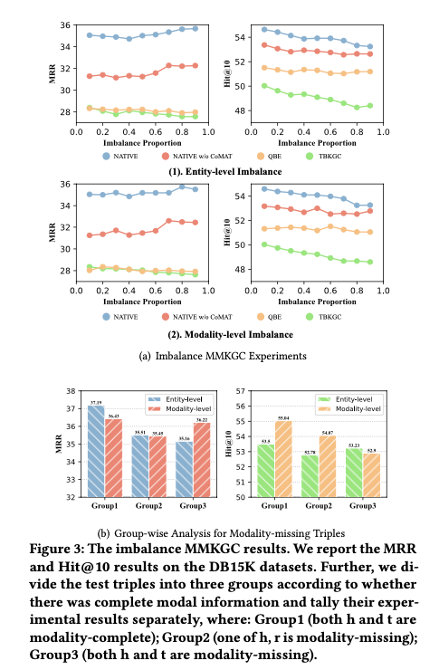

# 复杂场景下的多模态知识图谱补全

论文题目：Multi-modal Knowledge Graph Completion in the Wild

本文作者：张溢弛（浙江大学）、陈卓（浙江大学）、郭凌冰（浙江大学）、徐雅静（浙江大学）、胡斌斌（蚂蚁集团）、刘子奇（蚂蚁集团）、张文（浙江大学）、陈华钧（浙江大学）

发表会议：SIGIR 2024

论文链接：https://www.techrxiv.org/doi/full/10.36227/techrxiv.171259566.60211714 (ArXiV版处于On Hold状态)

代码链接：https://github.com/zjukg/NATIVE

## 引言
多模态知识图谱补全（MMKGC）旨在通过对实体的三元组结构和多模态信息进行协同建模，从给定的多模态知识图谱中自动发现未观察到的事实知识。然而，现实世界中的多模态知识图谱补全任务，因其多样性和不平衡性而面临挑战，这意味着模态信息不仅涵盖了多样化的类型（如图像、文本、数字、音频、视频），并且这些模态信息在实体间的分布并不均衡，从而导致某些实体的一部分甚至全部模态信息缺失。现有的研究通常只关注图像和文本等常见模态，并且也忽视了模态信息分布不均衡的现象。下图统计了已有的经典MMKGC基准数据集中涵盖的多模态信息种类以及分布情况。可以发现，已有的MMKG数据集面临着非常明显的模态信息分布不均衡问题。

为了解决这些问题，我们提出了一个综合框架 NativE，以在更复杂的环境中实现多模态的知识图谱推理。NativE 提出了一个关系引导的双自适应融合模块，可实现任何模态的自适应融合，并采用了一个协作模态对抗训练框架来增强不平衡的模态信息。我们用五个数据集构建了一个名为 WildKGC 的新基准来评估我们的方法。与多个最新基准的实证结果比较证实了我们方法的优越性，我们的方法在不同数据集和各种场景中始终保持最先进的性能，同时保持高效和通用性。

## 方法
在 NativE 中，在常规的模态特征编码之外，我们设计了两个新模块，即关系引导的双重自适应融合和协作模式对抗训练，以解决上述问题。模型整体的架构如下图所示：

为了提取实体中包含的丰富语义信息，通常需要对这些多模态嵌入进行融合。现有方法通常采用融合机制，如连接（concatenation）、点积（dot product）或门控（gating）来完成模态融合。然而，这些方法主要是针对特定模态（如文本和图像）设计的，可能无法充分满足与更丰富的混合模态交织在一起的场景。此外，考虑到 KG 固有的不平衡性，不同的模态需要扮演不同的角色，并为不同情境下的稳健预测提供不同的证据。为了解决上述问题，我们在框架中提出了一个关系引导的双重自适应融合(Relation-guided Dual Adaptive Fusion, ReDAF)模块。ReDAF包括一个自适应融合机制，使用一组针对不同模态的自适应权重，当模态信息不平衡时，可以对其进行动态调整。例如，当某个模态缺失且相应的模态嵌入被随机初始化时，该模态的自适应权重就会降低。同时，我们还设计了一个relational-wise temperature来进一步调节权重分布，从而为实体表征提供关系上下文。这就导致了模态的权重可以在不同实体和不同关系上下文下的动态调整。

尽管在不平衡和多样化的多模态数据中实现了双自适应多模态融合，但所提出的ReDAF框架的关键功能本质上是为预测进行特征选择，保留了原有的不平衡模态信息。受生成对抗网络思想的启发，我们提出了一个协作模态对抗训练(Collaborative Modality Adversarial Training, CoMAT)模块来增强模态嵌入。CoMAT模块通过对抗训练来增强多模态嵌入，使用特定实体的协作模态数据来平衡多模态信息分布。具体来说，CoMAT中设计了一个生成器，对输入的实体多模态信息进行降噪处理，以此来完善实体各个模态的信息。同时，通过在训练的过程中，将MMKGC的打分模型(即判别器)和生成器进行交替的对抗训练，来达到两者互相增强的目的。

## 实验与分析

为了在更加复杂多样的环境中更好地探索 MMKGC 任务，我们构建了一个新的 MMKGC 基准，其中包括五个不同的数据集。其中四个数据集来自之前的研究，一个数据集则是全新的。我们的基准包括以下数据集：
- MKG-Y和MKG-W是由YAGO和 Wikidata派生的两个 MMKG
- DB15K是 DBpedia [26] 的一个子集
- TIVA是一个包含图像、文本、音频和视频信息的 MMKG，有12K个实体
- KVC16K由视频概念百科KuaiPedia修改而成，我们将其重组为 MMKG，并利用原作者提供的图像/文本/音频/视频特征作为实体的多模态特征。

这五个数据集的统计信息入下表所示：

实验部分选取了21个不同的知识图谱补全方法(含单模态方法、多模态方法、负采样方法、融合数值特征的方法等四大类)。主要的实验结果如下：

实验结果显示，NativE的性能优于所有现有基线，并取得了新的SOTA结果。具体来说，NativE在DB15K（15.75%）、KVC16K（11.47%）和TIVA（10.05%）的Hit@1上都大幅超越了基线，这表明NativE的精确推理能力有了显著提高。当仅采用大多数主流方法所考虑的常见模态（结构/图像/文本）时，NativE的性能仍然优于基线方法，这表明它能够有效利用不同模态的信息。与两种基于对抗的方法MMKRL和KBGAN的性能比较表明，我们的对抗模块设计能够充分发挥实体多模态信息的威力，具有卓越的效果。

同时，NativE进行了模态不平衡场景下的实验，实验主要考虑了两种模态缺失的设定(实体级缺失、模态级缺失)，并设置了不同的缺失率。从上图的实验结果中可以看出，NativE在各种复杂的模态信息缺失场景下，依然有良好的表现。此外论文中还进行了通用性实验和效率实验，验证了NativE的设计可以支持多种不同的MMKGC基础模型，同时保持着较高的训练和推理速度。

## 总结

在本文中，我们提出了一个新颖的 MMKGC 框架 NativE 来纠正 MMKG 的多样性和不平衡问题。NativE提出了一种关系引导的双重自适应融合方法，以纳入任何模式的自适应特征来获得联合表征，同时通过一种基于WGAN的训练策略来增强不平衡模式的信息。我们进行了深入的理论分析，以证明我们设计的合理性。我们构建了一个新的 MMKGC 基准，并针对21个基线模型进行了全面的实验和性能对比，以展示我们框架的有效性、通用性和效率。