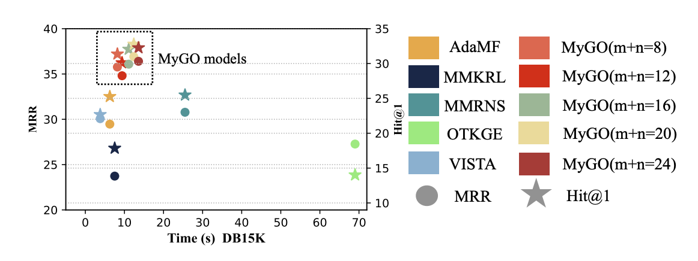

# 基于模态分词的细粒度实体表示学习框架

论文题目：Tokenization, Fusion, and Augmentation: Towards Fine-grained Multi-modal Entity Representation

本文作者：张溢弛（浙江大学）、陈卓（浙江大学）、郭凌冰（浙江大学）、徐雅静（浙江大学）、胡斌斌（蚂蚁集团）、刘子奇（蚂蚁集团）、张文（浙江大学）、陈华钧（浙江大学）

发表会议：AAAI 2025

论文链接：https://arxiv.org/pdf/2404.09468

代码链接：https://github.com/zjukg/MyGO

## 引言
多模态知识图谱补全（MMKGC）旨在从给定的知识图谱中发现未观察到的知识，协同利用来自三元组的结构信息和实体的多模态信息来克服知识图谱固有的不完整性。现有的 MMKGC 方法通常通过预训练模型提取多模态特征，并进行简单的融合，结果导致粗略处理多模态实体信息，忽略了细微、精细的语义细节及其复杂的相互作用。

为解决这一不足，我们引入了一个新颖的框架 MyGO，用于切分、融合和增强细粒度多模态实体表征，并增强多模态知识图谱的多模态实体识别能力。实体的细粒度多模态表征，并提高 MMKGC 的性能。受标记化技术的启发，MyGO 将多模态实体信息标记为细粒度的离散标记，并通过跨模态实体编码器学习实体表征。为了进一步增强多模态表征，MyGO 加入了细粒度对比学习，以突出实体表征的特殊性。论文在标准的 MMKGC 基准上进行的实验表明，我们的方法超过了 19 种最新模型，从而彰显了其卓越的性能。如下图所示，我们的方法和传统的MMKGC方法最大的区别在于，通过引入了各种模态的分词器（Tokenizer），进行了更加细粒度的表示学习架构的设计。

 

## 方法
我们的设计有三个关键组件：模态分词、层级化三元组建模，以及细粒度对比学习，如下图所示：

### 模态分词

为了捕捉细粒度的多模态信息，我们提出了一个模态标记化 (MT)模块，将实体的原始多模态数据处理为细粒度的离散语义标记，作为语义单元以学习细粒度的实体表示。我们分别为图像模态和文本模态使用标记器，分别记作$\mathcal{Q}_{img}$和$\mathcal{Q}_{txt}$，用于为实体$e$生成视觉标记$v_{e, i}$和文本标记$w_{e, i}$：

$$
\mathcal{U}_{img}(e) = \{v_{e, 1}, v_{e, 2},\cdots, v_{e, m_e}\} = \mathcal{Q}_{img}(\mathcal{V}(e))
$$

$$
\mathcal{U}_{txt}(e) = \{w_{e, 1}, w_{e, 2},\cdots, w_{e, n_e}\} = \mathcal{Q}_{txt}(\mathcal{D}(e))
$$

其中，$m_e, n_e$表示每种模态的标记数量，我们用$\mathcal{U}(e)$表示实体$e$的集合标记集。文本标记来自于语言模型的词汇表，而视觉标记则来自于预训练视觉标记器的代码簿。需要注意的是，$\mathcal{V}(e)$可能由多张图像组成，我们对每张图像进行处理并将标记累积到$\mathcal{U}_{img}(e)$中。

在标记化过程中，常常会遇到重复的标记。因此，我们统计每个标记的出现频率，并保留每种模态中最常见的预定数量的标记。此外，我们还会去除文本描述中的停用词，因为它们对实体语义的贡献较小。经过MT和优化处理后，我们可以得到处理后的标记集$\mathcal{U}_{img}'$和$\mathcal{U}_{txt}'$，每个实体$e$具有$m$个视觉标记和$n$个文本标记，这些标记包含了来自原始多模态数据的重要特征。随后，我们为$\mathcal{U}_{img}'$和$\mathcal{U}_{txt}'$中的每个标记分配一个单独的嵌入向量。此方法考虑到不同实体可能共享相同的标记，通过为标记分配个性化的嵌入向量，可以更细致地表示跨不同实体的相似特征，从而丰富实体的多模态语义单元表征。

### 层次化三元组建模

在MT处理之后，我们进一步设计了一个**层次三元组建模 (HTM)** 模块。HTM利用层次化的Transformer架构来捕捉多模态实体表示，并以层次化的方式建模三元组的可行性，包含三个组件：跨模态实体编码器、上下文三元组编码器和关系解码器。

#### 跨模态实体编码器

跨模态实体编码器（CMEE）旨在通过利用实体的细粒度多模态标记来捕捉实体的多模态表示。与现有的方法不同，MyGO执行细粒度标记化并获得一系列离散的标记。因此，我们设计了一种更加**细粒度的特征交互方法**，允许所有不同模态的信息进行充分交互。在MyGO中，我们应用Transformer层作为CMEE。我们首先将多模态标记线性化为一个序列：

$$
\mathcal{X}(e)=([\mathtt{ENT}], s_e, v_{e, 1},\cdots, v_{e, m}, w_{e, 1},\cdots, w_{e, n})
$$

其中，$[\mathtt{ENT}]$是一个特殊标记，$s_e$是一个可学习的嵌入向量，表示实体的结构信息。$[\mathtt{ENT}]$类似于BERT中的$[\mathtt{CLS}]$标记，用于捕捉下游预测的序列特征。$s_e$是一个可学习的嵌入向量，表示从现有三元组结构中学习到的结构信息，在训练过程中进行优化。

此外，对于来自$\mathcal{U}_{img}'$和$\mathcal{U}_{txt}'$的多模态标记，我们冻结其由标记器派生的初始表示，并定义线性投影层$\mathcal{P}_{img}, \mathcal{P}_{txt}$，将它们投影到与

$$
\widehat{v}_{e, i}=\mathcal{P}_{img}({v}_{e, i})+b_{img}\quad\widehat{w}_{e, j}=\mathcal{P}_{txt}({v}_{e, j})+b_{txt}
$$

相同的表示空间中，其中$b_{img}, b_{txt}$是定义的模态偏置，用于增强来自不同模态的信息标记。这样，最终输入到CMEE的序列变为

$$
{\mathcal{X}_{input}(e)}=([\mathtt{ENT}], s_e, \widehat{v}_{e, 1},\cdots, \widehat{v}_{e, m}, \widehat{w}_{e, 1},\cdots, \widehat{w}_{e, n})
$$

跨模态实体表示通过以下公式获得：

$$
\mathbf{e}=\mathbf{Pooling}(\mathbf{Transformer}(\mathcal{X}_{input}(e)))
$$
其中，$\mathbf{Transformer}()$表示Transformer编码器层，$\mathbf{Pooling}$是池化操作，用于获取特殊标记$[\mathtt{ENT}]$​​的最终隐藏表示。这允许输入序列中的每个标记通过CMEE动态地被突出显示以进行交互，并最终学习到具有表现力的实体表示。

#### 上下文编码器

为了在关系上下文中实现充分的模态交互，我们应用另一个Transformer层作为**上下文三元组编码器 (CTE)**，用于编码给定查询的上下文嵌入向量。以头部查询$(h, r, ?)$（尾部预测）为例，我们可以获得上下文嵌入向量$\tilde{\mathbf{h}}$，其计算公式为：

$$
\tilde{\mathbf{h}} = \mathbf{Transformer}([\mathtt{CXT}], \mathbf{h}, \mathbf{r})
$$

其中，$[\mathtt{CXT}]$是输入序列中的一个特殊标记，用于捕捉实体的上下文嵌入向量，$\mathbf{h}$是来自CMEE的头部实体$h$的输出表示，$\mathbf{r}$是关系嵌入向量，$r \in \mathcal{R}$。查询$(h, r, ?)$的上下文嵌入向量随后会通过关系解码器进行处理，以预测实体。

#### 关系解码器

此外，我们使用一个得分函数$\mathcal{S}(h, r, t)$来通过产生一个标量得分来衡量三元组的可行性，该得分作为查询预测的关系解码器。在MyGO中，我们采用Tucker作为得分函数，分数的计算过程可以表示为：

$$
\mathcal{S}(h, r, t) = \mathcal{W}\times_1\tilde{\mathbf{h}}\times_2\tilde{\mathbf{r}}\times_3\mathbf{t}
$$

其中，$\times_i$表示沿第$i$维的张量积，$\mathcal{W}$是训练过程中学习得到的核心张量。我们对每个三元组使用交叉熵损失训练模型。我们将$t$视为对整个实体集$\mathcal{E}$的黄金标签，这与头部预测是相同的。因此，目标是最小化交叉熵损失：

$$
\mathcal{L}_{head}=-\sum_{(h, r, t)\in\mathcal{T}}\log\frac{\exp(\mathcal{S}(h, r, t))}{\sum_{t'\in\mathcal{E}}\exp(\mathcal{S}(h, r, t'))}
$$

注意，我们使用头部实体$h$的上下文嵌入向量$\tilde{\mathbf{e}}_h$和尾部实体$t$的多模态嵌入向量$\mathbf{e}_t$来计算得分，这样可以加速计算。否则，我们需要为不同的关系下的所有候选实体提取上下文嵌入向量，这将需要$O(|\mathcal{E}| \times |\mathcal{R}|)$级别的前向传递，并大大增加模型的计算量。

此外，MyGO考虑了头部预测和尾部预测，目标$\mathcal{L}_{tail}$在给定尾部查询$(?, r, t)$时是类似的。整体的MMKGC任务目标可以表示为：

$$
\mathcal{L}_{kgc}=\mathcal{L}_{head}+\mathcal{L}_{tail}
$$

### 细粒度对比学习

基于上述设计，我们已经能够训练和测试MMKGC模型。为了进一步增强细粒度且鲁棒的多模态实体表示，我们在MyGO中引入了**细粒度对比学习 (FGCL)**模块，通过对实体表示进行多尺度的对比学习，来实现这一目标。

如前所述，CMEE旨在通过多模态标记序列来捕捉实体表示。受SimCSE思想的启发，我们通过对比学习来增强这些实体表示。具体来说，给定一个实体$e$，我们可以通过两次前向传递从CMEE中得到两个表示$\mathbf{e}$和$\mathbf{e}_{sec}$。这两个嵌入向量之间的变化是由Transformer编码器中的dropout层引起的，这使得多模态标记特征的部分去激活，有效地作为一种简单的数据增强方式。通过批内对比学习在一组实体之间，MyGO能够从标记序列中提取出真正重要的信息，从而增强每个实体表示的独特性。为了进一步加深这一过程的粒度，我们进一步从Transformer的输出中提取了三个额外的表示，表示实体特征的不同视角。我们可以定义输入序列${\mathcal{X}_{input}(e)}$中的多模态标记的输出表示为：

$$
{\mathcal{X}_{output}(e)}=([\mathtt{ENT}]', s_e', \widehat{v}_{e, 1}',\cdots, \widehat{v}_{e, m}', \widehat{w}_{e, 1}',\cdots, \widehat{w}_{e, n}')
$$

然后我们引入三个嵌入向量$\mathbf{s}(e), \mathbf{v}(e), \mathbf{w}(e)$ 来表示实体 $e$的全局、视觉和文本信息。$\mathbf{s}(e)$是通过对$\mathcal{X}_{output}(e)$中所有输出表示的平均值来得到的。类似地，$\mathbf{v}(e)$和$\mathbf{w}(e)$分别是对应的视觉和文本标记的平均值。它们可以表示为:

$$
\begin{aligned}
            \mathbf{s}(e)=&\mathbf{Mean}(\mathcal{X}_{output}(e))\\
            \mathbf{v}(e)=\frac{1}{m}\sum_{i=1}^{m}&\widehat{v}_{e, i}' \quad
    \mathbf{w}(e)=\frac{1}{n}\sum_{i=1}^{n}\widehat{w}_{e, i}'
    \end{aligned}
$$

在这些嵌入向量中，$\mathbf{e}_{sec}$和$\mathbf{s}(e)$包含了$e$的全局信息，而$\mathbf{v}(e)$和$\mathbf{w}(e)$则由实体$e$的局部模态信息组成。对于每个实体$e$，我们可以将其对比学习的候选集定义为$\mathcal{C}(e) = {e_{sec}, \mathbf{s}(e), \mathbf{v}(e), \mathbf{w}(e)}$，它由其全局和局部特征组成。$(\mathbf{e}, \mathbf{e}')$，其中$\mathbf{e}' \in \mathcal{C}(e)$，被视为正样本。然后，我们使用批内负采样来构造负样本对，最终的目标函数可以表示为：

$$
\mathcal{L}_{con}=-\sum_{i=1}^{\mathcal{B}}\sum_{e'_i\in\mathcal{C}(e_i)}\log\frac{\exp(\mathbf{cos}(\mathbf{e}_i, \mathbf{e}_i')/\tau)}{\sum_{j=1}^{\mathcal{B}}\exp(\mathbf{cos}(\mathbf{e}_i, \mathbf{e}_j')/\tau)}
$$

其中，$\mathcal{B}$是批大小，$\mathbf{cos}(\cdot, \cdot)$是两个嵌入向量的余弦相似度，$\tau$是温度超参数。通过这种FGCL过程，MyGO显著提高了其识别不同实体的细节多模态属性的能力，从而提升了MMKGC任务中的模型表现。最终，我们框架的整体训练目标可以表示为：

## 实验与分析

实验部分，我们主要在DB15K，MKG-W和MKG-Y三个公开的标准数据集上进行了实验。

### 主实验

首先，我们可以发现MyGO在所有评估指标上都优于所有基线方法，在两个数据集上取得了新的一流性能。结果表明，自适应 MMKGC 方法普遍优于静态方法。同时，与其他自适应方法不同的是，MyGO采用了更精细的特征处理，并通过模态标记化和分层三重建模进行融合。由于现有方法往往只为每种模态设置一个特征（嵌入向量），MyGO通过对现有原始数据进行标记化来获取更多细粒度特征，并通过与 HTM 中基于变换器的编码器进行细粒度交互式融合来提高模型性能。

此外，横向比较各个指标的改进，我们可以发现MyGO在Hit@1和MRR上的改进明显高于Hit@10和其他指标。例如，在DB15K上，MyGO在Hit@1上提高了18.4%，但在Hit@10上只提高了1%。这凸显了MyGO通过其复杂的设计显著提高精确推理能力的能力。

### 探索性实验

#### 多张图片场景下的实验结果

我们进行了在多张图片下的MMKGC实验，通过保留不同数量的图像来评估模型对图像信息的利用能力。上图中描述的结果突出表明，与其他基线相比，MyGO即使在面对越来越多的多模态数据时，也能实现令人印象深刻的性能提升，因为MMKGC的性能呈现出明显的上升趋势。相反，基线性能则有些不稳定，会随着图像量的增加而出现波动，整体效果与MyGO并不匹配。我们将这一现象归因于不同方法处理模态信息的方式不同。当前的模型通常会从实体的多个原始数据中生成特定模态的嵌入向量，从而丢失了初始特征的基本原始信息。然而，MyGO通过模态标记化设计将信息处理成细粒度的语义单元，保留了最经常出现的成分。通过这种技术，MyGO掌握了即使特定模态数据量扩大，也能保留模态中一般和统一信息的能力，使我们的方法更具稳定性和可扩展性。

#### 标记数量的影响

另一个值得研究的方面与我们在 MT 中设置的两个标记量超参数 $m$ 和 $n$ 有关。这些参数决定了 CMEE 所保留和处理的高频多模态标记的数量。更多的标记与模型中更复杂的交互相关联，其时间效率将提高 $O((m+n)^2)$。这是因为 CMEE 中使用的 Transformer 层的时间复杂度与序列长度的二次方呈正相关。因此，我们探讨了 MMKGC 在参数 $m$ 和 $n$ 变化时的性能。 实验结果以三维条形图的形式如图所示。从图中我们可以观察到，随着标记数 $m$ 和 $n$ 的增加，模型性能呈现出先上升后下降的趋势。

#### 不同的分词器的影响

为了进一步探索MyGO对不同标记符的鲁棒性，我们在 DB15K 上使用了更多种类的视觉分词器（BEiT 和 VQGAN）和文本分词器（BERT、RoBERTa 和 Llama）。 图中展示了 MMKGC 及其组合的结果。我们可以得出结论，MyGO在不同的标记符号化器中都是稳定而稳健的，这表明MyGO是一个可通用的通用框架，可以整合不同的多模态骨架。此外，我们还可以发现，像 Llama这样的大模型可以带来更好的性能，这证明了我们的方法与最新的 LLM 技术相结合的可能性。

### 效率实验

为了验证MyGO的效率，我们进行了一次效率实验。如图所示，我们将MyGO在不同的$m$和$n$条件下的训练效率和最终预测结果与最近的几种基线进行了比较。我们发现，MyGO在保持相对较好的效率的同时实现了最好的性能，实现了性能和效率之间的权衡。此外，我们还可以观察到，代币总量（$m+n$）对效率的影响很小。当 $m+n$ 从 8 个增加到 24 个时，MyGO 的效率从大约 8s 上升到大约 13s，这在实践中还是可以接受的。

### 消融实验

为了证实MyGO中每个模块的有效性，我们进一步从两个角度进行了消减研究：模型设计和FGCL损耗。我们删除了不同设置下的相应模块，并进行了MMKGC实验。实验结果如表所示。 根据第一部分的实验结果，我们在骨干网络、模态标记化过程和过滤过程中设计的所有核心模块都对最终预测结果产生了关键影响。此外，FGCL 的设计也对模型性能有所影响，其中 $\mathcal{C}(e)$ 中的对比候选码对实现 SOTA 性能至关重要。同时，我们探索了 FGCL 的损失权重 $\lambda$ 的影响。当我们在$\{1, 0.1, 0.01, 0.001\}$ 中调整$\lambda$时，MMKGC结果呈现出先上升后下降的趋势，并在$\lambda=0.01$时达到了最先进水平。总的来说，我们可以发现影响整体性能最关键的模块是 CMEE 和 CTE，它们提取细粒度的上下文实体表征，从而进行模态感知的三重预测。FCGL 模块在骨干的基础上进一步提高了模型的性能。

## 总结

在本文中，我们重点讨论了在 MMKG 中捕捉细粒度语义信息的问题。我们提出了一个新框架MyGO 来处理、融合和增强多模态实体表征。公共基准实验证明了我们设计的有效性、可靠性、合理性和可解释性。未来，我们将专注于处理和解释 MMKG 中的细粒度多模态信息。