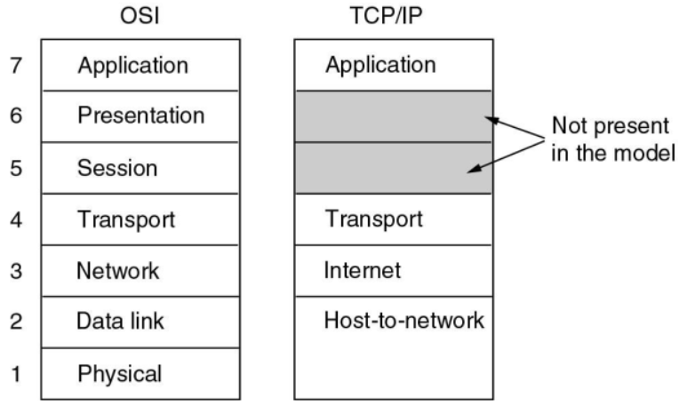

# 计算机网络1：导论

#### Randomstar 2020.09-2021.01

- 成绩组成
  - 平时成绩 50%
    - 平时小作业
    - 8个lab
    - 课堂表现和quiz
  - 期末考试 50%

## Chapter1.  Introduction

### 1.1 网络模型

- OSI 七层模型：三个重要概念：服务，接口和协议
  - 物理层：在一条通信信道上传输比特
    - 要确定用什么电子信号表示0和1，一个比特持续多久，传输是否可以双向，连接如何建立等等
  - 数据链路层：发送方将输入数据拆分成若干数据帧(frame)，然后按照一定的顺序来发送这些数据帧
    - 接收方必须确认收到的每一帧，保证数据的顺序和完整性，然后发回确认帧
    - 为了防止发送方淹没慢速的接收方，需要对流量进行调节
    - **介质访问控制子层**则是控制对共享信道的访问，没有拥塞控制的功能
  - 网络层：控制子网的运行，将数据包从源端发送到接收方，需要处理拥塞
    - 允许异构的网络相互连接成互联网络
  - 传输层：接受会话层的数据，将数据分割成小单元，然后传到网络层
    - 传输层是真正的端到端的层，始终将源数据从源端带到接收方
    - OSI模型中1-3层是链式连接的，而4-7层是端到端的
  - 会话层：负责管理主机间的会话进程，利用传输层提供的端到端的服务，向表示层提供增值服务，主要表现为**表示层实体或者用户进程**建立连接并在连接上传输数据
    - 这一过程也称为建立同步
  - 表示层：关注传递信息的语法和语义，主要是实现数据的格式转换和压缩
  - 应用层：包含了各种各样的协议，提供了用户和网络的接口
    - 软件开发基本都是应用层的工作

  

  - **几种常见设备所处的OSI七层模型的层级：**
    - 路由器：网络层
    - 交换机：数据链路层
    - 集线器：物理层

- TCP/IP
  - 原本是Linux/Unix下的一个网络通信栈，比较OSI七层模型简单
  - **没有表示层和会话层**，物理层和数据链路层Host-to-network
  - 因为开放，所以用的人多，所以成为了互联网的标准
  - 混合模型 hybrid model——本课程讨论的模型
    - 物理层
    - 数据链接层
    - 网络层：可能分为内层和外层
    - 传输层
    - 应用层

### 1.2 协议架构

- 几个关键词：
  - Protocol 协议
  - Layer 层
  - Peers 对等——不同的host之间存在对等的协议层
  - Interface 接口——传输的过程中上层协议会调用下层协议的接口
  - Protocol Stack 协议栈
- 数据传输的过程：
  - 在source machine中，数据自顶向下传输，每一层会给上一层传输的数据包添加一个header，如果传输的数据包过大则会把数据包进行拆分，但是**header不会进行拆分** 
  - 在destination machine中，则一步步去掉底层的header，并将小的数据包合并

### 1.3 服务 Service

- 服务类型

  - 面向连接的服务 connection-oriented
    - Reliable message stream 可信信息流，比如page的序列
    - Reliable byte stream 可信字节流，比如远程登录，TCP/IP协议向应用层发送的是字节流
    - Unreliable connection 不可信连接，比如数字化语音
  - 不需要连接的服务 connection-less
    - Unreliable datagram 不可信数据报，比如垃圾邮件
    - Acknowledged datagram 共识数据包，比如注册邮件
    - Request-reply 请求回复，比如数据库查询
  - QoS 服务的质量

- 服务原语 Service Primitives

  - 面向连接服务的5个服务原语

  | Primitive  | Meaning                    |
  | ---------- | -------------------------- |
  | LISTEN     | 等待一个还没来的连接       |
  | CONNECT    | 和一个等待的对等层进行连接 |
  | RECEIVE    | 等待一个还没来的message    |
  | SEND       | 向对等层发送一个message    |
  | DISCONNECT | 结束一个连接               |

  - Request--Indication--Response--Confirm

### 1.4 C/S模式

- Client-Server Model 客户端主动连接，服务端被动连接
  - 客户端之间不能直接通信，客户端的通信也需要经过服务器
  - 新技术：服务器分配端口，让两个客户端直接通信，不需要所有数据经过服务器
  - 当客户端升级的时候需要更新整个客户端，手机APP就是C/S模式
- Browser-Server Model 从C/S体系发展而来
  - 通过浏览器来实现用户和服务端的交互，只需要升级浏览器
- Peer-to-peer Model(P2P模式)——对等网络
  - 每个客户端同时又是服务端，没有固定的客户端和服务端

- wireless network 无线网络
  - 注意和移动计算mobile computing的区别，移动计算可以是有线的，可以是无线的
  - wifi就是一种无线网络

### 1.5 网络传输

- 三种传输方式：
  - Broadcast links 广播式传输
    - 传输模型类似于**总线**，总分式结构
    - 以太网的原理都是基于广播的
  - Point-to-point limks 点对点传输
    - 传输模型是一张复杂的网——网络拓扑结构
    - 一次只发给一台计算机
  - multicasting 多点广播
    - 传输模型是一个环，一次发给一组计算机
    - 不是天然存在的，需要通过软件系统来实现多点广播机制
- 网络的类型：按照规模来划分
  - 个人区域网 Personal area network(PAN)
  - 局域网 Local area network(LAN)
  - 层域网Metropolitan area network(MAN)
    - 技术的可替代性比较强，局域网大一点就可以作为层域网，广域网小一点就可以作为层域网
  - 广域网Wide area network(WAN)
    - 特点是会有很多router和subnet
  - 最大的网络就是因特网 The Internet

### 1.6 性能指标

这一部分来自XXR版计网，作为基础知识了解一下

- 数据率和比特率：表示数据传送的速率，单位是bit/s，也写作bps
- 带宽 bandwidth
  - 带宽本来是指某个信号具有的频带宽度，也就是某个信号所处频率区间的长度，这种意义上的带宽单位是HZ
  - 但是在计算机网络中也可以指某个信道的最大传输速率，此时的单位也是bit/s
  - 事实上两种说法一种是频域称谓，另一种是时域称谓
- 吞吐量：表示单位时间内某个网络每秒的实际数据量，并不是实际数据总量

