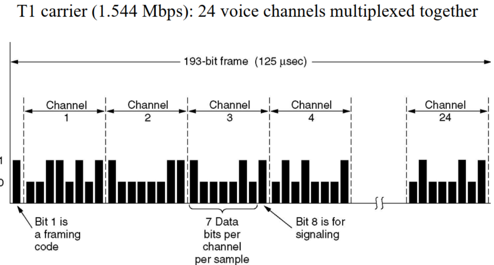

# 计算机网络2：物理层

## Chapter2.  Physics Layer

### 2.0 物理层的基本概念

- 物理层存在的意义正是要尽可能地屏蔽不同的传输媒体和通信手段之间的差异，使得物理层上面的数据链路层感受不到这些差异
  - 物理层的协议也常常称为规程 procedure，这个词比协议要出现的早
- 一个数据通信系统分为如下几个部分
  - 源系统，也叫发送端和发送方：包含源点和发送器
  - 传输系统，也叫传输网络
  - 目的系统，也叫接收端，包含接收器和重点

### 2.1 有线通信和无线通信

- 物理层用到的几种线
  - 双绞线 Twisted Pair
  - 同轴电缆
  - 光缆 Fiber Cables
    - 利用了光的全反射原理，在特定入射角度下不会发生折射
- 接口线 Interface Line
- 无线通信：
  - 卫星通信
  - 微波通信：常见于移动通讯，微波会穿过遮挡物继续传播，但可能会被吸收
- 物理层要做的就是把计算机中的电信号转化成上面这些可以传播的信号
  - 信号 signal是数据的电气或者电磁表现，分为模拟信号和数字信号
    - 模拟信号也叫连续信号，代表消息的参数的取值是连续的
    - 数字信号也叫离散信号，代表消息的参数取值是离散的，比如计算机和解调器的通信就是数字信号
  - 信号分为数字信号和模拟信号，比如：
    - 电话是将模拟信号转换成模拟信号
    - Modem是模拟信号转换成数字信号
    - Codec是把数字信号转换成模拟信号

### 2.2 信道channel和传输 Transmission

- 信道：表示向某一方向传送信息的媒体
  - 信道和电路的概念不相同，电路往往包含了发送信道和接受信道各一条
  - 信道的通信方式也分为单向通信、双向交替通信和双向同时通信

- 基带传输 Baseband Transmission 信号分为0和1，分为若干种传输方式：

  - Non-return to zero 用高频代表1，低频信号代表0
    - 存在时钟恢复问题，应该从中间处采样
  - NRZ Invert 在发生10切换的时候信号突变，高低电平进行切换
    - 被USB使用
  - Manchester 曼切斯特编码：传输1是半个高信号+半个低信号，传输0是半个低信号+半个高信号
    - 被Ethernet 以太网使用

  - 二级编码：AMI
  - 4B/5B编码：每四位一组，按照规则扩展成32位，共有32种组合，其余的16种作为控制码

  - 宽带传输和基带传输的**区别**：
    - 宽带传输是把基带信号调制之后形成频分复用模拟信号，在模拟信道上传输
    - 调制是将数字01转换为信号的过程

- 通带传输 Passband Transmission

  - 调制的三种方法：调幅Amplitude shift keying，调频 Frequency shift keying，调相 Phase shift keying
  - 调幅是用多个振幅来表示一个信号——调节振幅
  - 调频是用多个频率来表示信号——调节频率
  - 调相是用多个相位来表示信号——调节相位
  - QPSK 正交**相移键控**(调相的全名) 用45°，135°，225°和315°的四个偏移

- 信道的**最大数据传输速率**：

  - Nyquist定理：带宽为W，则**信号传输速率**不超过2W
    - 对于一个信道，并且没有噪声的情况下才适用
    - W的单位是赫兹，表示每秒信号变化次数
  - Bilevel 编码：数据传输速率 = 2倍的带宽，单位是bps
  - 多进制编码：数据传输速度 =  $2W\log_2M$ 其中M是进制，结果的单位是bps
    - 没有理论值的上限，但是会产生损失

- 香农定理 Shannon's Theorem

  - 带宽是H(HZ)，信噪比是S/N，信噪比的计量单位是dB
  - 最大的数据传输速率是：$H\log _2(1+\frac SN)$ 
    - 也就是说信噪比越大，最大的可能传输速率就越高
  - 信噪比的计算公式：$信噪比=10\log_{10}(\frac SN)$  

### 2.3 公共电话系统 PSTN

- PSTN用于传输人声，但是更加难以辨别，结构如下图所示：

  - 主要组成部分：
    - 本地回路：传输模拟信号的双绞线
    - 干线 Trunk：数字光缆，连接了各个交换局
    - 交换局 Switching office：进行通话的交换，从手动切换变成了计算机切换
  - 模拟信号在end office通过设备使用codec进行数字化
    - 每秒采样8000次，每次采样量化成8bit的二进制数，这项技术叫做PCM脉冲编码调制
    - T1信道有24个PCM信号，数据传输速率是**1.544Mbps** 
    - E1信道有32个PCM信号，数据传输速率是**2.048Mbps** 
  
  
  - 信道的**开销cost**：
    - T1信道每一帧传输的193bit中，有7*24=168bit是有效信息，有25bit是开销，因此开销率是25/193=13%
    - E1信道的32个信道中30个传输数据，2个传输信号，因此开销是2/32=6.25%

### 2.4 信道复用

#### 2.4.1 频分复用(FDM, Frequency Division Multiplexing)

- 利用通带传输的优势使得多个用户共享信道，每个用户拥有一个自己的频段来发射自己的信号

  - OFDM 正交分频复用

#### 2.5.2 时分复用 TDM

- 每个用户周期性地获取整个带宽非常短的一个时间段，每个输入流中的bit从一个固定的时间槽中取出，并输出到混合流中

  - TDM被广泛应用在电话网络和蜂窝网络中

#### 2.5.3 码分复用 CDM

- 码分多址 CDMA：在CDMA中，每个bit时间被分为m个更短的时间间隔，称为码片chip
  - 如果要传输一个1就发送分配的码片序列，如果要传输0就发送码片序列的反码
  - 发送站的任意两个chip都正交，也就是归一化的内积为0

### 2.6 习题

-  If a binary signal is sent over a 15-kHz channel whose signal-to-noise ratio is 15 dB, what is the maximum achievable data rate?
  - 首先需要根据信噪比的分贝数算出S/N，再算出香农定理下的最大传输速率，但是要注意另一种算法下的最大传输速率是30，因此取比较小的应该是30
- 14 signals, each requiring 5000 Hz, are multiplexed on to a single channel using FDM. How much minimum bandwidth is required for the multiplexed channel? Assume that the guard bands are 200 Hz wide.
  - n个信号，每个所需要的宽度是x，guard band是y，则一共需要的带宽是nx+(n-1)y HZ
- A simple telephone system consists of two end offices and a single toll office to which each end office is connected by a 1-MHz full-duplex trunk. The average telephone is used to make four calls per 8-hour workday. The mean call duration is 6 min. Ten percent of the calls are long-distance (i.e., pass through the toll office). What is the maximum number of telephones an end office can support? (Assume 4 kHz per circuit.)
  - 每天工作8小时，平均一台电话机要打4个电话，每个电话6min，一共是24min所以每小时只需要3min，因此可以一次支持20台远程通话，又因为只有10%是远程通话，所以一个信道可以支持200台
  - 1MHZ的干线，每个信道的带宽是4KHZ，一共有250个，因此答案是50000个

