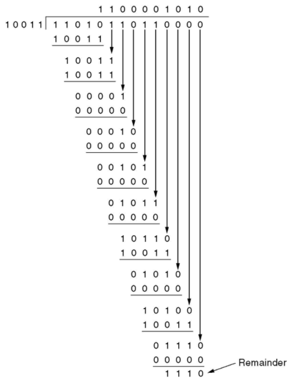
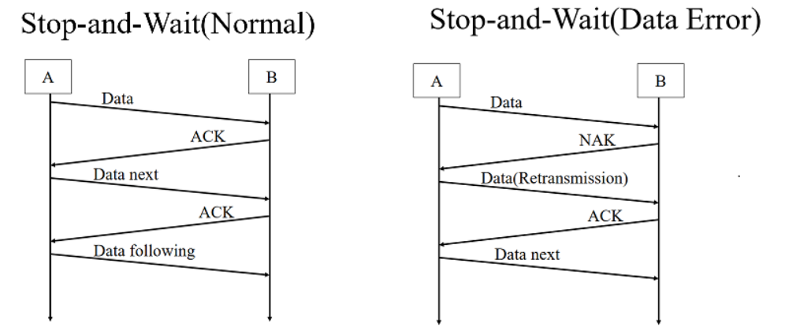
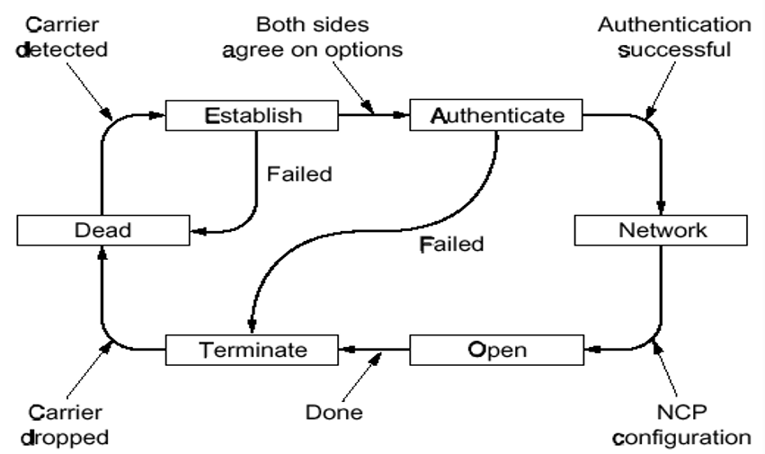

## Chapter3. Data link layer

### 3.1 基本概念

- 数据链路层：构建数据链路和逻辑链路，区别于物理层，物理层构建的是物理链路

  - **物理层和数据链路层**的本质作用都是用来构建网络通信、访问通道
  - 物理链路是真实存在的物理线路和设备，数据链路层是一些必要的硬件(比如网络适配器)和软件(传输协议)组成的
  - 数据链路层向上提供网络层的服务，处理传输的错误(因为物理层不能发现传输错误)，调节数据流，确保接收方不会被淹没
  - 提供的一些服务：
    - 无确认，无连接的服务：对丢失的帧不负责重发而是交给上一层处理，适用于实时通信或者误码率低的信道，比如以太网
    - 有确认的，无连接的服务，比如无线通信
    - 有确认的，面向连接的服务：帧的传输需要建立数据链路、传输帧、释放数据链路，适用于长距离的不可靠链路
    - 提供“虚拟的交流”：实际上就是通过协议和查错，避免需要通过物理层的通信产生的差错，就好像绕过了物理层一样
    

- Frame和Framing 帧：是数据链路层**发送数据的单位** 

  - Packet和Frame的关系


  - 具有一定的特殊格式：

    - character count 不常用的方法，很容易出错，一个错了后面的就都错了

    - 字节填充法：开始和结束使用特定的字符，用STX和ETX分别表示帧的开始和结束，DLE可以用来表示转义字符

      - DLE+STX表示需要把STX进行转义，不代表帧开始的符号，DLE+DLE表示把第二个DLE进行转义

    - 比特填充法：通过在帧头和帧尾各插入一个特定的比特串（如 01111110) 来标识-一个数据帧的起始与结束

      - 为了保证传输的内容不被错误解析，可以在传输的数据中每出现连续的5个1就在后面添加一个0，这样就不会出现连续的6个1，就算后面有0也要加一个0


### 3.2 数据链路层的错误检测

- 错误控制的方式

  - `error correcting` 纠错功能
  - `error detecting with retransmission` 错误检测和重发

- ### 纠错码 Error correcting code

  - 假设一帧由 $m$ 个数据位和 $r$ 个冗余位组成，记 $n=m+r$， 并将该编码描述成$(m,n)$码
  - 海明码：设置一系列校验码和校验位

    - 海明距离：两个码字(codeword)中不同的位的个数，如果两个码字的海明距离为 $d$ ，则需要 $d$ 个1位错误才能把一个码字转换成另一个码字
      - 也就是一个码字中最多可能错误的位数
    - 纠错能力：
      - 为了检测d个错误，就需要d+1的海明距离的编码方案，其实也就是说海明距离为n的编码方案只能检测出n-1个错误
      - 为了纠正d个错误，需要2d+1的海明编码方案
  - 对于每$2^m$个合法消息，任何一个消息都有n个非法码字，即海明距离为1的非法码字有n个，因此每个合法消息都需要用n+1位来标识，由于总共有$2^n$种位模式，也就是$(n+1)\le 2^r$ 
    - 用2的幂次的位置作为校验码，其他位置依次放数据
  - 海明码的海明距离为3，可以发现2bit的错误，可以纠正1bit的错误，将码字内的位编号为1到n，其中是2的幂次的位就是校验码，其余的都是数据码

- **循环冗余校验 Cyclic Redundancy Check**  
  
  - 基本思路：并在数据帧的末尾添加若干位作为校验码，**要使所生成的新帧能与**发送端和接收端**共同选定的某个特定数整除** 
    
    - 约定一个生成多项式$G(x)$ 需要首位和末尾的系数都是1
    
      - 所选定的除数二进制位数（假设为 k 位），然后在要发送的数据帧（假设为 m 位）后面加上 k- 1 位0，接着以这个加了 k-1 个0的新帧（一共是 m+k-1 位）**除**以上面这个除数
    
    - 所得到的余数（也是二进制的比特串）就是该帧的 CRC 校验码，又称 FCS（帧校验序列）
        - 但要注意的是，余数的位数比除数位数只能少一位，不能省略0
    - 还要注意这里的除法是特殊的计算方式，除法中用到的减法是异或XOR，也就是不会借位
    
    
      - 再把这个余数附加在原数据帧的末尾(覆盖之前的0)，构建一个新的帧发送到接收端
      - 在接收端除以第二步中的除数，如果没有余数就说明没有差错


### 3.3 数据链路层的协议

- 停止-等待协议 `Stop-and-Wait Protocol`

  - 最简单的通信协议


  - 基本思路：每次发送完毕，停止，等到接收方收到**表示发送成功的数据包(ACK)**之后再进行下一次的发送
    - 如果收到了NAK包，表示不确认，此时需要发送方重新发送一次数据包
    - 如果产生了数据丢失，就会Time Out，即发送方迟迟等不到接收方的回复，就会尝试**主动重发** 
    - 如果产生了ACK丢失，也会导致发送方重发，这时就会丢弃收到的数据，并再发送一个ACK提醒发送方已经收到
  - 对发送的数据包的标记方式可以只用1个bit来标记，01交替表示换了个新的数据包
  - 效率的衡量
    - $T_{frame}$ 表示发送方**发出去完整的一个帧**需要的时间，$T_{prop}$ 表示传输到接收方需要的时间
      - $T_{prop}=\frac{distance}{\mathcal {speed}}$ 而且 $T_{frame}=\frac{frame\_size}{bit\_rate}$ 
      - 令$\alpha = \frac{T_{prop}}{T_{frame}}$ 则链路利用率 $U=\frac 1 {2\alpha +1}$ 
  - 停止等待协议的编程实现——重要的数据结构

  ```c++
  #define MAX_PKT 1024
  typedef unsigned int seq_nr;
  typedef struct packet {
      unsigned char data[MAX_PKT];
  };
  typedef enum {data, ack, nak} frame_kind;
  typedef struct {
      frame_kind kind;
      seq_nr seq, ack;
      packet info;
  } frame;
  ```


- 滑动窗口协议 `Sliding Window Protocols`

  - 窗口就是一系列用于收发数据的**序列号的集合** 

    - 发送方维持一组连续的允许发送帧的窗口，称为发送窗口

      - 发送方每次收到一个ACK就把窗口移动一个位置
    - 某些协议中的发送窗口
    
  - 接收方维持一组连续的允许接收帧的窗口，称为接收窗口
    
      - 接收端收到一个数据帧之后就把接收窗口移动一格，并发回确认帧ACK，落在接收窗口之外的数据帧一律丢弃
    - 当发生错误时，丢弃错误帧后所有的帧，不发回确认，要求发送方重传开始错误之后的帧
    
  - 滑动窗口协议的利用率$U=\min (\frac{N}{2\alpha +1}, 1)$ 但是仅存理论可能

  - 几种不同的**重新发送**的协议

    - Go-Back-N 

      - 回退到第一个出问题的窗口，对后面的所有内容都进行重新发送，因此接收端也必须丢弃所有相应的数据包
    - 发送方窗口大小不超过 `MAX_SEQ`，即**最大的序列号** 
      - 接收方的窗口大小为1

      - 问题在于网络情况不好的时候会进一步恶化网络状况

    - Selective Repeat Protocol 选择重复协议
    
    
      - 在滑动窗口的基础上，不需要发送丢失之后的所有数据帧，只需要发送缺少的数据帧就可以
      - 为了保证没有序号重叠，窗口的最大尺寸不应该超过序号空间的一半，即(MAX_SEQ+1)/2
        - 接收方和发送方的窗口size一样，接收方的缓冲区=窗口的size
      - 相比于GO-Back-N需要更大的缓冲区

- PPP协议(Point to Point Protocol) 

  - 用于在链路中发送数据包的协议，包含光纤链路和ADSL
  
  - 是一个点对点的协议，需要提供身份验证，会动态分配IP地址，具有简单的差错功能，包含了链路控制协议LCP和网络控制协议NCP
    
    - 链路控制协议会激活数据链路，并进行测试，当不需要的时候再关闭
    
  - 有若干种状态
  
  
  

### 3.4 HDLC帧格式

- 起始和结束都是8bit的01111110+8bit address + 8bit control + 若干位data + 16位checksum 
  - 不同类型的帧的控制位数不一样
  - 对于信息帧而言，8bit = 1bit 0 + 3bit seq序号 + 1bit P/F + 3bit next序号
  - 监督帧：10+2bit type + P/F + 3bit next
  - 无符号帧： 11+2bit type + P/F + 3bit modifier


## Chapter4：Medium Access Sublayer

- 中译名：介质**访问控制**子层

### 4.1 回忆

- 数据链路的两种类型：
  - P2P的连接
  - 使用广播信道进行连接
    - 多路访问信道 Multiaccess Channel
    - 随机访问信道 Random Access Channel
- 介质访问控制子层 Medium Access Control(MAC)
  - 用于确定多路访问信道中下一个使用者的协议

### 4.2 信道分配协议

- 信道分配的方式：
  - 静态分配：比如物理层中介绍的频分复用，波分复用，码分复用等等
    - 在用户少，信道充足的情况下简单高效
    - 单个信道的帧平均延迟时间：K是帧的到达速率，$\frac{1}{\lambda}$是帧的长度，C表示信道的总数，则$T=\frac{1}{\lambda C-K}$，在频分复用的时候时间延迟变成NT，其中N是子信道的个数
  - 动态信道分配：又叫多点接入，特点是信道并非在用户通信的时候固定分配给用户
    - 5个基本的假设：
      - 流量独立：帧的传输是独立的，一旦生成了一帧，这个站就会被阻塞，直到帧被成功发送出去
      - 单信道假设：所有站点使用一个信道
      - 帧的发送冲突可以被观察到
      - 发送的时间是连续的或者有间隔的发送
      - 载体感知或者无载体感知：站点在发送之前可以知道信道是否在使用
    - 多路传输协议：ALOHA，CSMA等等

#### 4.2.1 竞争性的协议

- ALOHA协议
  - Pure ALOHA：有需要的时候就可以发送帧，不需要全局时间的同步
    - 协议的效率 $S=Ge^{-2G}$ 其中G表示每个帧发送所需的时间内new和resend的帧的数量，一个帧时间内希望有G帧，但是生成K帧的概率服从泊松分布
    - 协议最高的效率大约是：18.4%——因为所有的站点都可以随机发送，因此冲突非常多
  - Slotted分槽ALOHA：将时间分成离散的间隔，用户遵守统一的时间槽边界，效率是$S=Ge^{-G}$ 
- CSMA协议(Carrier Sense Multiple Access Protocol)
  - 特点：在发送数据之前一直监听信道，如果冲突了就等待一段随机的时间之后再试一次
  - 分为多种情况：
    - 1-persistant CSMA：
      - 先监听，一有空闲时间就发送，如果信道繁忙就持续监听
      - 如果发生冲突就等待一段随机的时间，如果带宽延迟乘积大，协议的性能就差
    - non-persistant CSMA：
      - 如果信道正在使用则不持续监听，改成随即等待，冲突就随即等一段时间
      - 信道的利用率高但是延迟大
    - p-persistant CSMA：
      - 持续监听信道，如果空闲就以一定的概率p发送数据，否则推迟到下一个时间槽，如果信道繁忙就持续监听
      - IEEE 802.11使用优化后的p-CSMA
    - 有冲突检测的CSMA(CSMA/CD)
      - 假设两个站点之间传播所需的最长时间是t那么只有一个站的传输时间大于2t才能被检测到冲突


#### 4.2.2 非竞争和有限竞争

- 无冲突协议 CFP
  - **基本位图法**：竞争槽中表示哪个station需要传输，假设数据的传输所需的时间长度为d，每个竞争期包含的槽的个数是N
    - 在低负载的情况下，低序号的站发送的平均等待时间是1.5N，高序号的站的平均等待时间是0.5N，对所有站而言平均等待时间是N，即每一帧的额外开销是N位，因此低负载的情况下信道的利用率是$\frac{d}{N+d}$ 
    - 在高负载的情况下，N个竞争位被分到了N个帧上面，此时利用率是$\frac{d}{1+d}$ 
  - **令牌传递** token passing
    - 令牌环：用于向下一个站点发送令牌
    - 令牌总线：利用总线发送帧
  - **二进制计数** Binary CountDown
    - 高序站的优先级比较高，利用率是$\frac d {d+\log_2 N}$ 
- 有限竞争协议：
  - 低负载的时候使用竞争协议降低延迟，高负载的时候采用无冲突的方法提高信道效率
  - 自适应树遍历协议：二叉树中的节点表示各个站点，当节点冲突的时候，左子树下面的节点才有竞争权

#### 4.2.3 WLAN协议

- WLAN的特点

  - 无线通信系统通常不能检测出正在发生的冲突，站点接收到的信号可能非常微弱
  - WLAN的站点可能无法给所有其他的站发送帧，也可能无法接受来自所有来自其他站的帧

- 一个简单的想法是使用CSMA：每个站点监听是否有其他的站点在传输，并且只有当没有其他站在传送数据的时候才进行传输，问题在于这种方法没有考虑WLAN的特性，如下图所示：

  

  - 当A发送给B的时候，C在监听，但是监听不到A，因为在距离之外，因此错误地认为C可以向B发送数据，因此B处就造成了混乱，扰乱了A发送过来的数据帧
  - 因此我们需要一个MAC协议防止此类冲突的发生
  - 冲突将导致宽带的浪费，由于竞争者离得太远而导致站点无法检测到潜在的竞争者，这个问题被称为**隐藏终端问题**(`hidden station problem`)

- MACA 冲突避免多路访问协议

  - 基本思路是发送方刺激接收方输出一个短的数据帧，以便其在附近可以接收到，同时避免接下去进行的数据帧传输也需要发送数据
  - RTS(Request to Send)：30字节，包含随后要发送的数据帧长度
  - CTS(Clear to Send)：应答帧

  


### 4.3 以太网 IEEE802.3标准

- 以太网的分类：

  - 经典以太网 Classsic
  - 交换式以太网 Switched：用交换机来连接不同的计算机，目前主要使用的以太网类型

  

#### 4.3.1 经典以太网的MAC子层协议

- 802.3的数据帧格式：

  - 前导码是8个字节，7个字节是10101010，最后一个字节是SOF10101011
  - 目标地址和源地址都是6字节的长度
    - 目标地址的第一位是0/1分别表示普通地址和组播地址
    - 目标地址全是1则是广播
  - 类型用2个字节来标识，取决于协议的类型
  - 数据字段最多可以有1500个字节
  - 以太网要求有效帧的长度至少是64bit，因此需要有0-46字节的填充区
    - 这是为了满足2t的传输时间
  - 校验和是4字节，一般十32位的CRC

  

  - 采用曼切斯特编码的方式

- **二进制指数后退算法** `Binary Exponential Backoff`： 

  - 在第i次的冲突之后，随即等待$0\rightarrow 2^i-1$ 个时间槽，但是最大不超过1023
  - 如果只有少量的站冲突可以确保比较低的延迟，但是冲突的站点比较多的时候也可以保证一个合理的时间来解决冲突
  
- 以太网的信道效率：假设每个时间槽的间隔时间是2t，并且传送一帧平均需要P秒，获得某个信道的概率为$A=kp(1-p)^{k-1}$ 则信道效率=$\frac{P}{P+2t/A}$

#### 4.3.2 交换式以太网

- 以太网的结构

  - 集线器：在电气上简单地连接所有的连接线，比如用双绞线，但是集线器不能增加容量，逻辑上等于一根电缆组成的经典以太网
  - 交换机：包含一块连接所有端口的**高速背板**，其他的略

  


