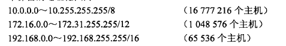
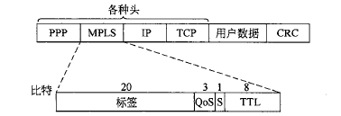
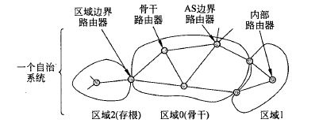

# 计算机网络4：网络层

## Chapter 5：Network Layer

### 5.1 网络层的设计

- 网络层

  - 关注的是如何将源端的数据包发送到接收方
  - 可以通过中间路由器进行转发，数据链路层只负责将线路从一边传送到另一边，而网络层是**处理端到端数据传输的最底层** 
  - 因此网络层必须知道网络的拓扑结构，并选择适当的路径进行传输

  

  - 网络层提供给传输层的服务
    - 应该独立于路由器技术，向传输层屏蔽网络拓扑结构的具体内容
    - 传输层可用的网络地址应该有一个统一的编地址方案

- 网络层提供的服务

  - 无连接服务：

    - 每个数据包独立路由，不需要任何预先的设置
    - 此时的数据包通常也称为数据报datagram，对应的网络称为数据报网络
    - 每个路由器中都有一个内部表，指明了针对每一个可能的目标地址应该将数据包送到哪里去。
      - 表中的每一项由两个部分组成：目标地址和通往目标地址所使用的出境线路
      - 管理路由表更新的算法称为路由算法

    

  - 面向连接的服务：

    - 在发送数据包之前需要先建立起一条虚电路，对应的网络称为虚电路网络
    - 一个例子是多协议标签交换 MPLS

    

### 5.2 路由算法

- 是**网络层软件**的一部分，负责确定一个入境数据包应该被发送到哪条线路上

  - 路由算法需要有一定的鲁棒性和稳定性，能够处理拓扑结构和流量的各种变化
  - 功能：路由routing和转发forwarding
  - 可以分为自适应算法和非自适应算法
    - 非自适应算法不会根据流量和拓扑结构来调整路由决策，也叫做**静态路由** 
    - 自适应算法会根据拓扑结构和流量来改变路由策略，也叫做**动态路由** 

- 最优化原则

  - 最优化原则的表述：最优路径上的子路径一定是最优路径
  - 从所有源到制定目标的最优路径构成的集合构成了一棵以目标节点为根的树，称为汇集树`sink tree` 

- 几种常用的算法

  - 最短路径算法：用跳数hop或者网线长度等指标来标识拓扑图中的边长

    - 可以使用数据结构基础中学过的Dijkstra算法

  - 泛洪算法：

    - 每个路由器必须根据本地的知识而不是网络的全貌做决策，一个简单的技术是泛洪，这种技术将每一个入境的数据包发送到了除了到达线路以外的每条出境线路
    - 问题使会产生大量的重复数据包，需要用措施来抑制泛洪，一种方法是在数据包里放一个跳计数器，每跳一次减小1，如果计数器为0就丢弃这个数据包

  - 动态路由算法：距离矢量路由算法

    - 每个路由器维护一张表，表钟列出了当前已知的到每个目标的最佳距离和使用的链路，通过邻居之间相互交换信息而不断被更新，最终每个路由器都了解到了到达目标的最佳链路
    - 每个路由器维护一张路由表，以网络中的每个路由器作为索引，并且每个路由器作为表中的一项，该表包含两个部分——到达目标路由器的**首选线路**和**距离的估计值**  
    - 每个路由器收到了相邻路由器发来的矢量之后会更新自己的路由表

    

  - 无穷计算问题：

    - 整个网络最佳路径的寻找过程称为收敛，距离矢量算法可以收敛到一条最短的路径，但是问题是速度太慢了
    - 距离矢量算法对好的结果反应特别迅速，对坏消息的反应非常迟钝
    - 某些情况下可能会让路由表的计算出现无限计算的情况，这就是无穷计数问题
    - **Poisoned Reverse染毒逆转：**在基于路由信息协议的网络中，当一条路径信息变为无效之后，路由器并不立即将它从路由表中删除，而是用无穷大，即不可达的度量值将它广播出去。但是它不能完全解决无穷计数问题

  - 链路状态路由算法：每一个路由器需要完成5个步骤，算法才能正常工作

    - 发现邻居节点，并了解网络地址
    - 设置每个邻居节点的距离或者成本度量值
    - 构造一个包含刚才所得的信息的链路信息包

    

    - 将包发送给所有的路由器，并接受所有来自其他路由器的信息包
    - 计算出到每个路由器的最短路径

  - 层次路由：

    - 路由器被划分成了不同的区域，每个路由器知道如何将数据包路由到自己所在的区域内的布标地址，但是对于其他区域的内部结构不知情，当不同的网络被相互连接在一起的时候，每个网络就会作为一个独立的区域，一个网络中的路由器不必直到其他网络的拓扑结构
    - 代价是增加了路径的长度

  - 广播路由：

    - 浪费带宽，并且需要源头拥有所有目标机器的完整地址列表，不够理想但是广泛使用
    - 多目标路由：每个数据包包含一组目标地址或者位图
    - 逆向路径转发

### 5.3 IP协议

- 网际协议IP是TCP/IP体系中最重要的协议之一，用来连接计算机网络进行通信
  - 互联以后的计算机网络都是由网际协议IP因此可以看成一个虚拟互联网络，因为物理介质之间的异构性是客观存在的
  - 而IP协议使得性能各异的网络在网络层中看起来就像上一个统一的网络
- 为了连接不同的网络，需要一些中间设备
  - 物理层的中间设备叫做转发器repeater
  - 数据链路层的中间设备叫做网桥或者桥接器bridge
  - 网络层使用的中间设备叫做路由器router
  - 网络层以上使用的中间设备叫做网关gateway，可以用来连接两个不兼容的系统，需要在高层进行协议的转换

- Internet的通信过程：
  - 从传输层获取数据流，并将数据流拆分成段，以便作为IP数据包发送
  - 每个数据包理论上最大容量是64KB，但一般不超过1500bytes
  - IP路由器转发每个数据包穿过Internet，沿着一条路径把数据包从一个路由器转发到下一个路由器，直到数据包到达目的地。
  - 在接受方，网络层将数据交给传输层，再由传输层交给接收进程

#### 5.3.1 IPv4协议

- 协议头

  - 每个IP数据报包含两个部分：头和正文，正文部分也叫做有效净荷
  - 每个IPv4协议头有20个字节的定长部分和一个可选的变长部分

  

  - 组成部分
    - 版本字段记录了协议属于哪个版本，目前用的比较多的依然是IPv4
    - IHL指明了头到底有多长(以32位字长度为单位)，最小值是5表明没有可选项，最大值是15，因此可选项最多为40字节
    - 总长度包含了数据报中所有的内容即头和数据的总长度
    - 标识用来让目标主机确定一个新到的分段属于哪一个数据报，同一个数据报的所有段包含相同的表示值
    - 后面还有一个空位
    - DF表示不分段，MF表示更多的段，除了最后一段之外所有段都必须设置MF这个位置
    - 分段偏移量表示当前段在数据报中的位置，该字段有13位，所有段的长度必须是8的倍数，因此**最多可以有8192个段** 
    - 生存期是一个计数器，每一跳后计数器都会减小，减小到0的时候数据包就会被丢弃
    - 协议表明了数据包需要被交给哪个传输进程，可能是TCP,UDP等等
    - 头校验和用来校验和保护地址
    - 源地址和目标地址是源网络接口和目标网络接口的IP地址

#### 5.3.2 IP地址

- IPv4协议中的IP地址是一个**32位的地址**，网络中的每一台主机和路由器都有一个IP地址

  - IP地址是一种逻辑地址，因为是软件实现的，而物理层和数据链路层的协议用的是物理地址

    - IP数据报一旦交给了数据链路层就被封装成MAC帧，MAC帧传送的时候使用的都是硬件地址

  - IP地址并不真正指向一台主机，而是一个**网络接口**，所以如果一台主机在两个网络上，它就必须有两个IP地址，路由器有多个网络接口，所以一个路由器有多个IP地址

  - IP一般由网络号和主机号构成，分为ABCDE五类(这里的网络号就是下面说的前缀)

    - A类的网络号有8位且第一位是0，B类有16位且前两位是10，C类地址的网络号有24位且前两位是110
    - D类地址是1110开头的多播地址，E类地址前四位1111有待开发

  - IP地址的**前缀**：IP地址具有层次性，每个32位地址由高位的可变长网络号和低位的主机两部分组成，同一个网络上所有主机其地址的网络值都是相同的，这一段就是前缀

  - 子网掩码：也标注了前缀的长度，比如128.208.101.21/24表示32位的IP地址中前缀长度是24位，后面8位是主机地址

    - 层次化的地址使得路由规模化了，但是也造成了地址的浪费

  - 子网：在内部将一个网络块分成几个部分供多个内部网络使用，但是对外部世界仍然像单个网络一样，这样的划分得到的结果就是子网

    

- CIDR 无类域间路由(构造超网)

  - 按块分配依然解决不了路由表爆炸的问题，尤其是位于默认自由区的骨干路由器，其路由表的规模非常大
  - 路由聚合Route Aggregation：可以运用和子网划分相同的方法，不同地点的路由器可以知道一个给定IP地址的不同大小的前缀，然而不是将一块地址分割成为若干子网，而是将**多个小前缀的地址合并成一个大前缀**，此时产生的大块前缀地址称为超网
  - 有了地址聚合，IP地址可以包含大小不等的前缀，同一个IP地址，可以作为不同长度的前缀被多个路由器使用，这个设计称为无类域间路由 `Classless Inter-Domain Routing` 

  

- NAT 网络地址转换

  - 因为IP地址非常有限，因此可以采取动态分配IP的策略，在主机不活跃的时候回收IP地址，然后分配给别人，但是也有局限性
  - NAT的基本思想是给每个家庭或者公司分配一个IP地址用来传输流量，但是在客户网络的内部，每台计算机有唯一的IP地址，该地址主要用来路由内部流量，然而当一个数据包离开客户网络发送到其他的地方的时候，必须进行一个地址转换，**把内部IP转换成公共IP地址**
  -  三个保留的地址范围：已经被私有化，任何网络可以内部随意使用这些地址，不允许包含这些地址的数据包出现在Internet上面

  

  - NAT带来的问题：
    - 违反了IP的结构模型，即一台机器对应一个IP
    - NAT打破了端到端的连接模型
    - NAT将因特网从无连接网络变成了面向连接的网络
    - 违反了最基本的协议分层规则
    - 进程并不一定只有TCP和UDP

#### 5.3.3 Internet控制协议

- ICMP 控制消息协议

  - 是路由器监视Internet的协议，当路由器处理数据包的时候发生了意外，就可以用ICMP向数据包的源端报告有关事件，所有的ICMP都被**封装在一个IP数据包中** 

  

- ARP 地址解析协议

  - 以太网网卡并不能理解IP地址，每一块NIC根据48位的以太网地址来发送和接收帧
  - ARP协议的作用就是将IP地址映射到以太网的地址(硬件地址)，优点是简单，比配置文件更加简单，属于网络层的协议
  - ARP协议解决转换问题的方法是在主机ARPcache中存放一个从IP地址到硬件地址的映射表，并进行动态更新，每一台主机上都设有一个ARP高速缓存，里面有本局域网上的各台主机和路由器的IP到硬件地址映射表
  - 当一台主机A要向本局域网上的主机B发送IP数据报的时候就先在缓存中查看有无主机B的IP地址，如果有就在ARP高速缓存中查出其对应的硬件地址写入MAC帧然后进行发送，否则就需要再进行一系列的操作
  - ARP解决的是同一个局域网上的主机或者路由器IP到硬件地址的映射问题

- DHCP 动态主机配置协议

  - 每个网络必须有一个DHCP服务器负责地址的配置，为发送请求的主机分配一个空闲的IP地址，并通过DHCP的OFFER包返回给主机
  - 动态分配的IP地址只能使用一段固定的时间，到期之前主机必须请求DHCP续订否则IP地址就失效了
  
- 标签交换和MPLS

  - 多协议标签交换 MOLS在每个数据包前面增加一个标签，路由器根据数据包标签进行转发，用标签作为内部表的一个索引，快速查找出正确的输出线路
  - 通用的MPLS有4个字节，并且包含四个字段，标签存放的是索引，QoS表明服务类别，S表示在层次网络中叠加多个标签的做法，TTL字段指出该数据包还可以被转发多少次，美经过一个路由器被减小1，降为0的时候数据包将被丢弃

  

### 5.4 Internet 路由

- OSPF：内部网关路由协议

  - 因特网由大量的独立网络或者自治系统(AS)构成，在一个网络的内部，一个组织可以使用自己的内部路由算法，也叫做域内路由算法

  - 开放最短路径优先 Open Shortest Path First 协议借鉴了ISIS(中间系统到中间系统)协议，已经成为了ISO的标准

    - 使用了分布式的链路状态协议(link state protocol)和最短路径算法
    - 动态算法，支持多种距离度量
    - 实现**负载均衡**，使用层次化的系统
    - 同时支持点到点的链路和广播网络

  - OSPF的工作方式本质上是对一张图进行操作，将一组实际网络、路由器和线路抽象到一个有向图中，两个路由器之间的点到点连接可以用两条有向的弧来表示

    

  - OSPF协议做了两件事情：

    - 用一个有向图来表示实际的网络，计算出各条最短的任务
    - OSPF记住最短的路径集合，并在报文转发阶段把流量分摊到多条路径上，实现负载均衡，这种方法称为等价成本多路径(ECMP)

  - OSPF可以将AS划分成若干个area，每一个都是一个网络，或者一组互连的网络，区域不能相互重叠，每个AS有一个骨干区域

    - 路由器也分为区域边界路由器和内部路由器，AS边界路由器，骨干路由器等等
    - AS边界路由器把通往其他AS的外部路由注入到本区域

    

  - OSPF协议需要在邻接的路由器之间相互交换信息才能工作，OSPF要求每个LAN中选出一台指定路由器，该指定路由器和本LAN上所有的路由器都是邻接的，并且和它们进行信息的交互

  - OSPF有五类消息，在邻接路由器之间进行传递：看xxr的计网教材

    

- BGP 外部网关路由协议

  - BGP的全称是边界网关协议 Border Gateway Protocol
  - 在一个AS的内部推荐使用的是OSPF和ISIS协议，而在AS之间用BGP比较好，这是因为域内协议和域间协议的目标不同，域内协议所需要做的只是尽可能有效地将数据包从源端发送到接收方，而域间的路由协议则必须要考虑大量的选择策略
  - BGP只能力求寻找一条能够达到目的的网络且比较好的路由，采用了**路径向量路由选择协议** 

- Internet 组播
  - 普通的IP通信发生在一个发送方和一个接收方之间，而IP用D类IP地址来支持**一对多的通信**或者组播，每个D类地址标识了一组主机  
  - Internet 组管理协议 IGMP用来解决广播成员分布在不同网络上的情况
  - 在AS中主要是使用协议独立组播协议PIM，在系数模式PIM中，使用特定源组播PIM可用来优化只有一个发送方的情况，当成员分布不知一个AS的时候，需要BGP的组播扩展来创建组播路由                        

### 5.5 拥塞控制

- 拥塞：网络中存在太多的数据包导致数据包被延迟传输和丢失，导致网络的性能下降
  - 控制拥塞是网络层和传输层共同承担的责任
  - 因为拥塞是出现在网络中的，但又是由于传输层发送出太多的数据包儿导师网络的过载，因此需要网络层和传输层共同承担责任
  - 根据拥塞发生的原因，可以将解决方案分为：增加资源或者减少负载
- 准入控制：在虚电路网络中，如果太拥堵了就拒绝建立新的连接
- 流量感知路由：了解到网络流量之后定制路由
- 负载脱落：一切努力都失败了，不得不丢弃一些数据包

### 5.6 服务质量

- 评价标准：可靠性、延迟、抖动(jitter)、带宽。抖动是延迟的方差，也代表了到达时间的变化

隧道技术

### 5.7 IPv6标准

- IPv6依然是无连接的，并且分为头部和有效载荷，IPv6的地址变成了128位，采用冒号十六进制记法，每个16位的值用十六进制来表示，并用冒号来分隔
  - 比如FF05:0:0:0:0:0:0:B3是一个冒号十六进制写法的IPv6地址
    - 零压缩：连续的一串0可以用两个冒号代替，一个IP地址只能使用一次

