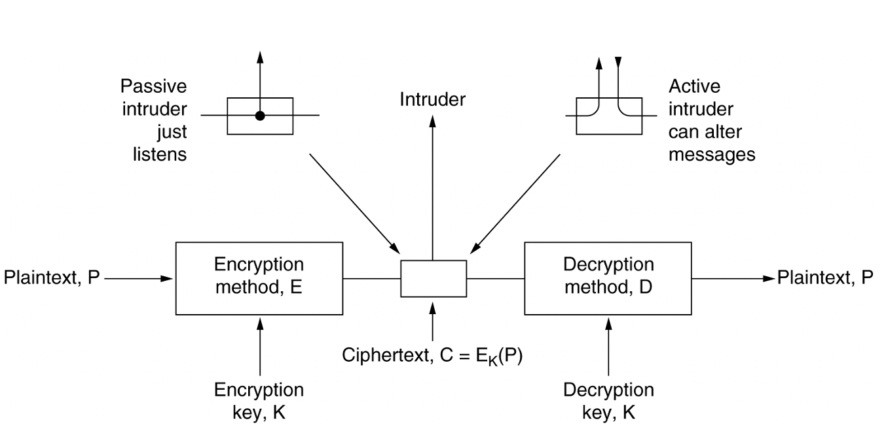

## 计算机网络7：网络安全

#### Chapter 7: Network Security

### 7.1 密码学和散列函数

- 加密模型：任何加密模型的安全性取决于密钥的长度，以及攻破所需的计算量

- 两类密码体制
  - 对称密钥体制：加密密钥和解密密钥使用相同的密码体制
    - DES是一种分组密码，由IBM公司研制，安全性更强的有三重DES
    - AES（高级加密标准）由Joan Daemen和Vincent Rijmen研制出，原名叫做Rijndael算法
  - 公钥密码体制：使用不同的加密密钥和解密密钥
    - RSA是Rivest、Shamir和Adleman提出的

- 密码散列函数：
  - 单向加密，输入长度不固定但是输出的长度固定
  - 要找到两个报文使得其具有相同的输出，在计算上是不可行的
  - MD5:报文摘要算法，算法需要将报文按规则填充成512的倍数，然后每个512位的块分成128位，128位再分成32位的小块
  - SHA是美国NIST系统的散列算法，但是码长是160位，比MD5更安全
- 密码攻击
  - 重放攻击replay attact：直接截获密码报文，不需要破译，而是伪装成发送方发给接收方，可以使用不重数nonce
  - 中间人攻击man-in-the-middle：我也没看懂，大概就是中间人把不重数用自己的私钥加密之后发送，然后分别向发送方和接收方发送获取公钥的请求

- 密钥分配
  - 由于密码算法是公开的，网络的安全性就完全基于密钥的保护
  - 对称密钥的分配
    - 设立密钥分配中心KDC，常用的密钥分配协议是Kerberos V5，使用鉴别服务器AS和票据授予服务器TGS
    - 票据有一定的有效期，过期了密钥就失效了，不能被用于长久的重放攻击
  - 公钥的分配
    - 使用认证中心把公钥和对应的实体进行绑定
    - ITU-T制定了X.509协议标准，并在RFC5280中给出了互联网公钥基础结构PKI

### 7.2 互联网安全协议

- IPsec协议族
  - 可以在IP层提供互联网通信安全的协议族，可以分为
    - IP安全数据报格式的两个协议：鉴别首部AH协议和封装安全有效载荷ESP协议
    - 有关加密算法的三个协议
    - 互联网密钥交换IKE协议
  - IP安全数据报有两种不同的方式：
    - 运输方式：运输层报文段的前后分别添加若干控制信息再加上IP头部
    - 隧道方式：在原始的IP数据报前后添加控制信息，再加上心得IP首部构成一个IP安全数据报
  - 安全关联SA是发送IP安全数据报之前在源实体和目的实体之间创建一条网络层的逻辑链接，将无连接的网络层变成了具有逻辑链接的一个层，并且是单向连接
- 运输层安全协议
  - 安全套接字层SSL：是Netscape提出的安全协议，作用在HTTP和运输层之间，在TCP之上建立一个安全通道
    - 提供的服务
      - SSL服务器鉴别，允许用户正式服务器的身份
      - SSL客户鉴别，允许服务器证实客服身份
      - 加密SSL绘画，对客户和服务器之间的报文进行加密，并检测报文是否被篡改
    - 工作过程：协商加密算法、服务器鉴别、会话密钥计算、安全数据传输
    - HTTPs是提供安全服务的HTTP协议，调用SSL对整个网页进行加密
  - 运输层安全TLS：基于SSL的标准化协议
  - 原本还有安全电子交易SET协议，但是已经out了
- 应用层安全协议
  - PGP是Zimmerman于1995年开发的电子邮件的标准

### 7.3 防火墙和入侵检测

- 防火墙是一种访问控制技术，是一种特殊的路由器
  - 可以禁止任何不必要的通信，可以实施访问控制策略
  - 防火墙内的是可信的网络，墙外面是不可信的网络
  - 防火墙的主要技术分为
    - 分组过滤路由器：按照一定的规则进行分组过滤，对进出内部网络的分组执行转发或者丢弃
    - 代理服务器，在应用层通信中扮演报文中继的角色，一种网络应用需要一个应用网关，所有的进出网络的应用程序都必须通过应用网关
    - 往往两种技术混合使用
- 入侵检测系统IDS
  - 对网络的分组执行深度分组检查，当观察到可疑分组的时候向网络管理员发出警报
  - 可以检测多种网络攻击：网络映射、端口扫描、DoS攻击（拒绝服务攻击，分布式拒绝服务简称DDoS）、蠕虫和病毒、系统修改漏洞攻击等等
  - 一般可以分为基于特征的入侵检测和基于异常的入侵检测

