## 操作系统0：Linux内核

#### 1 Linux内核重建

- Linux操作系统的基本层次结构

  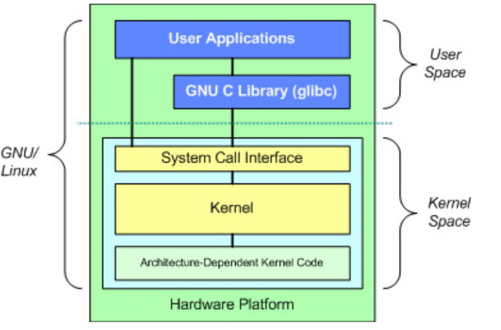

  - glibc提供了连接内核的系统调用接口，提供了用户态和内核态进行转换的机制
  - Linux内核中有系统调用接口、进程管理、内存管理、虚拟文件系统、网络堆栈、设备驱动程序等等
  - Linux内核是宏内核结构，运行在单独的内核地址空间，并且有模块化设计、抢占式内核、支持内核线程等等

- 配置内核实验中的相关操作与命令

  - make mrproper 清除目录下所有配置文件和.o文件
  - make menuconfig生成config文件
  - 编译内核make或者make -j2
  - 安装模块sudo make modules_install
  - 安装内核sudo make install

- Linux系统的启动过程

  - BIOS加载操作系统引导装入程序
  - 由操作系统引导装入程序和加载内核
  - 内核代码解压缩
  - 内核初始化
  - 生成init进程
  - 系统初始化，生成各种终端进程
  - 用户登录

#### 2 系统调用

- 系统调用时内核向用户进程提供服务的唯一方法，应用程序调用操作系统功能模块

  - 用户可以通过系统调用从用户态切换到内核态，访问相应的内核资源

- 地址空间

  - 每个进程的虚拟地址空间可以分为用户空间和内核空间
  - 在用户态下只能访问用户空间，内核态下都可以访问
  - 内核空间在每个进程的虚拟地址空间中都是固定的，3-4G的部分

- 上下文：

  - 分为用户级上下文、寄存器上下文和系统级上下文

  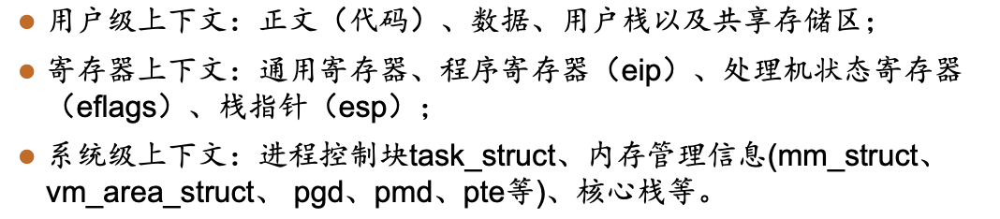

#### 3 Linux进程管理

- Linux是一个多任务多用户的操作系统
  - 一个任务就是一个进程
  - 存放在次盘上的可执行文件的代码和数据的集合称为可执行映像
  - 一个程序装入系统中运行的时候就形成了一个进程
  
- 进程由正文段、用户数据段和系统数据段、堆栈段组成的动态实体
  - 正文段中存放着进程要执行的指令代码，具有只读的属性
  - 用户数据段是进程在运行过程中处理数据的集合，可以直接访问
  - 系用数据段存放了进程的控制信息，包括PCB

- task_struct结构

  - 是Linux系统中进程管理块PCB，进程的task_struct是进程存在的唯一标志，在一个进程被创建的时候，系统就创建一个task_struct，进程结束的时候就撤销

    - Linux系统中，系统中的最多进程数目收到task数组大小的限制
    - `ulimit -u` 显示用户可以同时执行的最大进程个数

  - 定义了`volatile long state; int exit_state;`分别表示进程的可运行性，后者表示进程退出时候的状态

  - Linux进程的状态和状态切换

    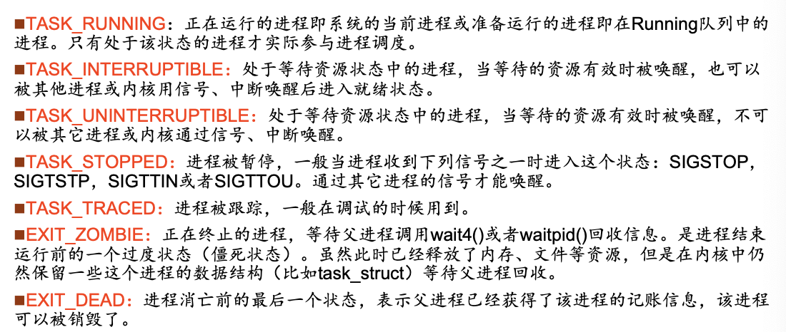

    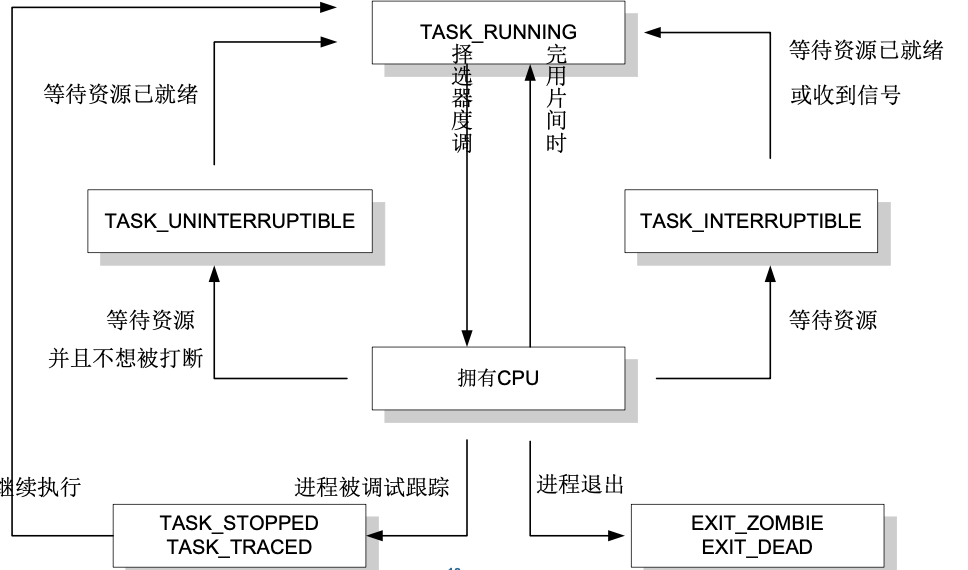

  - 进程的标识int pid，pid是32位的无符号整数，最大值是32768，除此之外还有很多奇怪的标识号，比如用户标识符UID和组标识符GID

  - 进程的亲属关系指针：每个进程维护了指向祖先进程、父进程、子进程、兄弟进程的指针

    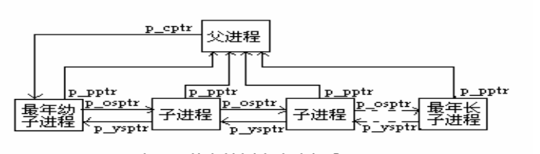

  - 进程间的链接信息：有指向上一个和下一个PCB的指针，也有指向可运行队列的上一个和下一个PCB的指针

  - 此外还存储了进程的调度信息、时间信息、虚存信息、文件信息、进程通信信息

- task_struct的存放
  - 进程拥有两个栈，用户模式栈和内核模式栈，分别在对应的模式下使用
  - Linux内核中定义了current宏用来获取当前正在执行的进程
  - 可运行队列的存放方式：一个双向链表，第一个进程是init_task，可以用for_each_task(p)宏遍历整个进程链表
  - 等待队列：表示一组睡眠的进程

#### 4. 文件系统

- Linux采用了多级目录的树形层次结构来管理文件，最上层是根目录

  - Linux的文件系统，不管是什么类型都安装到一个目录下面，并隐藏掉目录中原有的内容，这个目录就是安装目录或者安装点
  - Linux的根目录下面有多个不同的目录，每个目录下面挂载的文件系统可能不一样

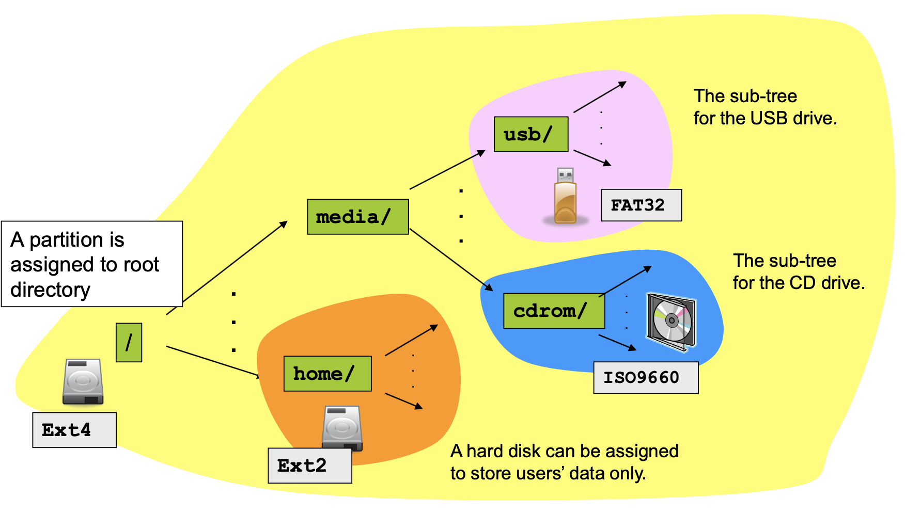
  - linux的文件系统将文件名和文件控制信息分开管理
    - 文件控制信息单独组成一个inode数据结构，每个文件对应一个inode
    - 目录中的项主要由文件名和inode号组成

- Linux系统中文件的分类

  - 普通文件：文件名不超过255个字符，不能使用保留字命名
  - 目录文件：目录+目录下面所包含的项，只能由系统来修改
  - 字符设备文件和块设备文件：把对设备的I/O当作文件的读写，提供了统一接口，如fd0，hda，sda，tty
    - 比如显示器、鼠标、键盘
  - 管道文件：用于进程之间进行通信
  - 链接文件：又称为符号链接文件，用于文件共享
  - socket文件

- Linux支持很多种不同的文件系统类型

  - 默认的标准文件系统是ext2/ext3/ext4，系统将磁盘分区作为根目录
  - /proc虚拟文件系统

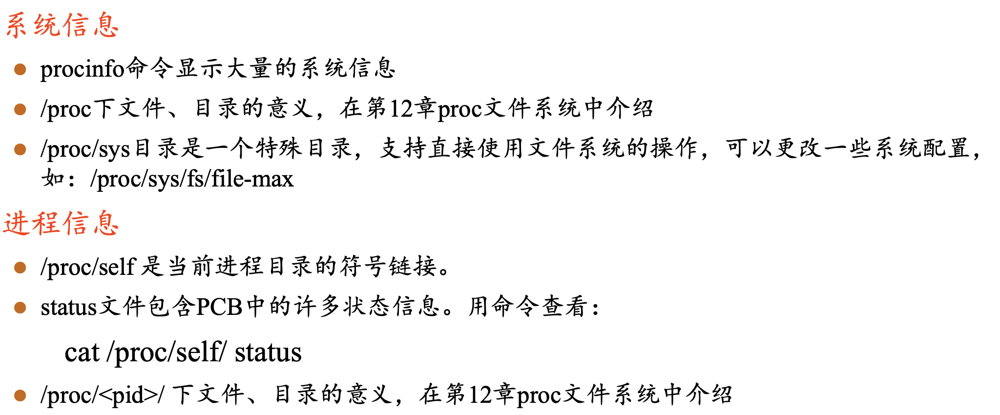
- VFS虚拟文件系统

  - 存在于内存中，是一种不同物理文件系统的转换机制，而像ext2是外存的物理文件系统
  - VFS对不同的物理文件系统提供了统一的文件api，统一了各类物理文件系统
  - VFS的通用文件系统模型由四种数据对象组成
    - 超级块对象：对应文件系统的超级块或者控制块
    - 索引节点对象：对应文件控制块FCB
    - 目录项对象：描述目录，组成路径
    - 文件对象：存储打开的文件和进程的关联信息

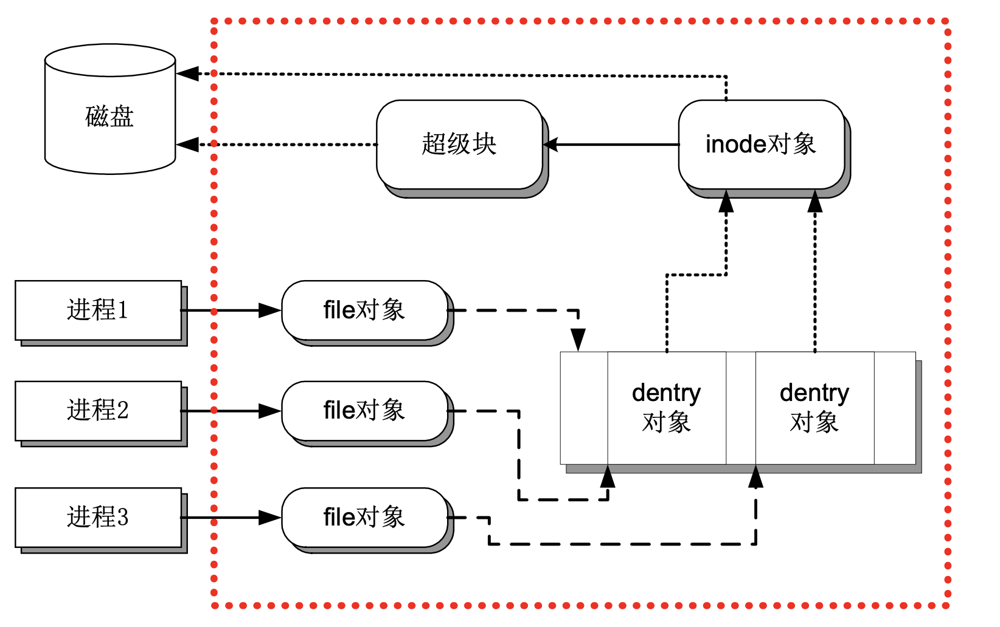
  - 超级块对象是文件系统中描述整体组织和结构的信息体，是在不同的文件系统安装的时候建立的，在文件系统卸载的时候删除，在建立索引节点的时候需要操作超级块对象
  - VFS也建立inode，不过物理文件系统的inode在外存，而VFS的inode在内存中，需要时才会建立

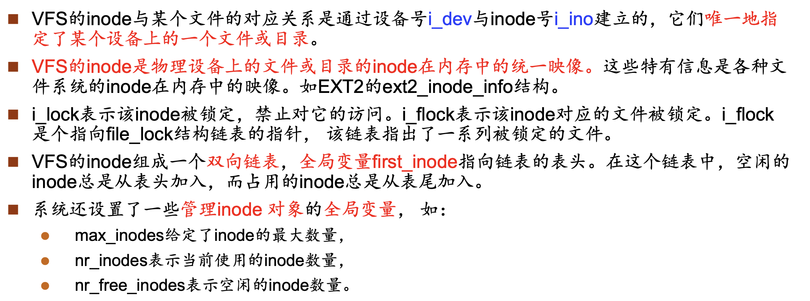
  - 每个文件除了有一个inode还有一个目录项dentry数据结构，用于实现文件的快速定位和缓冲作用

- 文件系统的注册

  - 在内核中注册文件有两种方式，一种是在系统引导的时候在VFS上面注册，另一种是将文件系统注册为可卸载的模块
  - 每种注册的文件系统登记在file_system_type结构体中，file_system_type结构体组成一个链表，称为注册链表，链表的表头由全局变量file_system给出，在VFS中用一个双向链表来维护

  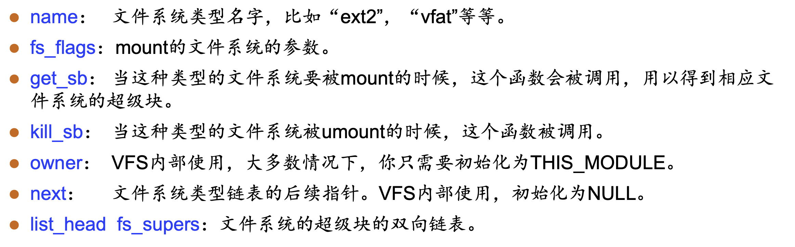

- 文件系统的安装

  - 每种文件系统占用一个独立的磁盘分区，具有各自的树形结构
  - Linux文件系统的树型层次结构中用于安装其它文件系统的目录称为安装点或安装目录
  - mount命令的用法

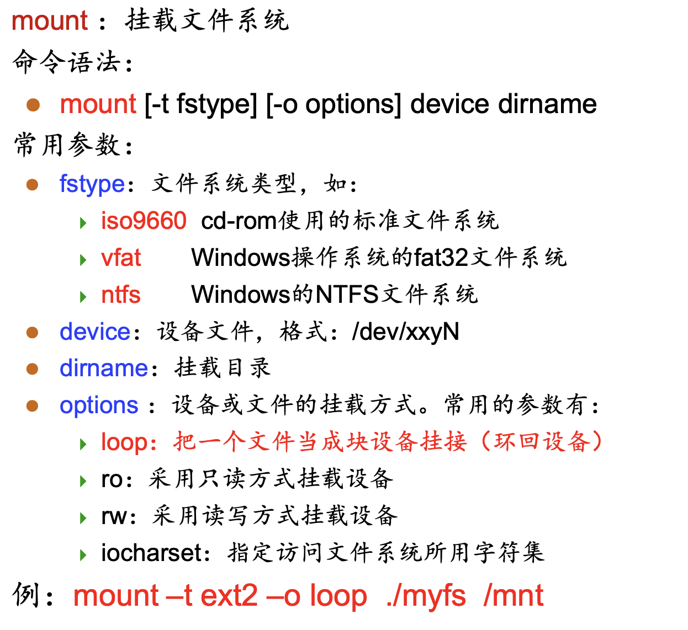
- Linux中的文件管理

  - 对于已经打开的文件可以通过打开文件表和私有数据结构进行办理

  - 每个进程的文件管理

    - fs_struct结构记录着进程所在文件系统根目录和当前目录
    - files_struct结构包含着进程的打开文件表

    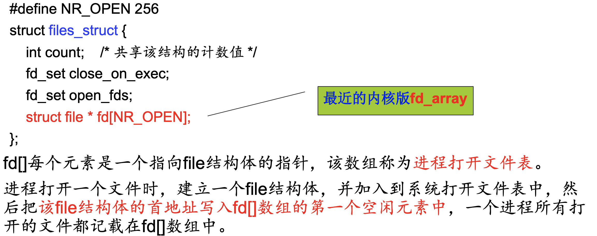

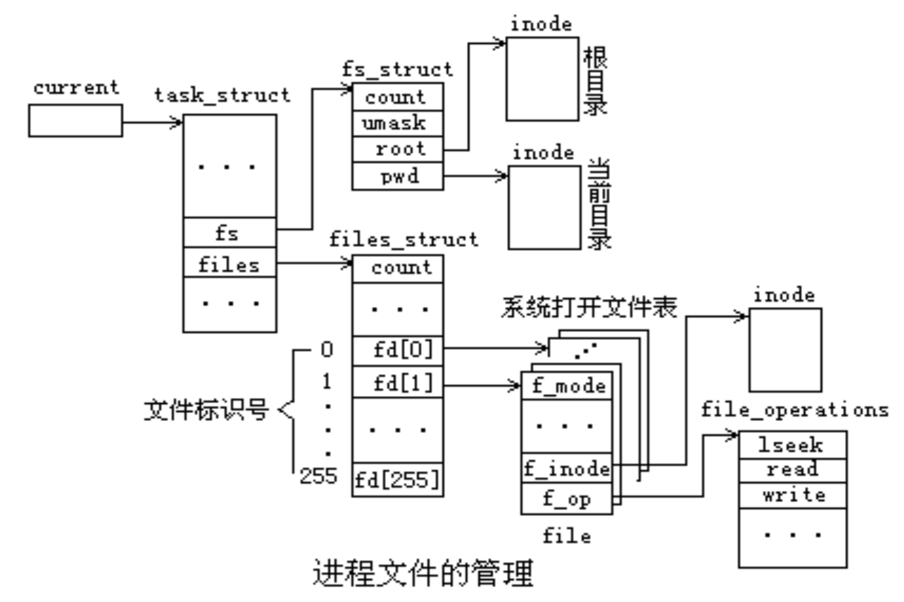
- Linux的open系统调用

  - 对应的内核函数是sys_open()，第一个参数是路径名，第二个参数是文件的访问标志

  - sys_open的各种步骤

    - 调用getname()从进程地址空间读取文件路径
    - 调用get_unused_fd()在current->files->fd所指向的文件对象指针数组中查找一个未使用的文件描述符（号），  存储在局部变量fd中

    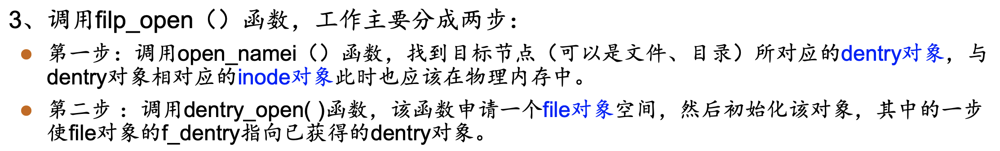

    - 调用fd_install函数，将文件对象装入当前进程的文件打开表，然后返回文件的fd

- ext2文件系统

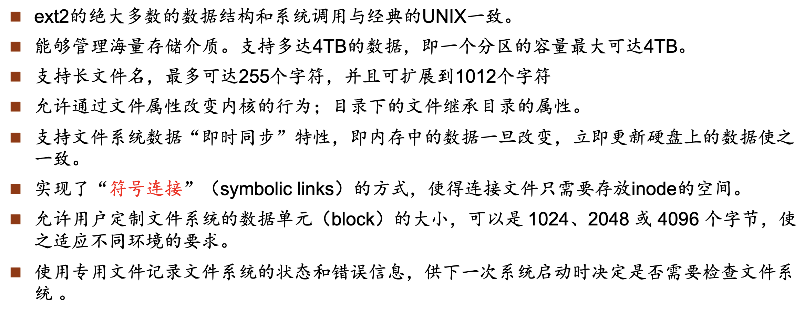

#### 5. 虚拟内存

- 早的操作系统采用的是实模式进行内存管理，即使用实地址进行内存管理，现在都是保护模式，即采用虚拟地址。在保护模式下，IA32提供了实现虚拟内存的硬件机制

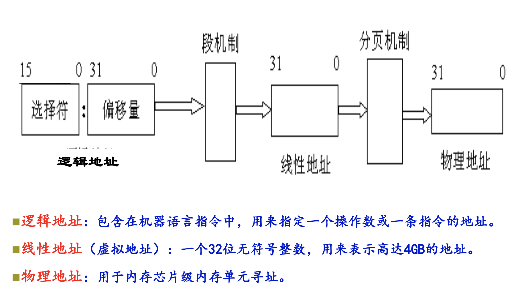

- 32位寻址空间的Linux系统的内核空间是1GB，用户空间是3GB，每个进程最多拥有3GB的地址空间

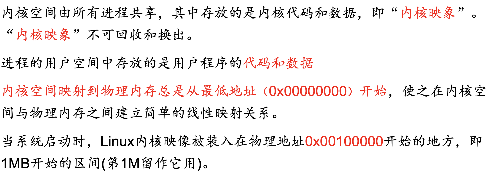

- 每个程序编译之后形成的二进制文件有代码段和数据度啊，而进程运行的时候必须占有独立的堆栈空间
- Linux中的内存管理结构体：
  - mm_struct对进程整个用户空间进行描述
  - vm_area_structs结构对用户空间中各个区间(简称虚存区)进行描述,vm_area_struct虚存段用一棵红黑树进行管理

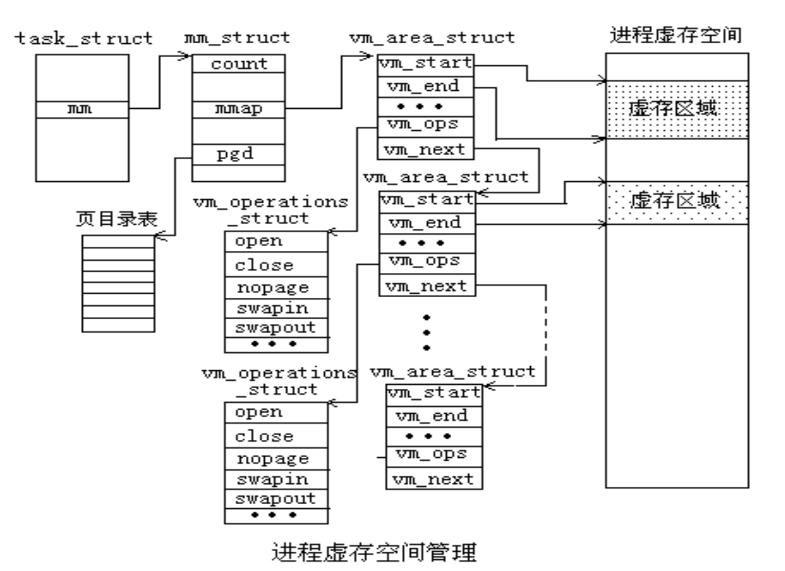

- Linux的分页内存管理机制

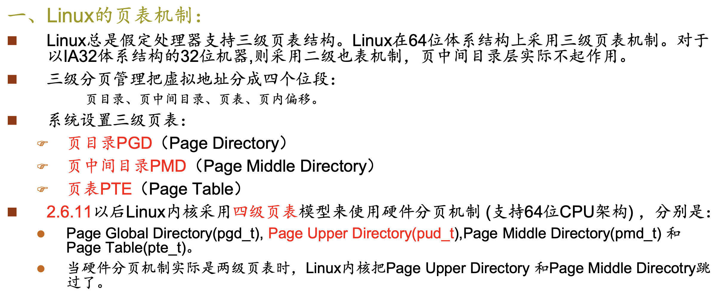

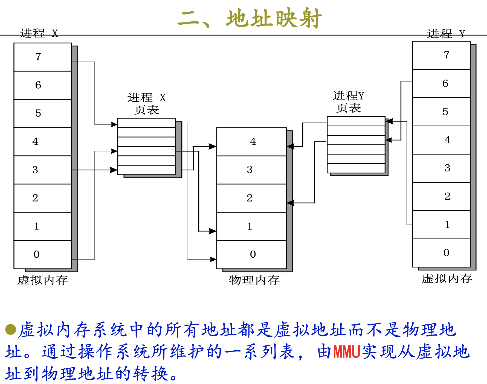

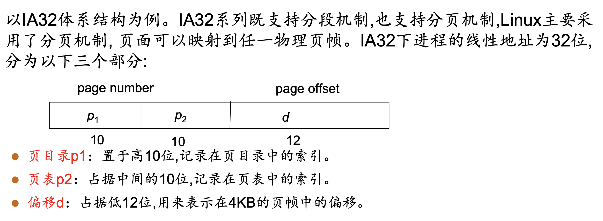

- 缺页异常：do_page_fault系统调用

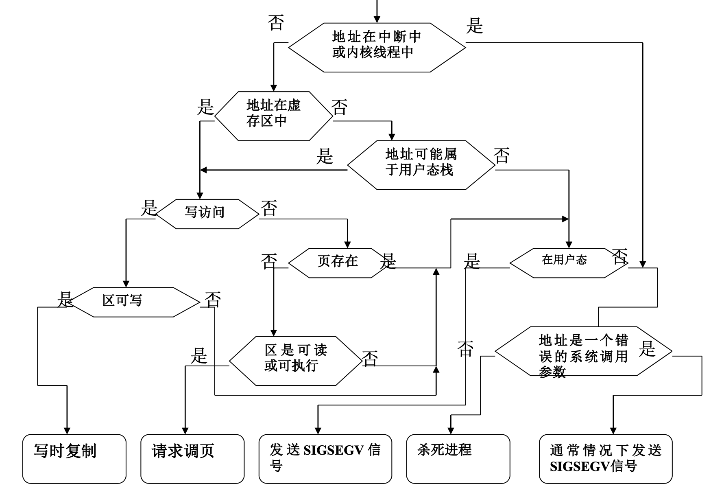
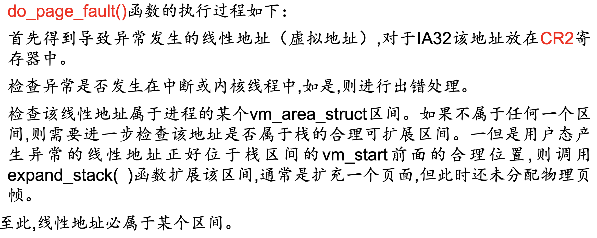

本文总阅读量次
