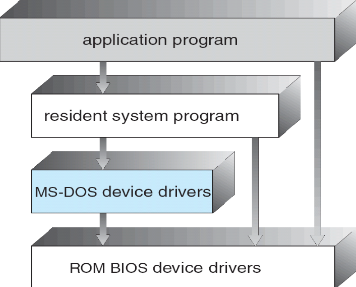
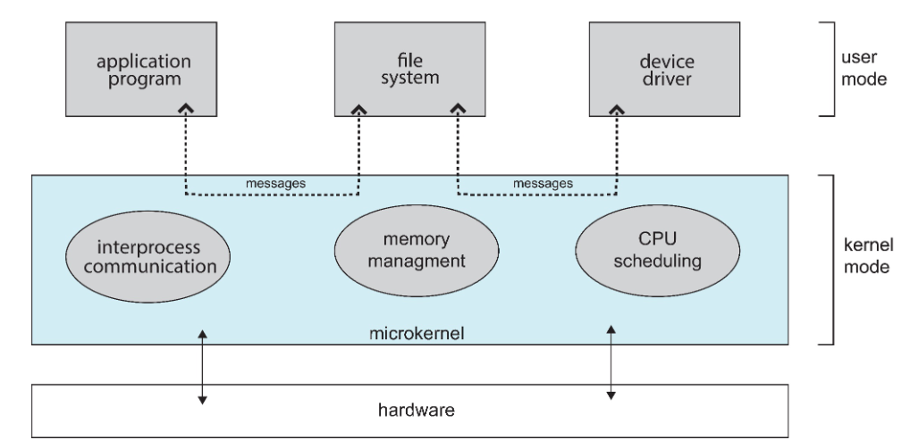

# 操作系统1：导论和操作系统结构

### RandomStar in 2020.09

# Chapter 1. Introduction

## 1.1 什么是操作系统

- 用户和计算机硬件之间的中间程序
  - 执行用户程序
  - 使计算机易于使用
  - 充分调用计算机资源
- 计算机系统可以分为四个部分
  - 硬件：CPU，内存和I/O设备
  - 操作系统
    - 用户视角：操作系统是用户和计算机硬件之间的接口
      - 计算机硬件
      - 操作系统提供了命令级接口(鼠标和键盘)和程序级接口(system calls)
    - 系统视角：操作系统是计算机系统资源的管理者
      - 控制程序，分配资源
    - 软件分层的观点：是扩充裸机的第一层系统软件
    - 一直在运行的程序就是kernel(内核) 
  - 应用程序
  - 用户 user，包含人、机器和其他计算机，不单指人
- 中文书上对操作系统的定义：
  - 操作系统是一组有效控制和管理计算机各种硬件和软件资源，合理组织计算机的工作流程，方便用户的程序的集合
  - 有效：系统效率高，资源的利用率高
  - 合理：公平，不公平的时候会产生死锁和饥荒
  - 方便：用户接口，图形界面

## 1.2 计算机组成

- 主机型计算机系统：以存储器为中心，CPU和数据通道都和存储器相连
- 中断：指系统发生某个异步/同步事件后，处理机暂停正在执行的程序，转去执行处理该事件程序的过程
  - 通过中断向量来实现，中断向量记录了所有服务例程的地址
  - 中断的分类
    - 中断(外中断)：I/O中断，时钟中断
      - 外部设备发出的I/O请求，分为可屏蔽和不可屏蔽两类
      - 可以在指令执行的任意时期产生
    - 异常(内中断)：系统调用，缺页异常，断点指令，其他异常
      - 由CPU产生，一条指令中止之后才会发出中断
  - 操作系统是**中断驱动**的

## 1.3 计算机系统结构

- 单处理器系统：core是执行指令和存储本地数据的组件

- 多处理器系统
  - 也被称为并行系统，分为同步和异步两种
  - 优点包括：规模经济的，吞吐量增加
  - NUMA——非同一内存访问
- 集群系统cluster
  - 是由一组互联的主机（节点）构成统一的计算机资源，通过相应软件协调工作的计算机机群
  - 分为对称集群和非对称集群
  - HPC(high-performance computing) 高性能你计算
  - DLM(distributed lock manager) 分布式锁管理器，用于避免集群中的冲突操作

## 1.4 操作系统的运行

- 何时运行操作系统？
  - 操作系统是硬件中断驱动的，此时先启动中断处理程序
  - 软件出错，或者产生异常exception和陷入trap
  - 其他的进程问题，比如死循环

- Dual-mode operation 双模式操作

  - user mode 用户态
  - 执行用户程序的时候的模式
    - 只能访问属于它的存储空间和普通寄存器，只能执行普通指令
    - 用户程序和操作系统以外的服务程序运行在用户态中，使用用户栈
  - kernel mode 内核态
    - 执行操作系统程序的时候的模式
    - 可以访问所有系统资源，执行**特权指令**(I/O指令、设置时钟、置控制寄存器等)，可以直接操作和管理硬件设备
    - 操作系统内核的程序运行处于内核态，使用内核栈
  - 上课讲过的几个习题
  
    - 三种从用户态**切换到内核态**的方式：
      
      - # 系统调用、异常、外围设备的中断
      
    - # 中断处理一定会保存而子程序调用不需要保存的内容是：程序状态字寄存器
  
    - 不可能发生在用户态的事件是：进程切换，需要调度处理器和系统资源，为保证系统安全
  
      - 缺页是用户态到内核态
      - 系统调用和中断既可以发生在用户态，也可以发生在内核态

## 1.5 资源管理，虚拟化

后面会细讲，这里就看了几个标题

## 1.6 计算环境

- 几种不同的计算环境
  - 传统计算：
    - 大型机系统：批处理系统和分时系统
      - 批处理系统：分为单道批处理系统/多道批处理系统，多道批处理系统中，内存同时进行若干工作，CPU被多路复用
      - 分时系统：多个用户**分时间共享**同一台计算机
        - 响应时间：分时系统的重要指标，假设分时系统中进程数为n，每个进程的运行时间片为q，则S=nq
    - 桌面系统——PC个人电脑
  - 移动计算：“再过几年可能是鸿蒙”
  - C/S结构计算，P2P计算——区块链技术，虚拟化计算，云计算(SaaS, PaaS, IaaS)

# Chapter 2. 操作系统结构

## 2.1 操作系统服务

- 操作系统提供如下服务
  - 用户接口：包括命令行CLI和图形用户界面GUI
  - 程序执行：把程序载入内存中执行，
  - I/O操作：操作文件和IO设备
  - 文件系统的操作
  - 交流：不同的进程之间交流信息
  - 错误检测：检测CPU，内存，IO设备出现的错误
  - 资源的分配，用户操作的记录
  - 安全性保护

## 2.2 用户操作系统接口 UOSI

- 操作系统的接口
  - 命令接口
    - 命令行用户接口，文本界面
    - 图形用户接口
    - 触摸屏接口、语音接口……
  - 程序接口：比如system call

## 2.3 系统调用system call

- 系统调用：提供操作系统服务的程序接口

  - 是进程和OS内核的程序接口，使用高级语言来编写
  - API封装了一系列的系统调用，比如win32 API， POSIX API和Java API(JVM)
  - 每个系统调用对应了一个封装例程(wrapper routine)，一些API应用了封装例程，API还包括各类编程接口，比如C语言库函数
  - 系统调用是在**内核**完成的，**用户态的函数**是在函数库中实现的

  

  - 注意区别系统调用和库函数的调用
    - 像printf，fopen，malloc这些都是C语言的库函数，而不是系统调用
  - 执行系统调用的几个过程：
    - 执行trap指令
    - 传递系统调用操作
    - 执行相关操作
    - 返回用户态
  - 系统调用的种类：进程控制，文件/设备的管理，信息的维护，通信，保护

- 系统调用的参数传递

  - 最简单的方法：通过寄存器传递参数
  - 用内存中的block和table存储参数，并在系统调用中把块地址放在寄存器中传递
    - Linux系统使用这种方法实现的
  - 通过栈来传递参数

## 2.4 系统服务

- 操作系统提供的服务，比如shell中的各种命令
- 操作系统中运行程序的步骤：
  - 将程序装入内存中
  - 确定起始地址，并从这个地址开始执行
  - 用控制台监控程序执行的过程
  - 不需要向操作系统预约运行时间
    - 只有实时的操作系统才需要预定CPU时间
- 操作系统提供的功能中，需要特定硬件支持的有：
  - 时钟管理
  - 地址映射
  - 中断
  - 进程调度不需要特定的硬件支持

## 2.5 Linker和Loader

- 程序编译之后变成了relocatable object file浮动对象文件
  - 链接器会将这些文件变成可执行的二进制文件
  - Loader将程序装载入内存执行，将最终地址分配给程序部件，并调整程序中的代码和数据以匹配这些地址
  - 动态链接库 (Windows系统中的后缀是dll) 通过接口的形式实现链接，而不是直接和库文件进行链接

## 2.6 操作系统结构

- 常见的结构
  - 简单结构：比如MS-DOS系统，不划分模块

  - 层次结构：操作系统分成了若干层次，最外层是用户接口，最内层是硬件

  - 单/宏内核结构(Monolithic Kernels)：内核的全部代码打包在一个文件中

    - 优点是效率很高，缺点是维护和修改非常困难，容易出bug，随着OS变复杂内核的规模会爆炸

  - 微内核结构(Microkernel  System Structure)

    - 最基本的功能直接由中央内核实现，其他的功能都委托给独立的进程，这些进程和内核通过通信接口进行通信

  - 内核的模块：在需要的时候才进行调用，模块之间互相独立，通过接口互相通信

## 2.7 虚拟机VM

- 虚拟机技术：
  - 硬件和操作系统内核都看成硬件来使用，和宿主机共享操作系统资源
  - 提供了一个独立于底层硬件的接口

# Chapter3：Linux系统概述和Linux内核

## 3.1 Linux操作系统

- Linux操作系统指的是GNU/Linux系统
  - Linux系统的组成：内核，C语言库，编译器，工具集和系统的基本工具，Shell，各种应用软件包等等
  - Linux是一种类Unix的操作系统，遵守GNU的GPL/LGPL/AGPL
  - Linux 是一个可供**多人使用**的**抢占式多任务操作系统** 
- GPL: **公用版权协议**General  Public Lisence
  - Linux采用该条款发行
- 开放源代码：Open Source=代码+许可证+管理机制
  - 基于社区开发的、非私有的代码，可令成本更低、开发效率更高、商业应用更加灵活
- Linux版本有两种表现形式
  - 内核版：Kernel
  - 发行版：Distribution
- Linux成长的五个重要支柱
  - UNIX操作系统
  - MINIX操作系统
  - GNU
  - POSIX
  - INTERNET

## 3.2 Linux内核

- Linux内核是**单一体系结构**的
  - 使用了一种全新的内核模块机制，用户可以根据需要，在不需要对内核重新编译的情况下，动态地装入/移除内核的模块
  - 模块在内核态运行，实际上是一种**目标对象文件**，没有链接，不能独立运行，但是内核的代码可以在运行的时候链接到系统中作为内核的一部分运行或者取出，从而实现了动态扩充内核的功能
  - 这种目标代码通常由一系列函数和数据结构组成
    - 编译相应的模块，用`insmod` 指令插入就可以
      - insmod 内核加载模块
      - lsmod 查看内核模块
      - rmmod 卸载内核模块
      - ksyms 显示内核符号和模块符号表的信息，可以读取`/proc/kallsyms` 中的文件
      - modprobe 是自动根据模块之间的依赖性插入模块的程序，比如A依赖于B，那么插入A的时候modprobe命令就会把B也加载进入内核之中
    - 模块不依赖某个固定的硬件平台
    - 被链接到内核之后，模块的作用域和静态链接的内核目标代码完全等价
  - 模块的全称是动态可加载内核模块 Loadable Kernel Module

- 引入内核会**带来的问题** 
  - 内核所占用的内存是不会被换出来的，所以把新的模块链接进去会给整个系统带来一定的性能和内存利用方面的损失
  - 装入内核的模块会成为内核的一部分，模块使用不当会导致系统崩溃
  - 为了让内核的模块能够访问所有的内核资源，必须维护一个符号表，并且在装入和卸载模块的时候修改这个符号表
    - 模块之间可能会相互依赖，因此内核需要维护模块之间的依赖性	

本文总阅读量次