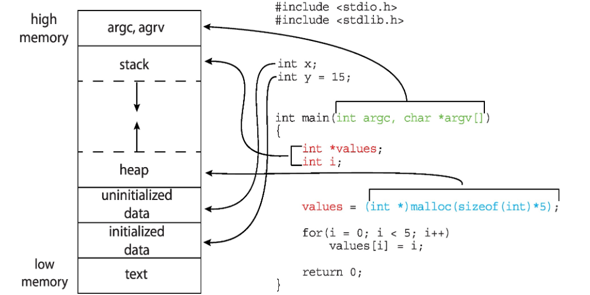
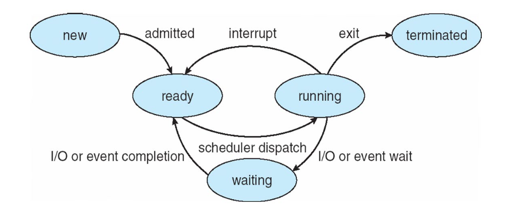
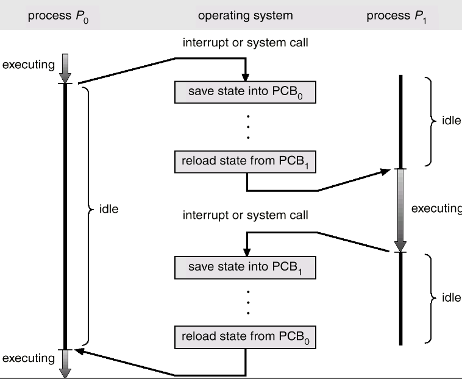
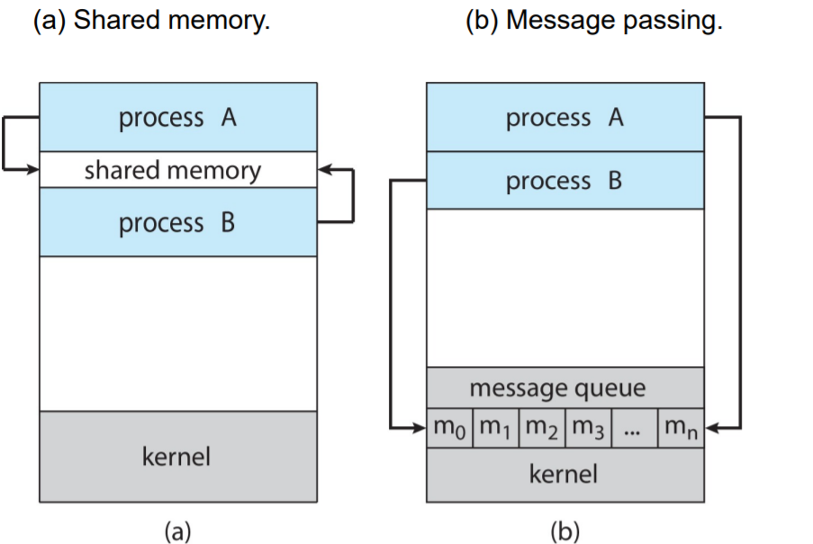
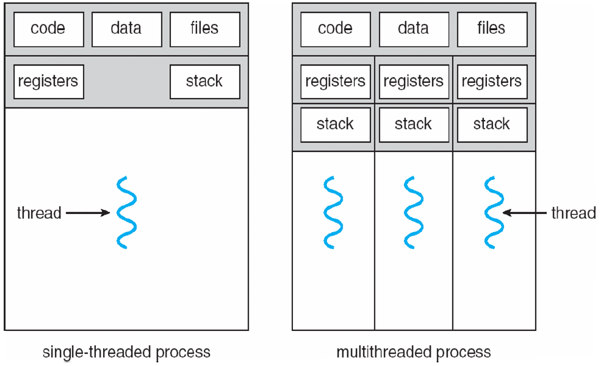
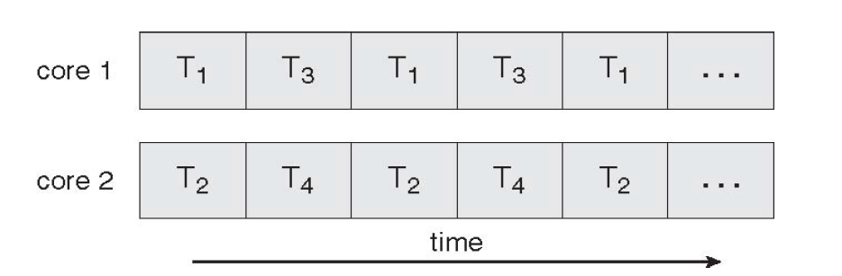
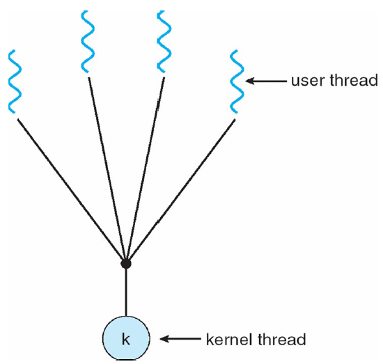
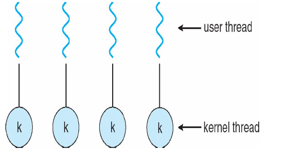

# 操作系统2：进程/线程

## Chapter 3. Process 进程

### 3.1 进程的定义

- 进程是一个在执行中的程序

  - 放在外存的程序就不是进程，进程可以理解为进行中的程序
  - 是计算机工作的基本单位，和job，task，user program等概念相同
  - 是一个包含了**一系列指令和一些资源**的容器
    - 是一个抽象实体，执行任务的时候，将要分配和释放各类资源

- 进程包括以下内容：

  - 程序代码(text section)

  - 程序计数器 PC

  - 寄存器

  - 数据区，存储全局变量

  - 栈区，存储临时变量

  - 堆，**动态分配**的内存(C语言中的malloc)

  - 在内存中的示例图


- 进程的状态：

  - 几种状态
    - new 新建，创建一个新进程
    - running 运行、执行：执行指令的状态
    - ready 就绪，准备好被分配给一个CPU执行
    - waiting 等待，等待一些事件结束后再执行
    - terminated 中止，执行结束
  - 会引起状态变化的操作：
    - 程序中的操作，比如系统调用
    - OS操作，比如调度的决策
    - 外部操作，比如中断
  - 状态迁移的图解：


  - 假设一个单CPU的计算机，OS进程有运行就绪等待三个状态，假设某个时刻该系统有10个进程并发执行：
    - 处于执行状态的最多有1个，处于就绪/等待状态的最多有9个

## 3.1.1 进程控制块 PCB

- 每个进程在操作系统内用进程控制块来表示
  - 进程控制块PCB包含如下信息：进程状态，PC，CPU寄存器，调度信息，内存管理信息，accounting信息，文件管理，I/O统计信息
  - 在Linux内核中，进程的信息用一个C语言中的结构`task_struct` 来表示，定义在头文件`<linux/sched.h>` 中，各个进程之间构成一个**双向链表** 

### 3.2 进程调度 Scheduling

- 调度队列：
  - 作业队列：系统中所有进程的队列
  - 就绪队列：在内存中处于就绪状态得进程的队列
  - 设备队列：等待I/O设备的进程的队列
  
- 三种scheduler
  
  - ## (作业题)进程调度需要将进程在ready、running、blocked三种状态之间切换
    
  - 长程调用/作业调度：现代操作系统已经没有使用长程调度了
  - 短程调度：又叫CPU调度，选择下一个将要被CPU执行的进程
  - 中程调度
- 另一种分类方式：
    - I/O型进程：主要事件花在IO上
    - CPU型进程：主要时间花在CPU处理上
  
- 上下文切换：

  - 当**切换到另一个进程的时候，系统必须要保留上一个进程的状态，同时又载入新进程的状态**

  - 在PCB中表示

  - 耗时取决于硬件的支持


  - A context switch occurs when the CPU switches from one process to another.


### 3.3 进程操作 Process Operation

## 3.3.1 进程的创建

- 父进程可以创建子进程，并可以形成一棵进程树，每个进程有唯一标识号pid

  - pstree命令可以查看进程树

- fork：创建进程的系统调用

  - `int pid1 = fork();` 
    - 事实上就是把当前进程分出了一个新的子进程，一个程序变成了两个进程，其中一个是父进程一个是子进程
    -  一个进程调用`fork()`函数后，系统先给新的进程分配资源，例如存储数据和代码的空间。然后把原来的进程的所有值都复制到新的新进程中，只有少数值与原来的进程的值不同。相当于克隆了一个自己
  - 返回值是一个pid1，从系统调用fork中返回的时候，两个进程除了返回值pid1不同以外具有完全相同的用户级上下文，子进程中pid1为0，父进程中pid1的值就是子进程的pid

  ```cpp
  int main() {
      int pid1 = fork();
      if(pid1 < 0) {
          cout << "Failed!" << endl;
      } else if(pid1 == 0) {
          // chidren proccess
      } else {
          // parant process
      }
  }
  ```

## 3.3.2 进程的终止

- 引起进程终止的事件：
  - 正常结束、异常结束、外界干预
  - `exit(0)` 退出进程
- 系统调用wait()
  - 通过wait**父进程可以等待子进程结束**，wait调用会返回进程的状态信息和结束进程的pid
    - 这使得父进程可以等待并回收子进程的资源
    - 父进程一旦调用了`wait()`就立即**阻塞自己**，由wait自动分析是否当前进程的某个子进程已经退出，如果让它找到了这样一个已经变成僵尸的子进程，wait就会收集这个子进程的信息，并把它彻底销毁后返回；如果没有找到这样一个子进程，wait就会一直阻塞在这里，直到有一个子进程出现并结束为止
  - **子进程中止而父进程尚未调用wait**就会使得子进程变成一个僵尸进程(zombie process)
  - 父进程中止而没有调用wait就会产生一个孤立进程(orphan process)

> 安卓操作系统的进程重要度分级架构——优先中止最不重要的进程
>
> - Foreground process 正在运行的进程
> - Visible process 可视化的UI组件等等
> - Service process 后台提供服务的进程
> - Background process 
> - Empty process 空进程


### 3.4 进程间通信 Interprocess Communication

- 进程的分类

  - 独立进程：不能被其他进程影响，也不能跟其他进程交互
  - 合作进程：进程之间可以进行通信
    - 信息共享、方便性
    - 计算加速

- 进程间通信 IPC

  - 通信分为直接通信和间接通信
    - 直接通信就是进程之间直接发送信息，间接就是还有中介，比如内存、邮箱共享等
  - 两种通信的模型：共享内存模型和消息模型


  - 常用的通信机制：	
    - 信号 signal
    - 共享存储区 shared memory
    - 管道 pipe
    - 消息 message
    - 套接字 socket
    - 是个操作系统都有的通信机制：信号量、消息队列、共享内存
    - 在Linux操作系统中，还有：
      - 文件锁 file lock 问题是速度很慢，因为文件是磁盘I/O
      - POSIX线程：互斥锁(mutex)，条件变量 

- Windows 的进程间通信

  - 信号：一系列Windows API
  - 文件映射机制：可以将整个文件映射为进程虚拟地址空间的一部分来加以访问
  - 无名管道：类似于UNIX的管道，与此相对的Windows还有命名管道
  - 邮件槽 mailslot
  - 剪贴板 Clipboard：暂时保存了一些文本

## 具体的栗子

- 有限缓冲区Bounded-Buffer，缓冲区的大小有上限
  - 生产者-消费者问题：生产者进程制造出新信息，消费者使用新的信息
  - 用类似于**循环队列**的数据结构控制内存的访问

- 消息传送：分为阻塞的和非阻塞的(block & unblock)
  - 阻塞的消息传递：同步的
    - send需要发送方阻塞直到消息被接收
    - receive需要接收方阻塞直到有消息送到
  - 非阻塞的消息传递：异步的
    - 发送方发送之后直接继续，接收方不断接受到有效/无效的消息

- Socket 作为交流的endpoint
  - Socket中包含了IP地址和端口，端口是一个包含了数据包起点的数字
    - 标号为1024以下的端口是常用端口，用来提供标准服务
    - 特殊的IP地址127.0.0.1表示正在运行进程的系统
  - 交流需要通过一系列的Socket来实现


## Chapter 4：Thread & Concurrency 线程和并发

### 4.1 Overview

- 进程是资源的拥有单位和调度(Dispatching)单位

  - 进程由虚拟地址空间，控制一些资源，有状态、优先级和调度
  - 进程是由一个或者多个程序的一次支持，可以和其他进程交替执行

- 线程thread

  - 资源拥有单元称为进程，**调度的单位称为线程**，也叫做轻型进程LWP

    - 一个传统进程，或者叫重型进程HWP和线程中的一个任务等价
    - 线城市进程内的一个执行单元或者一个可调度的实体

  - 线程只拥有必要的资源，但是可以和同一个进程下的其他线程共享进程拥有的全部资源

  - ## **线程的特点：**

    - 有执行状态
    - 不运行时，保存上下文
    - 有一个执行栈
    - 有局部变量的静态存储
    - 可以取所在进程的资源，但是**不拥有系统资源** 
      - 同一个进程下面的进程还共享代码段和数据段
    - 可以创建、撤销另一个进程
    - 一个进程中的多个线程可以并发执行，系统开销小，切换快


  - 线程带来的benifits	
    - 创建线程、线程之间切换的时间比较少
    - 共享了内存和文件，线程之间的通信不需要经过内核
  - 多核情况下的线程并行


### 4.2 多线程模型

- 用户级线程和内核级线程
  - 用户级线程
    - 不依赖于OS内核，应用进程利用线程库提供创建、同步、调度和管理的函数来控制用户线程
      - 即用户线程的维护由应用进程来完成
      - 内核**不了解用户线程的存在** 
      - 用户线程切换不需要内核特权
      - 一个线程发起系统调用而阻塞，则整个进程在等待
    - 常见的线程库：POSIX pthreads库， win32 threads， Java threads
  - 内核级线程
    - 依赖于OS内核，由内核的内部需求进行创建和撤销，用来执行一个指定的函数。一个线程发起系统调用而阻塞，不会影响其他线程。时间片分配给线程，所以多线程的进程获得更多CPU时间
      - 内核维护进程和线程的上下文信息
      - 线程的切换由内核完成
      - 时间片分配给线程，所以多线程的进程获得更过CPU时间
      - 一个线程发起系统调用而阻塞，不会影响其他线程

- 线程模型

  - 多对一模型：内核一个线程，用户多个线程，好处是不需要OS的支持	

    - 可以使用调度策略来优化，但是在多处理器中不适用


  - 一对一模型：每个用户线程对应一个内核线程

    - 每个内核线程独自调度，由OS进行一系列线程操作


  - 多对多模型：每个用户线程对应多个内核线程


### 4.3 Implicit Threading（隐私多线程）

- 隐私线程：将线程的创建和管理交给编译器和运行时库来完成
  - 常见的方法有：Thread Pools 线程池
    - 创建一系列线程等待工作
  - 这里好像讲的比较随意，估计是不太重要


## 练习题

- process scheduler可以切换ready running和blocked三种状态
- **线程控制块 TCB** 存储的内容包括machine states，包括寄存器和程序计数器，实际上就是存储了线程拥有的资源
- 抢占式多任务系统 preemptive multitasking system
  - 一个进程在运行随时可能被另一个进程抢占
  - running到ready是有效的切换


