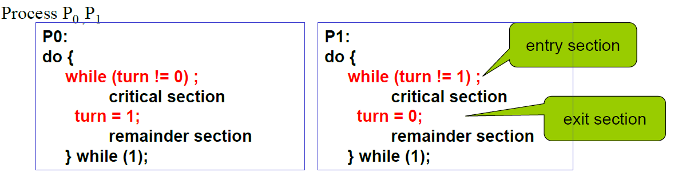
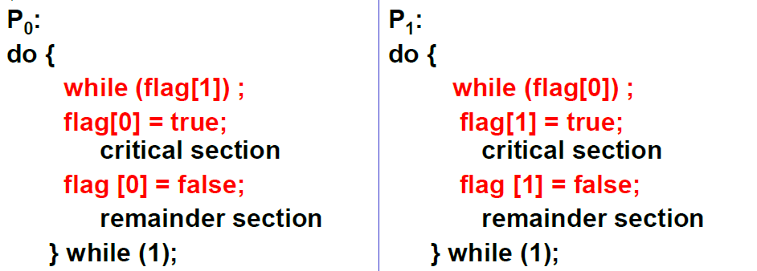
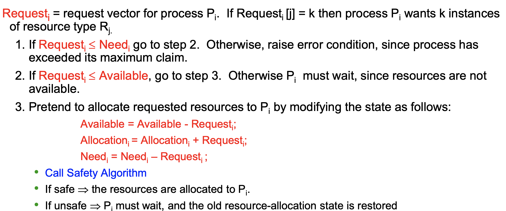

# 操作系统4：同步和死锁

## Chapter 6：Process Synchronization

##### 6.1 Background

- 并发的线程访问共享数据的时候可能会出现数据的不一致性

  - 需要有一定的机制去维持一致性

  - 比如上一节提到的有限缓冲区问题中，我们维护一个counter来记录缓冲区中item的个数，其中两个进程producer和customer分别需要执行`counter++`和`counter--`，但是这两种操作需要满足**原子性**(运行的时候不允许被中断)，如果两个进程producer和customer都想要改变counter，就可能导致数据的不一致性

    - 一个`counter++`的操作编译成汇编语言可能就是,`counter`--同理，区别是**寄存器不同**

    ```c++
    regiter1 = counter;
    register1 = register1 + 1;
    counter = register1;
    ```

  - 一个神奇的题目：

    ```C
    有两个进程P1、P2，它们分别执行下面的程序体，其中total是两个进程都能访问的共享变量，初值为0（可理解为共享存储段中的存储单元），count是每个进程的私有变量。假设这两个进程并发执行，并可自由交叉（interleave），则这两个进程都执行完后，变量total可能得到的最小取值是
    A. 50 B. 1 C. 2 D. 3;
    
    P1: {
    	int count;
    	for ( count =1; count <= 50; count++ )
    		total = total + 1; 
    }
    P2: {
    	int	count;
    	for ( count =1; count <= 50; count++ )
    		total = total + 2; 
    }    
    ```

    - 这道题的答案是3，因为每一次都会有`total=registerX` 这样一个步骤，只需要合理地控制这一步就可以使得最后total是3，题目中讲的方法就是在写入total之前执行另一个进程剩下的49次，这样就使得total不会被这49次影响，因此**能影响到total结果的只有一次+1，一次+2**，最后的结果就是3

- 竞争条件 Race Condition

  - 多个进程都需要访问和修改一块共享数据区，此时数据的状态取决于最后访问这一区域的进程
  - 为了防止竞争条件的出现，并发的进程必须**同步**`Sychronized`
  - 三个控制问题：
    - 互斥mutual exclusion 多个进程不能同时得到一个资源
    - 死锁dead lock 进程互不相让，导致永远得不到资源
    - 饥饿starvation 资源分配不公平，一个进程长时间得不到资源

##### 6.2 主要问题

- 基本概念

  - 假设有n个进程在竞争一些共享的数据区
  - **临界资源**：一次只允许一个进程访问的资源，比如消息缓冲队列等等
  - **临界区critical section**：访问临界资源的代码段
  - Solution必须满足以下条件：
    - `mutual exclusion` 互斥，一个进程在访问临界资源的时候其他的进程不能访问
    - `Progress` 空间让进：如果临界资源没有进程在访问，并且有进程想要进入临界区，那么应该允许其进行
    - 有限等待：进程需要在等待有限时间之后可以访问资源

- Peterson's Solution

  - 以两个进程为例，指令的装载是原子的，即不能被中断

  - 算法1：


    - 这个算法是强制轮流的，没有考虑进程的实际需要，造成资源利用不充分，没有实现空闲让进

  - 算法2：


    - 依然不满足空闲让进，两个进程可能都进不了临界区，如果两个进程同时执行了第一行，就会两个都进不了临界资源，这里就造成了死锁，看起来比前面一个算法更加糟糕，开倒车🚗	
    - 如果改成下面这样，可能会导致两个进程同时进入临界区，不满足互斥条件


  - 算法3：Peterson's Algorithm——缝合怪，是上面两个算法的结合


    - 变量turn表示谁可以进入临界区，flag数组表示进程是否准备好了
    - 满足了三个条件：互斥，空闲让进，有限等待

  - 面包房算法`Bakery Algorithm`：处理n个进程时候的情况

    - 进入临界区之前，进程收到一个标号number，标号最小的进程可以进入临界区
    - 如果两个进程有相同的标号，则按进程本身的下标决定谁先来
    - 共享的数据区`bool choosing[n]; int number[n];` 若choose为真则表示进程i正在获取编号，number表示进程的编号

##### 6.3 硬件的同步

- 计算机提供的硬件支持和硬件指令
  - Test-And-Set 测试与设置的指令，调度的选择是随机的
  - swap 交换指令
  - 优缺点：
    - 优点：
      - 适用于任意数目的进程，单处理机/多处理机系统都适用
      - 简单容易验证，可以支持进程内存存在多个临界区，只需为每个临界区设置一个布尔变量
    - 缺点：
      - 消耗CPU时间，不能实现让权等待
      - 可能产生饥饿，从等待的进程中随机选一个，可能永远选不上
      - 可能死锁
- 自旋锁 Spinlock
  - 处理多处理机的互斥机制的自旋锁，类同于TS指令机制，是一个和公用数据结构有关的锁定机制
  - 自旋锁像所保护的数据结构一样，存储在共用的内存中，是用汇编语言写的
  - 当线程试图获得自旋锁的时候，在处理器上所有其他的工作都要终止，因此拥有自旋锁的线程永远不会被抢占

##### 6.4 semaphores 信号量

- 信号量：一种数据类型，只有初始化，wait和signal三种操作

  - 整型信号量
  - 记录型信号量：可以取任意的正整数，表示资源的个数
  - AND型信号量
  - 二值信号量：只能是0或者1，也叫做同步互斥锁

- 记录型信号量S

  - 数据结构表示

  ```c
  typedef struct {
      int value;
      struct process *list;
  } semaphore;
  ```

  - S.value>0表示有这么多资源可以用，等于0表示无资源可用或者不能进入临界区，负数表示在等待队列中进程的个数或者表示等待进入临界区的进程
  - 两种原子操作：block()将running转换成waiting，wakeup()将waiting转换成ready
  - wait操作和signal操作的实现方式

  ```c
  wait(semaphore *S) {
  	S->value--;
  	if (S->value < 0) {
  		add this process to S->list;
  		block();
  	}
  }
  
  signal(semaphore *S) {
  	S->value++;
  	if (S->value <= 0) {
  		remove a process P from S->list;
  		wakeup(P);
  	}
  }
  ```

  - wait表示申请一个资源，signal表示释放一个资源，一般都需要成对出现

- 死锁和饥饿

  - 死锁：两个进程互相等待导致执行不了，陷入无限的等待中

  

  - 饥饿：资源没有释放导致进程一直在等待队列中

##### 6.5 经典的同步问题

###### 6.5.1 生产-消费者问题

- 也叫做有限缓冲区问题，描述了一组生产者向一群消费者提供消息，他们共享了一个优先缓冲池(bounded buffer pool)，生产者向其中写入消息，而消费者从中取得消息
  - 这是很多协作进程通信过程的抽象
  - 假设可以写的缓冲区有N个，设置三个初始的信号量：`mutex=1，full=0，empty=N`

###### 6.5.2 读者-写者问题

- 问题描述：
  - 只要读数据的称为读者，一些进程要求修改数据内容的称为写者
  - 读者可以同时读，但是写者不能和其他进程同时访问，必须互斥
  - **第一**读者写者问题：允许多个读者一起读，只有一个写者可以进入数据区，会导致写者饥饿
    - 信号量的设置：`mutex=1，wrt=1` 用一个readcount记录读者的数量
  - **第二**读者写者问题：当有写者就绪的时候就尽可能满足写者的要求

###### 6.5.3 哲学家吃饭问题

- 问题描述：
  - 一群哲学家围成一圈吃饭，每个哲学家和邻座共有一根筷子，一个哲学家吃饭需要拿起两边的筷子，哲学家的行为在吃饭和思考之间转换


## Chapter 7：死锁 DeadLock

##### 7.1 死锁的基本概念

- 死锁的定义：指多个进程因竞争共享资源而造成相互等待的一种僵局，若无外力作用，这些进程都将永远不能再向前推进
  - 死锁发生的前提是我们写的程序不能自己倒过来运行
- 产生死锁的四个必要条件：
  - 互斥：一个资源在一个时间里只能被一个进程使用
  - 占有并等待：进程已经占有了一个资源又提出新的要求，而该资源又被其他进程占有
  - 资源不可抢占/剥夺：资源只能等占有它的进程使用完之后释放，不能被抢占
  - 循环等待：一系列进程Pi，等待后一个进程占有的资源，占有了前一个进程需要的资源

##### 7.2 资源分配图Resource Allocation Graph

- 由一系列的节点V和边E组成：
  - 是有向图，边是有方向的
  - 节点V分成两类，P表示进程节点的集合，R表示资源节点的集合
  - 边分成请求边和分配边两种，请求边从P指向R，表示进程请求这个资源，分配边从R指向P，表示资源被分配给进程

- 资源分配图中有环就表明**可能存在**死锁，当一个资源有多个实例的时候也可能不死锁，也就是说判断是否死锁需要考虑资源的实例个数和分配情况
  - 没有环的肯定没有死锁
  - 有环并且可用的只有一个实例，就产生死锁
  - 有环但是还有多个可以分配的实例，不死锁

##### 7.3 死锁的处理

- 三种方法：
  - 程序的开发阶段预防和避免死锁
  - 程序运行时进行死锁的检测和解除
  - 鸵鸟方法：假装死锁没有发生过，这一方法被大多数操作系统使用，如UNIX，Linux，Windows
  
- 预防死锁：
  - 对于不能共享的资源使用同步互斥
  - 当一个进程请求一个资源时，不能占有其他任何资源——静态预分配
  - 不能抢占
  - 资源有序申请，破坏循环等待
  
- 避免死锁
  - 分配资源之前判断是否可能产生死锁，如果会死锁就先不分配
  
  - **安全状态**：系统存在一种调度的方式使得进程按这个顺序可以申请到所需资源并完成运行，这个进程序列叫做安全序列，否则就叫不安全状态
  
  - 如果系统处于安全状态就不可能会产生死锁，否则就有可能，而**避免死锁就要让系统永远处于安全状态**
    - 每类资源只有一个实例，使用资源分配图算法
    - 每类资源有多个实例，使用银行家算法
    
  - 资源分配图算法：
    - 用虚线表示需求边，一定条件下可以转换成请求边
    - 假设P需要R，只有在需求边P-R变成分配边R-P而不会形成环的时候才允许这次申请
    
  - 银行家算法：
  
    - 假设有n个进程和m种资源
      - available[m]=k表示第m种资源有k个实例
    - max[i,j]=k表示第i个进程需要资源j 的k个实例
      - allocation[i,j]=k表示第i个进程分配了资源j的k个实例
    - Need[i,j] =k表示还需要k个
    - 安全算法：
  
    
    - 资源分配算法
    
  
- 死锁的检测：

  - 单个实例：使用等待图，如果**有环就是死锁** 
  - 多个实例：有一套死锁检测算法
  
  


