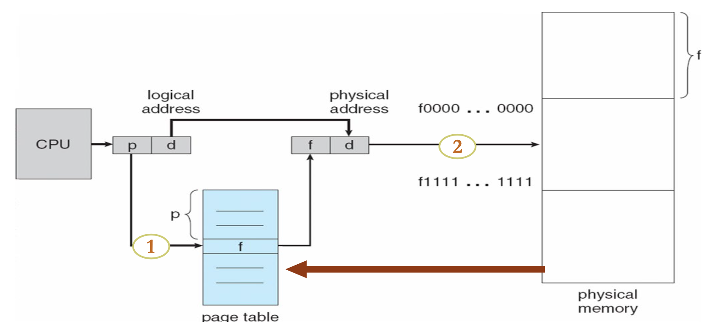

# 操作系统5：存储管理

## Chapter 8：主存 Main Memory

### 8.1 基本知识

- 程序一定要从磁盘装载进入内存才能运行，内存和寄存器是CPU可以直接访问的存储部分

  - cache位于内存和CPU寄存器之间

- 逻辑地址和物理地址

  - 逻辑地址也叫相对地址和虚地址，由CPU生成，用户程序汇编之后生成的目标代码通常采用相对地址的形式
    - 首地址作为0，其他指令都用相对于首地址来编址
    - 不用能逻辑地址在内存中读取信息
  - 物理地址：实地址，绝对地址，可以直接寻址

- 基地址寄存器和限长寄存器

  - 一对基地址寄存器和限长寄存器定义了逻辑地址空间
  - 基地址寄存器存放地址的首地址，限长存储长度

- 地址映射

  - 在编译、装在和执行三个阶段都有发生
  - 编译阶段，如果预先知道内存的location就可以生成absolute code，一旦起始位置变了就需要重新编译
  - 装载阶段，如果内存的location未知，必须生成可以重定位的代码
  - 执行阶段，如果进程可以移动那么绑定会延迟到运行的时候，需要硬件支持地址映射

- 内存管理单元

- 动态装载和动态链接

### 8.2 交换技术

- 交换技术是指一个进程可以暂时被移出内存并保存在backing store中，然后再次装载进入内存执行
  - backing store是后备存储器，是一个可以存储所有内存映像的快速磁盘，可以提供对这些内存映像的直接访问
    - 在Linux系统中表现为交换区，Windows中表现为pagefile.sys
  - 调出和调入：优先级低的进程被调出，优先级高的被调入，使用交换变量，交换的主要耗时是transfer time
  - 系统会维护一个准备队列来存放准备运行的进程，其内存映像都存储在disk上面
  - 正常情况下是不会交换的，在内存低于一个阈值的时候会启动交换，在内存增加到一定数量的时候停止换出
  - 移动操作系统不支持交换，因为是基于闪存的，有写的次数限制

### 8.3 连续分配

- 主存往往被分为两个单独的分区：

  - 常驻操作系统：保存在具有中断向量的低内存中
  - 用户进程被保存在高内存中

- 浮动寄存器relocation register被用来保护用户进程，将进程之间隔离，并防止其改变操作系统的数据和代码

  - 基寄存器保存最小的物理地址的值
  - 有限寄存器包含了逻辑地址的区间，每个逻辑地址必须比有限寄存器要小
  - MMU动态映射逻辑地址

- 分区式管理的基本思想是将内存划分成若干个连续的区域，称为分区，每个分区只能存放一个进程，分为固定分区和动态分区

  - 固定分区：分成若干块固定长度的分区，区域和区域之间存在着未使用的内存空间
  - 动态分区：
    - 动态划分内存，在程序装入内存的时候把可以使用的内存划分出一个连续的区域分配给该进程，并且分区的大小正好适合进程的需要
    - 三种动态的分配算法
      - First-Fit 分配第一个可以用的足够大的内存分区给进程
      - Best-Fit 分配最小的足够大的内存分区给进程
      - Worst-Fit 分配最大的一个分区给进程，必须搜索整个记录表
      - Next-Fit 类似于First-Fit，每次分区的时候总是从上次查找结束的地方开始，找到一个够大的区域就分配

- 内存碎片 Fragmentation
  - 内存会浪费，产生很多的fragmentation，内部碎片是进程内存空间内部的fragmentation，外部碎片是进程内存空间之间的碎片，会减少可运行的进程个数
  - 可以通过拼接和压紧来进行，但是消灭fragmentation需要非常大的cost

### 8.4 页式存储管理

- 分页管理使得一个进程内部的逻辑地址所处的物理空间可以是不连续的，进程在有空的地方就被分配物理内存

  - 物理内存被分成许多固定大小的frame(帧、物理块)，一般大小都是4k
  - 逻辑地址被分成了若干块相同大小的block，称为页，运行一个n页的程序需要找到n个空闲的帧
  - 页表用于将逻辑地址转化成物理地址，页表中列出了进程的逻辑页和其在主存中的物理帧之间的对应关系

- 地址的转换：

  - 由CPU生成的地址被分为页号p和偏移d，页号被作为页表的索引，包含每一页的在物理内存中的基地址，偏移表示在物理地址相对于基地址的偏移量
  - 对于**逻辑地址空间大小**为$2^m$，页的大小是$2^n$的情况，页号p有m-n位，偏移量有n位

- 页表page table

  - 页表位于内存中，有PTBR和PTLR分别存储页表号和页表的长度
  - 页表的cache：TLB也叫联想寄存器，快表，工作原理如下图所示

  - 有效访问时间

  - 内存的保护：用一位来表示数据是否有效

- 共享页：没仔细讲

- 页表的类型

  - 分级页表：x86的逻辑地址32位，页的大小是4kb，则页表项最多有1M个，这就需要每个进程的页表需要连续的4MB，这很明显是不现实的，因此需要分级的页表
  - 哈希页表：虚拟页号通过一个hash函数在页表中查找

  - 反向页表：逻辑地址由pid+页表号+偏移量组成

### 8.5 分段管理

- 一个进程有若干个部分组成，包括

  - 将逻辑地址分为段号+段内地址

## Chapter 9：虚拟内存Virtual Memory

### 9.1 基本概念

- 虚拟内存的基本思路：只将一部分正在运行的程序放入内存中，将逻辑内存和物理内存分开
  - 请求调页Demand Paging 按需要调取页，请求页式管理
  - 请求段式管理 Demand Segmentation
  - 局部性原理：空间局部性和时间局部性
  - 虚拟内存的空间比物理地址的空间要大
- 一个进程的地址空间中，从高到低依次是栈、堆、数据和代码区，再往外的高地址空间是操作系统的内核和环境变量和参数

### 9.2 按需调页

- 基本的想法是只在需要的时候将一个页调度内存，可以减少I/O次数和内存使用，相应更快，支持更多用户
- 页表的结构
  - 有效位：每个页表的项目需要一位来表示该页是否有效，如果页表中显示这个页表项是无效的，就说明存在page fault，说明这一页在内存中不存在
  - 在请求分页系统中，每个页表项的页号对应有如下内容：
    - 物理块号
    - 状态位P，表示该页是否已经调入内存中，供程序访问的时候参考
    - 访问字段A，用于记录本页在一段时间内被访问的次数，或者最近已经有多长时间没有被访问
    - 修改位R/W，表示页在调入内存后是否被修改过
    - 外存地址：用于指出该页在外存上面的地址
- 缺页Page Fault
  - 第一次访问页表中的某一项肯定会导致缺页(因为还没有调入内存，这一页无效)，会使得操作系统进入缺页中断，此时操作系统会把页调入内存中并修改表项，然后重新运行上一条指令(因为没有访问到)
  - 缺页率p在0-1之间，内存访问有效时间EAT的计算方式是：(1-p)*物理内存访问效率+p\*缺页中断服务的时间
    - 缺页服务的时间包括发现缺页、换入和换出、重新启动所需要的时间之和
    - PPT上有一个比较具体的时间统计过程，但是太细了，记不住

### 9.3 进程创建

- 虚拟内存允许进程创建的时候进行写时拷贝(copy-on-write)
  - COW允许父进程和子进程一开始的时候共享一些页，如果有进程需要改变页的内容，才会copy一份该页，这样可以让进程的创建更加有效率
  - Windows和Linux都使用该技术

### 9.4 页面置换

- 当内存没有空闲帧的时候，就需要进行页面的置换，即找到一些内存中的页将其换出
  - 目标是要尽可能减小page fault的概率
  - 使用一个修改位来减少过多的页置换，只将修改过的页写入磁盘中
  - 页面置换算法的过程：
    - 找到磁盘上需要换入的页面
    - 然后去内存中找一个空闲的帧或者选出一个淘汰帧，将这个淘汰帧写入磁盘，然后修改页表
    - 将需要换入的帧换入内存中并修改页表
    - 启动进程
  - 我们希望置换之后得到最小的page fault率，因此可以使用引用串来表示一系列对页的访问，引用串由一系列页号组成
  - 常见的页面置换算法
    - FIFO先进先出算法
      - 会引发Belady's Anomaly 更多的帧导致更多的缺页
    - OPT最佳页面置换算法：选择未来不再使用的或者在离当前最远位置上出现的页被替换
    - LRU最近最久未使用算法：选择最久没有引用的页面来替换，但是要记录页面使用时间，硬件开销太大
      - 该算法的关键问题在于怎么计算多长时间没有被引用
        - 使用计数器：每个页有一个计数器，每次页被使用就将时钟拷贝到计数器中，当页中的内容需要改变的时候，通过计数器来决定把哪一页换出去
        - 使用栈：使用一个双向链表来维护一个页号的栈，当页被引用的时候就将对应的页号移动到栈顶，好处是确定替换页面的时候不需要进行搜索
    - 近似LRU算法
      - 使用引用位，初始化为0，被引用就变成1，优先替换引用位是0的页
      - 附加引用位算法：每页使用一个8bit的引用位，被访问的时候左边最高位为1，定期右移并且最高位补0，寄存器数值最小的就是最久未使用的页面
      - 二次机会算法：也叫clock算法，需要引用位，如果被替换的页的引用位是1，那么就设置引用位为0，然后保留这一页，将时钟顺序的下一页作为替换
      - 增强二次机会算法
    - LFU最不经常使用算法
    - MFU最多引用算法
    - Page Buffering页面缓冲算法

### 9.5 帧分配

- 固定分配Fixed Allocation
  - 平均分配算法：顾名思义，平均分所有的帧
  - 按比例分配：按照进程的size来分配
- 优先级分配Priority Allocation
  - 如果一个进程发生了缺页，可以置换自己的帧，也可以置换一个更低优先级进程的帧
  - 置换策略有全局置换和局部置换，全局置换就是可以置换所有的帧，而局部置换只能置换该进程拥有的帧
  - 分配策略有固定分配和可变分配，和置换策略组合之后产生了三种分配和置换策略
    - 固定分配局部置换
    - 可变分配全局置换
    - 可变分配局部置换

### 9.6 抖动Thrashing

- 如果有一个进程没有足够的页数，会导致缺页率非常高，导致低的CPU使用率，抖动就是一个进程频繁换进换出页的行为
  - 按需掉页的基本原理是计算机的两个局部性，当局部性失效的时候就会出现抖动的现象
- 工作集模型
  - 工作集WS是最近被引用的页的集合
  - 后面慢慢看

### 9.7 内存映射文件

- 内存映射文件的读写允许文件读写被作为一个routine memory access来进行，将一个磁盘块映射到内存中的一页
  - 一个文件一开始用按需调页的方法读入
  - 文件子序列的读写被作为内存访问来进行
  - 允许多个进程将同一个文件映射到内存中

### 9.8 内核内存分配

- 和用户内存不同，通常使用一个空闲内存池
  - 内核需要多种不同size的内存大小
  - 一些内核内存需要是连续的
- Buddy-System
  - 用一些物理地址连续的定长段分配内存
  - 内存的分配以2的幂为单位
- Slab Allocator

### 9.9 其他

- 预调页：
  - 可以减少一开始会产生的大量缺页
  - 预先将一些页调入内存中，但是如果没有被引用，就会导致内存和I/O的浪费
- 页的大小：需要综合考虑帧的大小、页表的大小、I/O设备的性能
- TLB的范围

本文总阅读量次