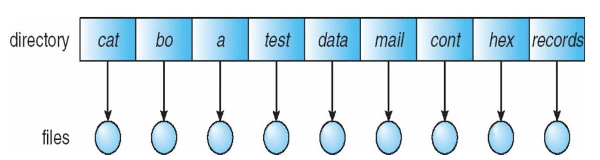
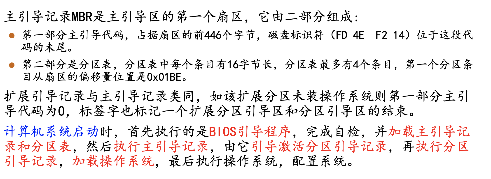
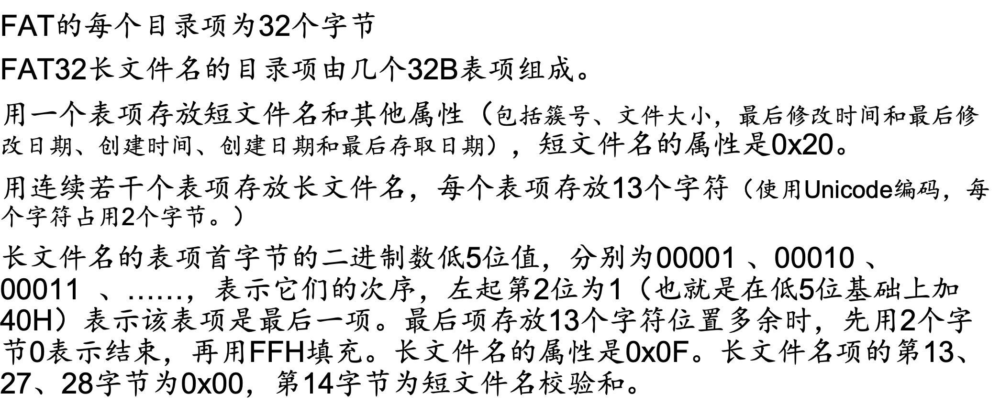

# 操作系统6：文件

## Chapter 10. File-System Interface

### 10.1 文件

- 文件是存储在某种介质上的并且具有文件名的一组信息的集合，分为数据和程序
  - 文件具有很多属性，比如name，type，location，size，protection等等
  - 文件是一种抽象数据类型，可以进行创建、读写、删除等操作
  - 打开文件需要：
    - 文件指针，指向上次读写位置的指针
    - 文件打开次数的计数器，记录文件被打开的次数，当最后一个进程关闭文件的时候就从打开文件的记录表中移除这个文件名
    - 文件的磁盘位置
    - 访问权限
  - 文件的结构
    - 流文件结构：字符流或者字节流
    - 记录文件结构：按照行或者定长、变长的段来存储
    - 复杂结构：格式化文档、可重定位加载文件

### 10.2 文件访问的方式

- 三种存取方式

  - 顺序存取：按照顺序读取文件中的内容，有一个当前位置的指针，读写一次都前进一格，也可以将指针reset

  - 直接存取：可以直接读写n个字符
  - 索引顺序

### 10.3 文件目录

- 磁盘的结构

  - 磁盘可以划分成若干个分区，每个分区都有目录和文件
  - RAID可以防止磁盘或者分区failure

- 目录

  - 可以搜索、创建、删除、重命名、遍历文件

  - 分类：

    - 单级目录

    - 多级目录
    - 树形目录：搜索速度快
      - 绝对路径和相对路径的区别
    - 无环图目录：允许项目有共享的子目录和文件，同一个文件或者目录可以出现在两个不同的目录中
      - 共享文件的实现方式是创建一个链接，链接实际上是指向另一个文件或者目录的指针，但是无环图必须是无环的，
      - 删除链接并不影响原文件而只是删除链接，当原文件被删除的时候链接也会被删除，也可以暂时不管这些指针，而是等使用的时候再发现原来的文件已经被删除
      - 也可以使用一个文件引用表，在删除所有链接之前不能删除文件，UNIX系统中采用了硬链接的方式，在inode中记录文件被引用量

    - 通用图目录

### 10.4 文件系统安装

- 文件系统在访问之间必须要进行挂载

### 10.5 文件共享和保护

- 网络文件系统：常见的分布式文件共享方式
- 多用户系统中可以使用用户id和组id标识文件和访问权限
- Linux/Unix系统中，文件的权限分为读写执行三种，用RWX分别表示三种权限，用户/小组的权限可以用一个数字来表示，执行用1表示，读是2，写是4，用一个0-7之间的数字来表示用户的权限，比如5=4+1表示可以写和执行，7=4+2+1可以读写执行

## Chapter11：File System Implementation

### 11.1 文件系统的分层

- 文件系统
  - 位于二级存储中，即被存储在磁盘中
  - 是操作系统中以文件方式管理计算机软件资源的软件和被管理的文件和数据结构的集合
  - 文件控制块FCB：存储文件的结构
  - 设备驱动器控制物理设备
  - 分层的文件系统设计：
    - 逻辑文件系统：管理各类文件的元数据，即文件系统的所有数据结构，而没有实际的数据，或者文件内容，根据给定的符号文件名来管理目录结构，逻辑文件系统通过FCB来维护文件的结构
    - 文件组织模块：知道文件对应的逻辑块和物理块
    - 基本文件系统：向合适的设备驱动程序发送一般命令就可以对磁盘上的物理块进行读写
    - I/O控制：由设备驱动程序和中断处理程序组成，实现内存和磁盘之间的I/O
  - 常见的文件系统
    - FAT用于MS-DOS中的文件系统，FAT32（VFAT）是Windows98中的文件系统，NTFS是最新的Windows文件系统
    - ext系列是Linux操作系统中使用的文件系统，proc是Linux的虚拟文件系统，yaffs是闪存文件系统
    - HFS+是macOS和iOS上的文件系统
    - NFS网络文件系统
    - VFS是Linux使用的一个虚拟文件系统是物理文件系统和服务之间的借口，给用户和程序提供了统一的接口（系统调用）

### 11.2 文件系统的实现

- 磁盘上的文件结构
  - 在磁盘上，文件系统包括如下信息：
    - 如何启动存储的操作系统 boot control block
    - 总的块数，空闲块的数目和位置
    - 目录结构和各个具体的FCB
  - FCB包括文件的权限、时间信息、大小、所有者、数据块或者数据块的指针
- 内存中的文件结构
  - 分区表
  - 目录结构
  - 系统打开文件表
  - 进程打开文件表

### 11.3 文件目录的实现

- 线性检索法：按照线性遍历查找所有的文件
  - 程序实现比较简单
  - 缺点是非常耗时
- 哈希表：减少了目录搜索的时间，但可能会引发冲突
- 索引：用的比较多，如B+树索引

### 11.4 文件物理结构

- 分配方式：磁盘块如何被分配给文件

  - 连续分配：每个文件分配一系列连续的磁盘块，优点是简单但是浪费空间

    - 允许随机访问
    - 文件的size不能增长否则就要换块，可以采用defragmentation机制
    - 存在一个逻辑地址向纹理地址转换的机制，LA/512=Q…R
    - 基于长度的分配

  - 连接分配：每个文件是若干磁盘块组成的链表，一个block包含数据和指针

    - 不允许随机访问，逻辑地址/块的数据位大小=Q…R
    - FAT(File-allocation table)文件系统就是连接分配的，FAT32有一个引导区，而文件分配表维护了一系列文件的链表

    

    

    - NTFS卷布局：引导系统，主文件表，文件区，MFT前16个元数据文件备份，文件区
      - 每个分区有一个主文件表MFT，用数据库形式组织，每条记录长度是1K

  - 索引分配：

    - 用索引块专门存放所有的指针，**每个文件使用一个索引块**，包含文件所使用的块的地址
    - 分为一级索引和二级索引等形式
    - 链接索引：索引块组成的链表

  - Linux的ext2/ext3以及Unix的UFS采用了混合分配机制

本文总阅读量次
