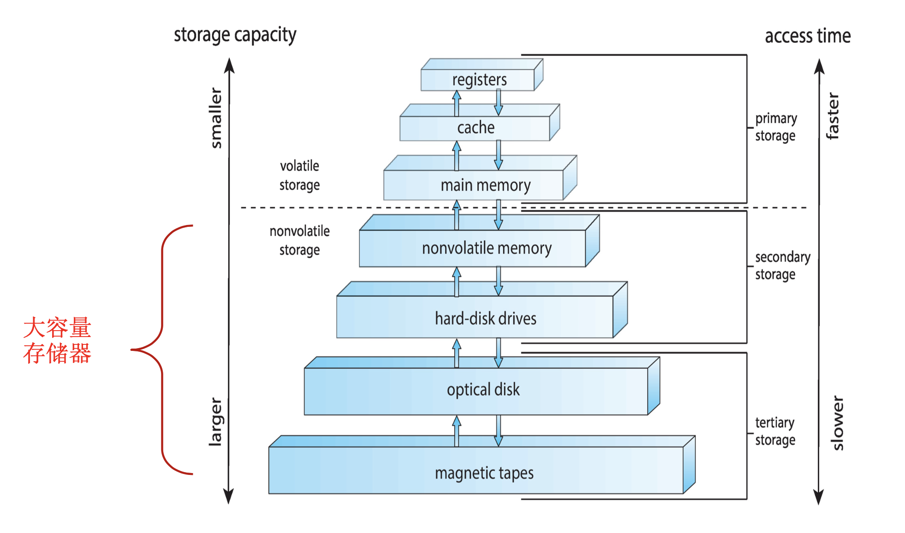

# 操作系统7：磁盘和I/O

##Chapter 12：大容量存储系统

- 存储器的体系结构，二三级都是大容量存储器

- 常见的大容量存储器
  - 磁盘：可拆卸，通过**总线**连接到计算机
    - 总线的种类很多，有EIDE, ATA, SATA, USB, Fibre Channel, SCSI等等
  - 固态驱动器：Solid State Drives，简称SSD，也叫固态硬盘，由控制单元和存储单元（FLASH或者DRAM）组成
  - 磁带：LTFS(Liner Tape File System)为磁带提供了一种通用、开放的文件系统

###12.1 磁盘结构

- 磁盘的地址被分为若干个逻辑块的一位数组，一般逻辑块的大小是512字节
  - 逻辑块的数组被映射到扇区中
  - 扇区0是第一个磁道上的第一个扇区
  - 映射的顺序是从一个磁道用完之后，使用同一个cylinder中的其他磁道，然后从cylinder从外到内

- Network-attached storage(NAS) 通过网络来存储
- Storage Area Network(SAN)

- 虚拟化存储技术
  - 是将存储（子）系统内部功能与具体应用、主机及通用网络资源分离、隐藏及抽象的行为。以期达到存储或数据管理的网络无关性
  - 对于存储服务及设备的虚拟化应用，以期达到整合设备功能、隐藏复杂细节以及向已经存在的底层存储资源添加新的应用

###12.2 磁盘的调度

- 磁盘的**访问时间**有三个主要影响因素

  - 寻道时间：将读写头移动到对应的扇区中所需要的时间
  - Rotational latency旋转延迟：将扇区旋转到读写头对齐所需要的额外的时间
    - 可以通过转速来计算，平均需要旋转半圈
  - Transfer Time传输时间：读写所需要的时间

- 磁盘的调度算法：

  - 先来先服务(FCFS)：按照需要的顺序来调度磁盘中的内容
  - 最短寻道时间优先(SSTF)：先选择需要的寻道时间最短的磁盘进行调度
  - 扫描(SCAN)算法：先往start或者end扫描，然后再反方向扫描，读取需要的扇区，也叫电梯算法
  - 循环扫描(C-SCAN)算法：到一头之后直接返回另一端，再扫描一次

  - C-LOOK：SCAN的升级版，往一端去的时候，到了最后一个请求就直接折返，不死磕到底
  - 总结：
    - 扫描类算法在大规模的系统中效果更好，算法的性能取决于磁盘访问请求的数量和类型
    - 磁盘调度算法应该在操作系统中单独写成一个模块，方便被其他的算法替换。

###12.3 磁盘的管理

- 磁盘管理

- 启动块 Boot Block存储在ROM中，启动的时候，先启动ROM中的代码，然后是启动块中的代码，然后是整个OS内核

###12.4 Swap-Space Management 交换空间管理

- 交换空间是因为虚拟内存将磁盘空间作为内存的扩展，因此需要大量的交换
  - Windows中用pagefile.sys来存储交换空间的信息
  - Linux和Unix系统中划分了专门的磁盘分区

###12.5 RAID结构

- RAID的全称是Redundant Arrays of Inexpensive (independent) Disks（冗余廉价磁盘阵列）

  - 把多块物理硬盘组合成一个逻辑磁盘，提供更好的存储性能和数据备份技术
  - 提高了fail所需的平均时间
  - RAID的分级

  - RAID依然有可能fail，因此备份是非常必要的
- 通常情况下，会有少量热备盘未被分配，自动替换失效的硬盘并在其上重建数据

##Chapter13：I/O System

- I/O设备日益多样化，但是软硬件的接口却越来越标准化，因此操作系统内核设计成使用设备驱动程序模块的结构，为不同的I/O设备提供了统一的接口

- I/O系统由总线I/O系统和主机I/O系统两种组成

  - I/O设备具有一定的寻址方式，被直接I/O指令和内存映射I/O所使用

- 不同的I/O方式：

  - 轮询polling，需要考虑设备的状态（ready、busy、error）
  - 中断interrupt，CPU有一条中断请求线，由I/O设备触发，设备控制器通过中断请求线发送信号而引起中断，CPU捕获中断并派遣到中断处理程序，中断处理程序通过处理设备来清除中断。
    - 中断请求分为非屏蔽和可屏蔽的两类，非屏蔽的中断用于处理如不可恢复内存错误等事件，可屏蔽中断可以由CPU在执行关键的不可中断的指令序列前加以屏蔽
    - 中断优先级：能够使CPU延迟处理低优先级中断而不屏蔽所有中断，这也可以让高优先级中断抢占低优先级中断处理。
    - 中断可以用于处理各种异常，系统调用是中断驱动的，中断可以用来管理内核的控制流
  - DMA：直接内存访问，不需要CPU，需要DMA控制器，数据直接在I/O设备和内存之间传输

- I/O的系统调用提供了对不同I/O设备的统一接口

  - 驱动设备对内核隐藏了不同I/O控制器差异

  - 块设备包含了磁盘驱动器，可以进行read, write, seek 等操作，允许Raw I/O or file-system access，或者内存映射文件访问
  - 字符设备包括鼠标键盘和串口，包含get和put等命令

- 阻塞I/O和非阻塞的I/O

  - 阻塞：进程挂起直到I/O完成
  - 非阻塞：I/O调用立刻返回，比如buffered I/O，通过多线程机制来实现
  - 异步I/O：进程和I/O同时运行

- 内核的I/O子系统

  - I/O的调度：
    - OS通过为每个设备维护一个请求队列来实现调度，调度方式根据实际需要确定，可以FCFS也可以优先级调度
    - 其他的实现方法：缓冲、高速缓冲、假脱机
  - 缓冲：
    - 解决了CPU和I/O设备的速度失配问题，需要管理缓冲区的创建、分配和释放
    - 单缓冲、双缓冲、多缓冲、缓冲池
  - 假脱机SPOOLing 用来保存设备输出的缓冲，这些设备如打印机不能接收交叉的数据流
  - 内核中需要维护一些I/O相关的数据结构，保存留I/O组件使用的状态信息，包括打开文件表，网络连接，字符设备状态等

- 进程从磁盘中读取一个文件的过程

- STREAM

  - 是一个用户进程和I/O设备之间的全双工通信信道

- 提高I/O性能的办法：

  - 减少上下文切换、数据的copy
  - 减少中断，使用更大的数据传输和更优秀的控制器，或者使用轮询
  - 使用DMA
  - 平衡CPU，内存，I/O设备和总线的吞吐量

  

