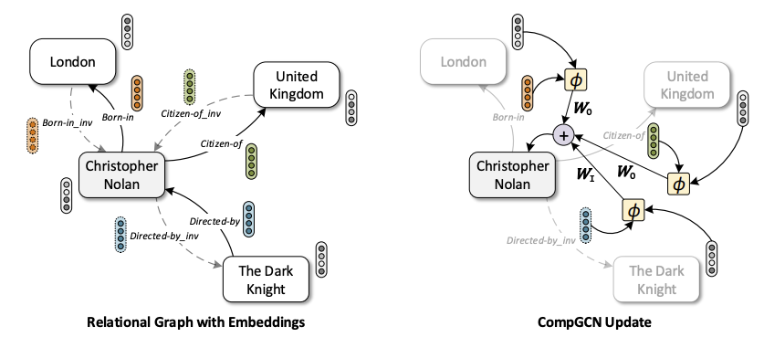

# 论文阅读笔记29：异构GCN

> ICLP2020论文《Composition-based Multi-Relational Graph Convolution Networks》阅读笔记，并合其他常见的异构图神经网络结合进行分析对比。

## Introduction

异构图神经网络是在同构图神经网络的基础上发展而来的，其目的是用来对异构图的进行表示学习，相比于同构图，异构图在真实世界中更加常见，因此异构图神经网络也有很多应用场景，比如自然语言处理/知识图谱/分子性质预测等等。图卷积网络是非常重要的一类图神经网络，而已有的异构图卷积网络主要有R-GCN及其变种，他们的主要设计思路是对于不同的边(即Relation)使用不同的图卷积核，并且图卷积核对于一个关系中不同的实体的权重是不同的，比如R-GCN的结点更新策略是：

$$
h_{i}^{(l+1)}=\sigma\left(\sum_{r \in \mathcal{R}} \sum_{j \in \mathcal{N}_{i}^{r}} \frac{1}{c_{i, r}} W_{r}^{(l)} h_{j}^{(l)}+W_{0}^{(l)} h_{i}^{(l)}\right)
$$

而这样的方法往往面临着过**参数化(Over-parameterization)**的问题，即设置了过多的参数，导致模型的学习效果反而下降，同时这些方法大多数只能学习到结点的表示，而不能学习边的表示，因此限制非常多。

而本论文中提出的模型CompGCN就是为了解决为了解决这些问题，CompGCN从知识图谱嵌入中获得了灵感，采用了一系列机遇composition的操作对异构图进行建模，并在链接预测等任务上进行了实验，取得了非常不错的效果。

## 模型的细节

一个异构图被定义为$G=(V,R,E,X,Z)$，其中V和R分别表示所有结点和所有边，而E表示图中所有的路径信息(即点-边-点，对应到KG中就是三元组)，CompGCN使用了一个很常见的异构图trick对数据进行扩增——引入逆关系，即：

$$
\left.\mathcal{E}^{\prime}=\mathcal{E} \cup\left\{\left(v, u, r^{-1}\right) \mid(u, v, r) \in \mathcal{E}\right\} \cup\{(u, u, \top) \mid u \in \mathcal{V})\right\}
$$

这么多可以丰富异构图的数据，同时可以让信息**在有向图中双向流通**。

### 基于关系的组合

参考了知识图谱表示学习中的方法，CompGCN对一系列三元组$(s, r, o)$(即有向图中的一条边和头尾两个结点)进行建模，并且希望尾结点可以由头结点+关系通过某种函数的运算来得到：

$$
\boldsymbol{e}_{o}=\phi\left(\boldsymbol{e}_{s}, \boldsymbol{e}_{r}\right)
$$

这种建模的方式适合用来进行链接预测，这个函数$\phi$ 也被称为是组合函数。

这样的建模方式可以让模型学习到关系的嵌入表示。这也是CompGCN的一大特点，它和其他几种已有的GCN的对比如下：

### 参数更新

CompGCN的参数更新相比于已有的RGCN，减少了参数的数量，有效防止了过参数化，GCN的消息传递机制可以表示成：

$$
\boldsymbol{h}_{v}=f\left(\sum_{(u, r) \in \mathcal{N}(v)} \boldsymbol{W}_{r} \boldsymbol{h}_{u}\right)
$$

造成参数量过大的核心就是矩阵W在异构图的情况下太大了，而CompGCN的设计是：

$$
\boldsymbol{h}_{v}=f\left(\sum_{(u, r) \in \mathcal{N}(v)} \boldsymbol{W}_{\lambda(r)} \phi\left(\boldsymbol{x}_{u}, \boldsymbol{z}_{r}\right)\right)
$$

这里的W是一个和关系的类型有关的矩阵，论文将关系分成了原本的关系，逆关系和自关系三种，每一种关系共用一个矩阵W，即：

$$
\boldsymbol{W}_{\operatorname{dir}(r)}=\left\{\begin{array}{ll}
\boldsymbol{W}_{O}, & r \in \mathcal{R} \\
\boldsymbol{W}_{I}, & r \in \mathcal{R}_{\text {inv }} \\
\boldsymbol{W}_{S}, & r=\top(\text { self-loop })
\end{array}\right.
$$

这样一来就有效减少了参数量(原本是每个关系都对应一个参数矩阵)

同时CompGCN会对关系的嵌入向量也进行更新：

$$
\boldsymbol{h}_{r}=\boldsymbol{W}_{\mathrm{rel}} \boldsymbol{z}_{r}
$$

这里所有的关系共用一个投影矩阵，而为了在关系数量变大的时候让模型保持更好的可扩展性，论文提出将关系的初始表示分解成若干个可学习向量的线性组合，这样一来虽然关系变多了，但还是这些向量的线性组合，总的参数量不会增加很多。

$$
\boldsymbol{z}_{r}=\sum_{b=1}^{\mathcal{B}} \alpha_{b r} \boldsymbol{v}_{b}
$$

### 组合函数的选择

组合函数$\phi$ 的设计思路其实就是来自于知识图谱表示学习，论文从TransE, DisMult, HolE等多个知识图谱表示模型的打分函数中汲取了灵感，设计了这样几个不同的组合函数：

## 实验

论文的实验主要做了链接预测和结点分类等等，值得注意的是GNN得到的结点和边表示并不能直接进行链接预测，而是作为知识图谱表示模型的初始化向量再进行进一步的训练才能进行链接预测，比如论文使用了CompGCN+TransE的方式进行链接预测实验：

本文总阅读量次

