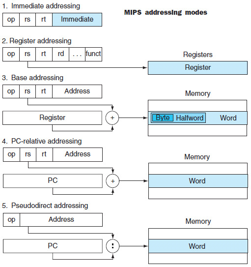
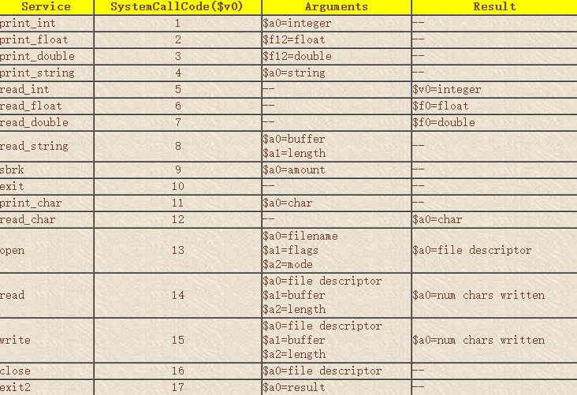

# 1. MIPS 指令系统

## 1.1 基本的MIPS指令

- Operands 操作数

  - 算术指令的操作数一定存放在在寄存器(registers)中
    - MIPS体系中有32个寄存器，每个寄存器有32bits
  - 寄存器中可以用`$s0-$s7`来存储变量，其**编号为16-23**
    - 这和C语言中的`register int i;`进行的操作相同
  - 可以用`$t0,$t1,…`来存储一些临时变量，编号为8-15，各寄存器的功能和对应编号如下

- Data transfer instructions 数据传输指令

  - 需要获取数据在内存的地址
  - 读取数据用lw，存储数据用sw，**寄存器中存储了数据在内存中的地址**  
  - Offset 偏移量：数据传输指令中的常数，表示读取多少位
  - Base Register：用于存储**基地址**的寄存器(比如数组的基地址)
    - MIPS中的地址偏移量和数组下标之间的关系是**4倍**，比如数组A的基地址在`$s3`中，要获取A[8]，则需要指令`lw $t0,32($s3)`  
    - 原因是内存中一次只能读出**4字节内存中的一行**，也就是1word的长度，事实上一条MIPS指令的长度就是1word

- MIPS指令对应的机器码格式

  - R型指令：`OP+RS+RT+RD+shamt+funct ` 
  - I型指令：`OP+RS+RT+address` 
  - OP是对应的**操作码**，RS,RT分别是第一个和第二个操作寄存器，RD是**目标寄存器**，shamt是偏移量，func是函数对应的编码
    - R型指令的操作码没记错的话都是`00000` 
  - 所有的**MIPS指令都是32位**的，其中OP6位，寄存器都是5位，shamt是5位，funct是6位，address是16位 
    - 这是设计的原则：good design demands good compromises
    - 计算机的两条原则
      - 指令用数字表示
      - 程序可以存储在内存中，像数字一样读写


## 1.2 条件判断指令

- 选择判断型指令

  - `beq register1,register2,L1 ` 和`bne register1,register2,L1 ` 
    - L1是一个行标号，可以在每行MIPS指令前写，跳转的时候就按照标号所在的位置进行跳转
    - 相当于C语言中的goto
- 例子：实现一个简单的loop，其中变量g,h,i,j存储在s1-s4而数组A的基地址存储在s5
  
  ```c
  Loop:	g=g+A[i];
  		i=i+j;
  		if (i!=h) goto Loop;	
  ```
```assembly
Loop:add $t1,$s3,$s3 #t1=2*i
  	add $t1,$t1,$t1
  	add $t1,$t1,$s5 #address if A[i]
  	lw $t0,0($s1)
  	add $s1,$s2,$t0 #g=g+A[i]
  	add $s3,$s3,$s4 #i=i+j
  	bne $s2,$s3,Loop
```

  - 跳转指令jr，用法是`jr $r` r的计算方式是当前所在地址+4*要跳转的行数
      - 一个函数结束的时候一定要写`jr $ra` 来返回主函数

## 1.3 Procedure Instructions 过程调用指令

- 用于过程调用的寄存器和指令
  - `$a0-$a3` 是4个传递参数到函数的寄存器
  - `$v0-$v1`是2个用于存储返回值的寄存器
  - `$ra` 用于返回地址的寄存器
  - `jal` (jump and link) 用于跳转到一个函数中，后面的参数为要跳转的地址，使用`jar $ra`返回主函数
  - `$sp` 一个栈指针，MIPS汇编中的栈从高地址往低地址扩展，支持Push和Pop两种操作

### 1.3.1 caller-saved和callee-saved寄存器

- Caller-saved register 易失性寄存器：用于保存每个调用过程中**不需要在各个调用之间保留的**临时变量
- Callee-saved register 非易失性寄存器，用于**保存**需要在每个调用过程中保留的临时变量
  - MIPS在函数调用的过程中需要保留`$s0-$s7` 和全局变量`$gp` 和栈指针`$sp`还有`$fp` 

### 1.3.2 案例1：编写一个简单的函数调用

```c
int  leaf_example ( int  g,  int  h,  int  i,  int   j )
{
    int f;
    f=(g+h)-(i+j);
    return f;
}
```

- 其对应的MIPS汇编代码如下
  - Assume: g ~ j ---- r0 ~ r3    f ---- r4  

    ```assembly
    Leaf:	addi $sp,$sp,-12 	#adjust stack to make room for 3 items
            sw $t1,8($sp)
            sw $t0,4($sp)
            sw $s0,0($sp)
            add $t0,$a0,$a1		#g+h
            add $t1,$a2,$a3		#i+j
            sub $s0,$t0,$t1		#f=(g+h)-(i+j)
            add $v0,$s0,$zero	#return value in v0
            lw * 3 #restore register for caller
            add $sp,$sp,12
            jr $ra
    ```

  - 往往在函数调用的时候把下一行的地址写在寄存器ra中，因此函数运行结束之后可以用`jr $ra` 指令返回到函数调用的下一句继续执行程序
  - 函数编写的时候，s0-s7的寄存器需要被**保护**，不能在函数中使用使用的，t0-t9存储临时变量，可以视情况调用

### 1.3.3 案例2：循环调用 Nested Procedure

- 简单的递归函数

```c
int fact(int n)
{
    if(n<1) return 1;
    else return n*fact(n-1);
}
```

- 对应的MIPS汇编如下：

```assembly
fact:	add $sp,$sp,-8
		sw $ra,4($sp)
		sw $a0,0($sp)
		slti $t0,$a0,1 #test for n<1
		beq $t0,$zero,L1
		add $v0,$zero,1 #return 1
		add $sp,$sp,8
		jr $ra #return to after j
L1:		addi $a0,$a0,-1
		jal fact #call fact with n-1
2000:	lw $a0, 0($sp)      
		lw $ra, 4($sp)      
		addi $sp,$sp,8
		mul $v0,$a0,$v0
		jr $ra
```

- `$fp`提供了一了一个stable base register
- `$gp`指向静态变量static variables


## 1.4  Character Instruction 字符指令

- 操作字节的MIPS指令
  - Load byte `lb $t0,0($sp)` 读取字节
  - Store byte `sb $t0,0($sp)` 存储字节
  - MIPS中表示字符串的三种方法
    - 在string的开头先写好长度
    - 维护一个表示string长度的变量
    - 在末尾使用结束标志表示一个字符串的末尾(C语言的choice)、
  - 同时还有

### 案例 strcpy的MIPS实现

```c
void strcpy(char x[], char y[])
{
    int i=0;
    while((x[i]=y[i])!=0)
        i+=1;
}
```

- 其对应的MIPS代码如下，其中x和y的首地址位于a0和a1

```assembly
strcpy:	addi $sp,$sp,-4
		sw $s0,0(sp)
        add $s0,$zero,$zero #i=0
L1:		add $t1,$a1,$s0  address of y[i] in $t1
		lb $t2,0($t1) 
		add $t3,$a0,$s0
		sb $t2,0($t3)
		add $s0,$s0,1
		bne $t2,$zero,L1
		lw $s0,0($sp)  end of the string 
		add $sp,$sp,4  pop 1 word off the stack
		jr $ra #return 
```

## 1.5 寻址模式

- Immediate addressing 立即数寻址
  - 在I型指令中出现，I型指令中的后16位作为一个二进制数字来使用
  - 立即数有时候是地址，有时候是运算数
- **跳转**寻址
  - 比如J指令前六位是000010，后面26位就表示要跳转到的地址
    - 这里的26位需要乘以4变成PC form
- 分支语句的寻址——相对寻址
  - 对于bne之类的分支语句的寻址，计算机采用**相对寻址**
    - PC(Program Counter)计算方式是`PC+4+offset*4`，offset是分支指令后16位
  - 原因是每条MIPS指令都是4字节长
- MIPS中的寻址方式的总结
  - 寄存器寻址：通过寄存器的编号来找到对应的寄存器，常见于R型指令
  - 基地址寻址：用寄存器中存储的地址到内存中去寻址，比如lw和sw
  - 立即数寻址：通过I型指令中的**立即数**来寻址
  - PC相对寻址：通过PC+4寻址
  - 伪直接寻址：J型指令中经常出现



## 1.6 MIPS指令总结

- MIPS指令的形式


- MIPS指令的Operands
  - 32 registers
  - Memory words
- MIPS编程中的注意点
  - 汇编程序可以不遵循编程原则
  - 函数可以直接跳出
  - 形参超过四个可以用栈来存储参数，在函数中弹出栈，返回值超过2个也要用堆栈，当然可以打破规则用闲置的寄存器传递参数
  - 传递参数和获取返回值的寄存器a0-a3和v0-v1一般不直接参与运算

- C语言程序在计算机中的编译过程
  - 编译compiling：将C程序转化为汇编语言程序
  - 汇编assembling：将汇编语言程序转化为机器码
  - 链接linking：将object-modules(含各个库)转化成可执行程序

## Extra：文件的一些背景知识

- 文件存储在硬盘的逻辑分区中，具体来说是扇区，一般为32KB

  - 100个1字节的文件占据了100*32KB的空间，而100KB的内容占据了4/*32KB
  - 文件的起始扇区存在目录中，多个扇区的顺序存在FAT表中，文件删除的时候需要在目录中先清空文件名，再在FAT表中设置各扇区为空闲

  - 目录也是一个文件，每个文件在目录中是一条记录
  - 内存/磁盘碎片整理
    - 文件分配的原理：从0开始，找到一块整块的能存下则放置文件，否则就进行分散分配
    - 内存用于执行某个程序，则从0开始，找到一块整块的能存下，则分配邮与文件删除和内存释放造成碎片
- 链接库

  - 分为静态链接库和动态链接库，静态链接库可以直接链接，动态链接库作为外部调用
  - Windows系统中动态链接库的后缀是dll，静态链接库的后缀是lib
  - Linux系统中动态链接库的后缀是so，静态是a
- MIPS体系下的内存动态分配：从低位到高位依次是
  - 保留区，Text区
  - static data区
  - dynamic data区
  - stack

## 1.7 MIPS 需要补充的内容

### 1.7.1 伪指令

- 伪指令：没有基于硬件实现，而是用现有的指令组合而成的一些功能
  - `move $rd, $rs`：值的拷贝， 实现的功能是rd=rs
  - `blt $rs, $rt, RR` 比较地址的大小，如果rt的地址比较大则进行跳转

### 1.7.2 系统调用

- MIPS中的系统调用相当于一个内部中断，调用系统程序

  - 指令的格式是`syscall` 进行系统调用
  - 系统调用会读取`$v0` 寄存器中的数字，根据不同的数字来执行不同的系统调用，将结果保存在a系列或者f系列的寄存器中

  

- 系统调用的一个实例

  - 这个系统调用的作用就是把寄存器t0中的数字打印出来

```assembly
li  $v0, 1            service 1 is print integer
add $a0, $t0, $zero   load desired value into argument register $a0, using pseudo-op
syscall
```

### 案例1：实现一个swap函数

```c
void swap(int v[],int k)
{
    int temp;
    temp=v[k];
    v[k]=v[k+1];
    v[k+1]=temp;
}
```

- 对应的MIPS代码如下，其中v的基地址在a0，k在a1，temp是t0

```assembly
swap:	add $t1,$a1,$a1
		add $t1,$t1,$t1
		add $t1,$a0,$t1  t1 has the address of v[k]
		lw $t0,0($t1)
		lw $t2,4($t1)
		sw $t2,0($t1)
		sw $t0,4($t1)
		jr $ra
```

### 案例2：指针和数组的区别

```c
void clear1(int a[], int size)
{
    for(int i=0;i<size;i++)
        a[i]=0;
}

void clear2(int *a,int size)
{
    int *p;
    for(p=&a[0];p<&a[size];p+=1)
        *p=0;
}
```

- 第一种函数的MIPS实现
  - 只要size是正数就可以工作

```assembly
		move $t0,$zero
loop1:	add $t1,$t0,$t0
		add $t1,$t1,$t1  i*4
		add $t2,$a0,$t1  address of a[i]
		sw $zero,0($t2)
		addi $t0,$t0,1
		slt $t3,$t0,$a1
		bne $t3,$zero,loop1	
```

- 第二种函数的MIPS实现

```assembly
		move $t0,$a0 #p=&a[0]
		add $t1,$a1,$a1
		add $t1,$t1,$t1
		add $t2,$0,$t1 #t2=&a[size]
loop2:	sw $zero,0($t0) #*p=0
		addi $t0,$t0,4 #p=p+4
		slt $t3,$t0,$t2  p<&array[size] ?
		bne $t3,$zero,loop
```


