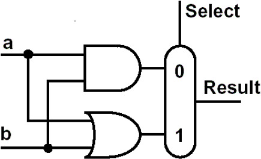
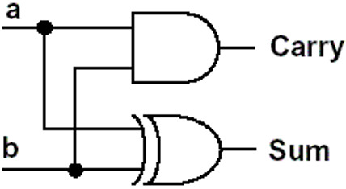
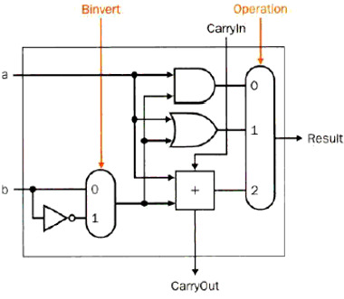

# 2.  Arithmetic for computer 计算机运算

## 2.1 数据表示：浮点数/无浮点数

### 2.1.1 二进制数的表示

- K进制的数的表示方式 $N=/sum/limits_{i=m}/limits^{n-1}b_i/times K^i$ 其中0-n-1是整数位，-1到m是小数位
  - 无符号数：n位二进制无符号数可以表示的值的范围是：0到$2^n-1$ 
  - 有符号数：把最高位用来表示数的正负，0表示正数，1表负数
    - 存在的问题：存在正0(0000 0000)和负0(1000 0000)两种0

- 二进制数的一些操作
  - 对应的十进制数的计算方式是：对于n位有符号的二进制数，最高位的权重是$-2^{n-1}$,其余位的权重是$2^{n-1}$,将权重相加就得到了对应的十进制数
  - 二进制的位扩展(sign extension)：把符号位扩展到高位的每一位 
    - 比如4位的1010扩展成8位就是11111010
  - 大小比较(MIPS指令)
    - 有符号数之间的比较用slt和slti(和立即数比较)
    - 无符号数之间的比较用sltu和sltiu

### 2.1.2 各种二进制码

- **有符号数**的三种🐎：原码，反码，补码和移码

  - 能用这些码表示的都按照有符号数来处理
  - 原码：由符号位+绝对值组成，最高位是符号位0或1，其余位是原本数字的**绝对值**表示
  - 反码：由原码到补码的一种中间形式
    - 正数的反码就是其本身
    - 负数的反码是**符号位不变**，其他位依次取反
  - **Two's Complement** 补码
    - 正数的补码还是本身，负数的补码**按位取反之后加1**，对于负的整数$[X]_{c}=2^{n+1}-|X|$ 

  - overflow
    - 对于N位二进制数，如果数值小于$-2^{N-1}$或者大于$2^{N-1}-1$即为溢出
    - 无符号数不考虑溢出的情况
    
  - 移码(biased-code)的表示

    - 由符号位+绝对值组成，计算的方法是**补码的最高位取反**
      - 比如-128的补码是1000 0000，其对应的移码就是0000 0000
      - 127的补码是0111 1111，其移码就是1111 1111

- 三种🐎的比较(8位数字的情况下)

  | 类型         | 原码                     | 补码                 | 移码               |
  | ------------ | ------------------------ | -------------------- | ------------------ |
  | 范围         | -127-127                 | -128-127             | -128-127           |
  | 最小数       | 1111 1111                | 1000 0000            | 1000 0000          |
  | 最大数(+127) | 0111 1111                | 0000 0000            | 1111 1111          |
  | 0            | 0000 0000 1000 0000 | 0000 0000            | 1000 0000          |
  | 优点         | 直观                     | 加减运算方便         | 大小上数码完全一致 |
  | 缺点         | 同号异号，运算麻烦       | 大小比较需要单独处理 | 符号位和别的码不同 |

## 2.2 汉字系统

- ASCII码：美国信息交换标准码
  - 标准的ASCII码只有7位，但是为了方便计算机处理，扩展成了1字节(8位)
  - ASCII码中有128个字符，其中可打印字符96个，控制字符32个
  - 后来因为128个字符不够又扩展了新的128个
  - 常见的ASCII码：A位于65，a位于97
- 汉字的表示
  - GB2313区位码
  - 输入码：五笔，拼音等等
  - 字模码：
    - 用8x8的点阵表示ASCII码
    - 用16x16的点阵表示汉字，可以用16个16位的二进制数来表示一个汉字

## 2.3 Addition & Subtraction

- 加减法

  - 加法：原码直接相加，进位给下一位
  - 减法：直接相减，或者将两个数的补码相加(此时得到的结果是补码)
  - overflow，比如1111 1111+1111 1010 = 1 1111 1001，1000 0001 + 1111 1110 = 0111 1111

  

  - MIPS中处理溢出的方式是**interrupt**，溢出指令的地址被**保存在寄存器中**，计算机跳到预定地址以为该异常调用适当的例程。中断的地址将被保存，以便在某些情况下程序可以在执行纠正代码后继续执行
    - 其他的处理方式还有：在ALU中进行硬件检查；interrupt和EPC存储指令地址
  - 符号数加法的MIPS代码

  - 无符号数加法的MIPS代码
    - 取相反数的运算方式：将数字和0进行nor运算

- 加法器的设计

  - 最简单的一位ALU：进行and或者or操作

    

  - 一些名词的简称

    - OF: overflow 判断是否溢出，最高进位和次高进位的**异或** 
    - CF: CarryOut 进位的值
    - ZF：zero，当结果为0的时候ZF=1，否则是0
    - SF：符号位的判断，正0负1
    - PF：奇偶校验

  - 半加器 half adder(不能和进位Carryout进行运算)

    - `sum = a xor b`, `carry = a or b` 其设计如下

      

  - 全加器 full adder

    - 运算规则,本位和$Sum=A/oplus B/oplus Carry$，进位$Carry=AB+BCarry+CarryA$ 
    - 二阶全加器的设计

  - 1 bit的ALU的设计：包含AND, OR , ADD三种指令

    - 可以通过输入的值operation来控制输出结果，比如operation=0输出的就是and运算的结果
    - 第一个Carry in的值是0

  - 32-bit的ALU：实际上是32个1bit的ALU连接起来进行运算

    - 如果是逻辑运算，就是32个1bit的ALU分别输出对应位上逻辑运算的结果，然后输出
    - 如果是算术运算，Carry In和Carry Out会在ALU之间按顺序传递下去，实现加法的进位

  - 1bit ALU的扩展：支持减法

    - 此时操作码还是3种，参数Binvert控制第二个运算数是否取反

    

    - 由于支持减法，因此ALU也可以支持大小的比较，比较大小的操作码为2
      - 加入一个Less输入作为大小判断时的输出

  - 32-bit的完全ALU

    - 还可以对32个result添加一个zero检查器

  - 加法器的基本原理
    - 完全串行的进位方式，一次运算需要3个与门，2个或门，消耗2份的时间，完成32位全加法需要的时间是一次加法运算的的32倍
    - 并行计算的进位方式，进位的ci计算全部转换成第一位的a0,b0,c0的=，依次进行迭代
    - 先行进位(并行)用$g_i=a_ib_i,p_i=a_i+b_i$来简化运算
    - 组内并行，组之间串行：4位一组

- ALU：算术逻辑单元

  - 一个最基本的ALU的结构图如下图所示

  - ALU控制线路：000对应and，001对应or，010对应add，110对应sub，111对应less than

## 2.4 **Multiplication** && Division

- 和十进制乘法一样，可以列竖式计算
  - 一一乘法口诀表：00得0，11得1，01得0，10得0
  - 乘法得两个因数分别叫做multiplicand和multiplier

- 乘法算法1
  - Binary multiplication 列竖式计算，具体过程就和十进制一样

  - 逻辑图：乘数是32位，被乘数，积和ALU是64位

    - 需要32次迭代，计算非常缓慢，需要64位加法器1个，64位寄存器2个，32位寄存器1个，移位2次

- 乘法算法2
  - Don’t shift the multiplicand，Instead,**shift** **the** **product**，Shift the multiplier
  - 逻辑图，积的寄存器的左半边才会进行change

  - 2个64位的寄存器其中一个变成了32位

- 乘法算法3
  - 1个32位加法器，1个64位寄存器，1个32位寄存器，移位操作1次

### 2.4.1 有符号数的乘法

- 补码乘法
  - $(A/times B)_{补}=A/times B_{补}$ 已知AB的补码，可以把A转换成原码和B的补码进行计算

  - 无符号数的补码之积等于积的补码

- **Booth 算法**⭐⭐⭐
  - 基本原理：用于**二进制补码的相乘**的运算，从最低位开始，只要这串数字为0就不执行任何操作，当遇到第一个1时执行一次减法，也就是减去被乘数和该位权值的积，对于后面的1不进行操作，再碰上0就加权值，如此往复
  - 两个因数都用补码的形式参加乘法运算，**结果是积的补码**
  - 加速的原理
    - Booth算法会导致addition减少而shift增加，如果shift的效率更高就会使得运算加快
  - 也就是需要判断连续的两位
    - 10 减去1所在位置的权重
    - 00 不进行操作
    - 11 不进行操作
    - 01 加上0所在位置的权重
    - 为了方便，把第-1位当作0来使用

### 2.4.2 二进制数的除法

- Dividend = quotient x divisor + remainder  被除数=商x除数+余数

- 算法1

  - 需要64位加法器1个，64位寄存器2个，32位寄存器1个，移位操作两次

- 算法2

  - 需要32位加法器1个，64位寄存器1个，32位寄存器2个，移位操作两次

- 算法3

  - 需要32位加法器1个，64位寄存器1个，32位寄存器1个，位移操作2次

  
- 有符号数的除法

  - 基本原则：计算商的时候把除数和被除数都当作正数，得出一个非负数的商，然后根据除数和被除数的符号确定商的符号，在根据关系计算余数
    - 比如7/2=3余1，而-7/2=-3余-1，7/-2=-3余1，-7/-2=3余1
  - 除数不能为0，负责会overflow

## 2.5 Float 浮点数的表示——IEEE754标准

- IEEE制定的舍入规则
  - ceil 向上取整 
  - floor向下取整
  - int 抹去小数部分
  - 三个特殊的数字 `NaN(Not a Number)`, 正负无穷大
  
- 二进制的浮点数的表示方式是 `1.xxxxxxxx * 2^yyyyyy` ，类似于十进制中的科学计数法，

  用公式表示为$x=(-1)^s/times 1.M/times 2^{E-127}$ 

  - E是阶码，一定是一个非负数，表示的范围是0-255(float中)，0-1023(double中)
  - M也叫significand，E叫exponent 
  - 浮点数的精度：用S+E+M的顺序来表示一个浮点数
    - 单精度浮点数(float)中s占1位，E占8位，M占23位，一共32位
    - 双精度浮点数(double)中s占1位，E占11位，M占52位，一共64位
  - 浮点数进位的计算方式：
    - 先确定符号位S，将数字取绝对值
    - 将数字转换到1.多的范围里，然后确定E，获取尾数M的十进制表示
    - 将M转换成23位二进制，具体方法是不断*2，如果结果超过，取整数部分作为每一位上的结果
    - **注意尾数需要四舍五入，也就是计算24位，如果24位是1就在前23位向上进1** 

- 浮点数的加减法
  - 把十进制的全部转换成二进制浮点数的原码
  - 将小数点对齐，进行加法运算
  - 说了半天其实真的算起来加减乘除都要靠转化成十进制来计算

本文总阅读量次