# 3. CPU结构

## 3.1 计算机的基本结构

- 计算机的组成结构
  - CPU
    - control unit 控制单元
    - datapath 数据通道
      - path
      - ALU 算术逻辑单元
      - registers 寄存器

  - Memory 内存

  - I/O interface 输入/输出接口

- 简单的MIPS实现原理


  - 不 言 而 喻 ，一 目 了 然

## 3.2 基本的功能组件

这一部分貌似是数逻学的，没修过所以这里先学一学

- 逻辑门电路：由于非常天空上的图非常难看，所以不贴图了
  - 与门电路：符号是半个椭圆型

    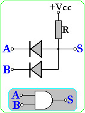

  - 或门电路：符号是月牙形

    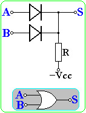

  - 非门电路：符号是三角形+圆点

    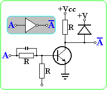

  - 异或门电路：$(A\and \neg B)/or(\neg A\and B)$ 由两个与门和一个或门组合而成

    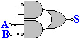

- 组合逻辑 combinational logic

  - 译码器 Decoder

    - 给出一组输入，所有输出端的输出只有一个与其他所有的输出都不同。译码器可以用于地址选择，如果译码器由n个输入端，有$2^n$个输出端，则是完全译码器

    - 由若干个非门电路和与门电路组成

      - 2-4 译码器

        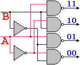

      - 3-8 译码器

        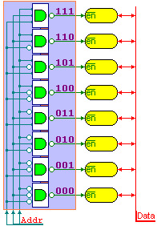

  - 多路选择器 MUX

    - 有多个数据输入，只能有一个数据输出，通过控制信号决定哪个输入被连接到输出端

    - 通过控制信号，对输出进行筛选，信号是若干个0或1，通过**非门和与门的组合**使得恰好只有一个输入值会被原样输出，n位的信号刚好可以控制$2^n$个输入数据

      

      - 四个选择的多路选择器MUX实现原理

        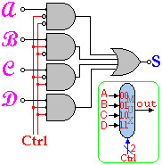

  - 移位器 Shift

    - 使用**移位寄存器**或者**多路选择器**实现移位的操作，多路选择器的本质是**空间换时间**，利用复杂的设计提高位移速度

    - 固定的移位可以直接通过输入输出线的错位来实现

      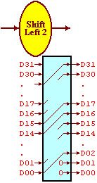

  - 符号扩展 Sign Extend

    - 对于有符号的补码进行扩展，并且正数和负数的扩展方式不同，对于补码的扩展可以通过重复符号位的方式实现，对于无符号数的扩展

      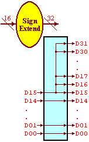

- 状态元件

  - 状态元件和组合逻辑的区别
    - 组合逻辑的输出只和输入值有关
    - 状态原件的输出还**和状态元件自身的状态有关**，一般输入输出有一个时钟的延时
  - 寄存器单元
    - 输入的值有：clk时钟，**RegWrite 写入控制**，idat **32位**的输入数据
    
    - 输出的值有：odat 32位的输出数据
    
      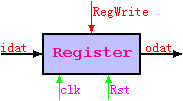

- 复杂模块

  - ALU 算术逻辑单元

    - 算术逻辑单元ALU可以执行算术逻辑运算，是CPU中最重要的运算部件

    - 支持的运算包括加减法，逻辑and和or，以及slt，采用3位控制信号

      - 控制信号中000表示and，001表示or，010表示加法，110表示减法，111表示slt

      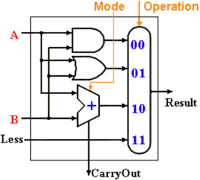

    - 32位ALU简化的示意图如下

      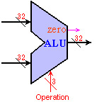

    - 输入：两个32位的数据，ALUop **3位的操作码ALUoper**

    - 输出：

      - Result 32位的输出
      - zero零标志，这个值为1的时候表示结果为0，为0的时候表示结果不是0
      - carryout **进位**标志
      - overflow 溢出标志

  - ALU 控制器：为了让常见的运算(加减法)更加容易控制

    - 输入的内容：

      - ALUop 两位的**控制信号**
      - Func 指令的功能字段

    - 输出：ALUoper ——ALU的操作码，有3位

      | ALUop | Function Field(F5-F0) | ALU      |
      | ----- | --------------------- | -------- |
      | 00    | XXXXXX                | 010——add |
      | 01    | XXXXXX                | 110——sub |
      | 1X    | XX0000                | 010——add |
      | 1X    | XX0010                | 110——sub |
      | 1X    | XX0100                | 000——and |
      | 1X    | XX0101                | 001——or  |
      | 1X    | XX1010                | 111——slt |

    - ALU控制器的示意图：

      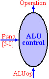

  - 算术逻辑单元的多级控制

    - 用ALU控制器控制ALU，示意图如下：

      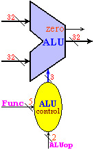

- 存储器

  - 存储器是多个寄存器和集合，由**译码器**选择指定的寄存器单元(通过地址)

  - 存储器分为只读存储器和读写存储器

    - 指令存储器是**只读**存储器(Read Only Memory, ROM)

    - 数据存储器是读写存储器(RAM) 可以根据读写控制信号，一次读/写一个32位的数据

      - 读写**共用一个地址输入端**，读写数据分别和存储器连接

      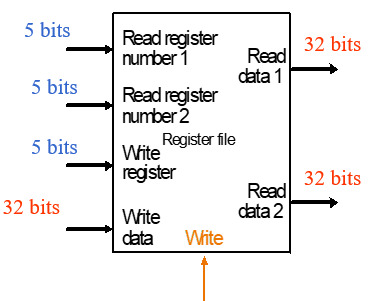
    
    - 存储器按照字节编址，MIPS采用了32位的**地址线**，可寻址空间为$2^{32}=4GB$， 数据线也是32位

  - **寄存器组**：

    - 寄存器组是CPU的主要部件

    - 因为很多指令都有2-3个操作数，因此需要用寄存器组来实现多路同时读写

    - 寄存器组的读

      - 32个32位的存储单元，由两路5位寄存器地址选择读出寄存器中的内容

        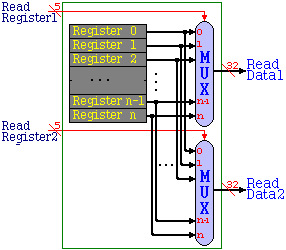

    - 寄存器组的写

      - 由5位地址选择器选择写入的寄存器，数据端位32位

      - 信号RehWrite 作为允许写入操作的控制信号

        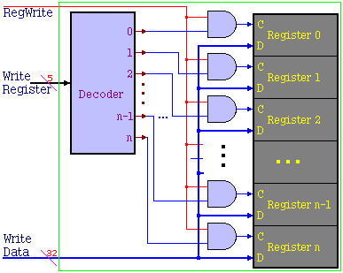

    - 寄存器组的整体结构图

      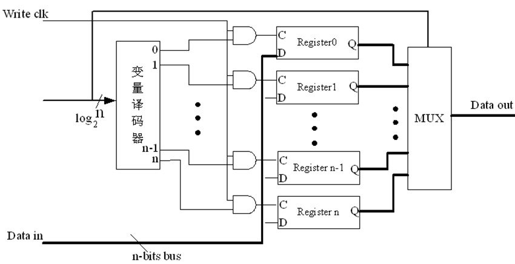

    - MIPS的一个寄存器组一共有32个32位的寄存器，编号为0-31，采用5位二进制寻址

      - 各个寄存器的功能之前已经提到过了，在第一部分MIPS指令系统里面

        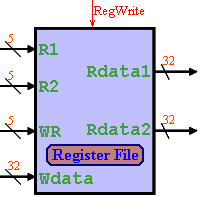

      - 输入数据

        - clk 时钟
        - rst 种植控制
        - regA，regB两路5位读的寄存器号，regW 一路写的寄存器号
        - wdat写入的数据
        - regWrite：1的时候表示允许写入

      - 输出：Adat，Bdat 二路32位读出的数据

## 3.3 单指令数据通道

- PC组件

  - 在MIPS中，所有的指令都是等长的，每条指令4字节(32位)，在PC中，保存着当前执行指令的地址

  - PC的输出接到指令存储器的地址端，每条指令执行之后，PC+4，在下一个时钟的时候就自动转到执行下一条指令

    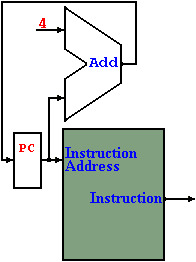

- R指令的数据通道

  - 回忆：MIPS中R指令的格式为6位操作码+3个五位的操作数(rs,rt,rd 其中rd是目标寄存器)+5位shamt+6位func

    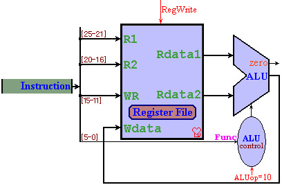

- LW/SW指令的数据通道

  - lw指令的格式：`100011+rs+rd+offset`, 表示`$rd=Memory[$rs + offset]` 

    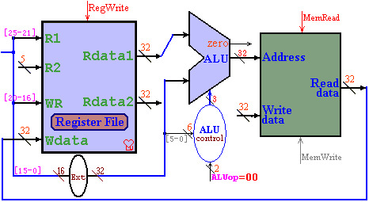

  - sw 指令的格式`101011+rs+rt+offset` ，表示`Memory[$rs + offset] = $rt`  

    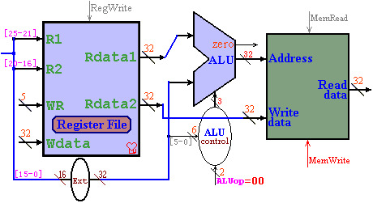

- BEQ指令的数据通道

  - BEQ指令：`pc+=4; if(r1==r2) PC+= address*4;` 

    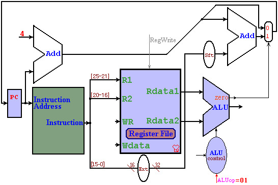

- J指令：0-25位是一个address，`PC={PC[31-28], IR[25-0], {00}}` 

  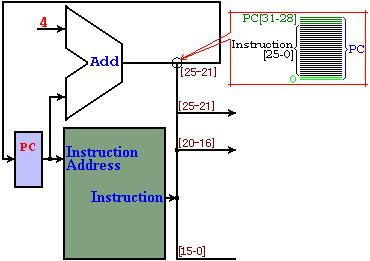

- addi指令:`rd = rs + Data` 

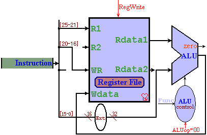

## 3.4 单时钟CPU数据通道

- 接入和接出的实现原理

  - 分支接出：对于电路，从一组线接出或者部分接出都可以

    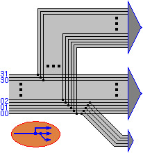

  - 多路接入：使用多路选择器MUX

    - 当有多个信号接入同一个输入端，不能直接合并，必须通过MUX选择性接入

    - 通过控制信号来决定**哪一个输入连接到输出**端

      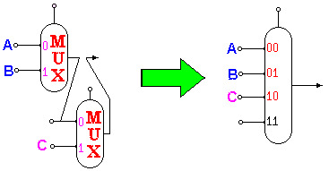

- 指令的组合：可以通过多路选择器的设计将指令合并到一个数据通道中

  - 多路选择器对于不同的指令(R型，I型，J型)会选择不同的路径

  - 需要刻在DNA里的单时钟CPU实现原理图：

    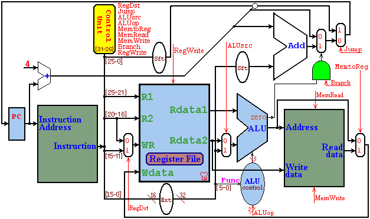

  - 新增control unit控制单元，可以发出一系列的**控制信号**，对不同的指令取不同的值

    

    - 控制信号控制了数据的流向和操作类型

    - 可以将指令码各位进行逻辑and运算，保证一条线只有当操作码为对应指令的时候才是1，否则为0

    - 控制单元内部原理示意图：

      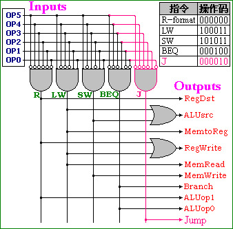
      
    - 控制信号对应表
    
      | 控制信号 | R    | LW   | SW   | BEQ  |
      | -------- | ---- | ---- | ---- | ---- |
      | RegDst   | 1    | 0    | x    | x    |
      | ALUsrc   | 0    | 1    | 1    | 0    |
      | ALUop    | 10   | 00   | 00   | 01   |
      | MemtoReg | 0    | 1    | x    | x    |
      | RegWrite | 1    | 1    | 0    | 0    |
      | MemRead  | 0    | 1    | 0    | 0    |
      | MemWrite | 0    | 0    | 1    | 0    |
      | Branch   | 0    | 0    | 0    | 1    |
    
    - 该数据通道的若干假设
    
      - 等长的指令结构，每条指令都是32-bit，其中最高的6位是操作码
      - 内存以字节编址，32位的寻址范围
      - 寄存器组公有32个32位的寄存器(5-bit寻址)，其中
        - 0号寄存器的值恒为0
        - 31号寄存器是指令的地址寄存器，用于存放**子程序的地址** 
        - 29号是堆栈指针寄存器
      - Memory，Register File，ALU的操作分别需要2，1，2个单位的时间，其他的时间可以忽略不计
    
  - 各项指令执行所需要的时间统计表

    | 指令 | 取指令 | 寄存器 | 运算 | 存储器 | 回写 | 合计 | 使用率 |
    | ---- | ------ | ------ | ---- | ------ | ---- | ---- | ------ |
    | R    | 2      | 1      | 2    |        | 1    | 6    | 44%    |
    | LW   | 2      | 1      | 2    | 2      | 1    | 8    | 24%    |
    | SW   | 2      | 1      | 2    | 2      |      | 7    | 12%    |
    | BEQ  | 2      | 1      | 2    |        |      | 5    | 18%    |
    | J    | 2      |        |      |        |      | 2    | 2%     |

    - 指令执行的平均时间为6.34
    - 在单数据通道中，每条指令只能设置一次各种控制信号，所以只能以需要时间最长的指令为一个时钟，也就是8
      - 执行效率：6.34/8=79.25% 比较低

- 单时钟数据通道新增指令设计

  - 设计机器码的格式：操作码6位是固定的，其他的东西安排在剩下的26位里面

  - 在原设计图上增加必要的组件和通路

    - 寄存器组和存储器，ALU等一般不变，可以实现新的指令功能

  - 添加新的控制信号：对于添加的新控制信号，一般原指令的默认值为0

  - 举例：新增`push $r` 指令

    - 指令的执行过程

    ```C
    $sp=$sp-4
    Memory[$sp]=$r
    ```

    - 方案1：由于指令里只有一个操作数r，因此可以将sp直接涉及到指令里面，sp有读写操作，而r只读，需要增加额外的信号4，为了连接简便，将ALUsrc改为4选1
      - 指令格式是`000000+sp+r+sp+shamt+push` 
      - 控制信号中，ALUsrc设置为10
    - 方案2：4可以写在立即数中，但此时第三个寄存器不能放sp，需要R1连接到R3，作为写sp
      - 指令格式是`push+sp+r+0004` 
      - 信号设计：RegDst设置为10

## 3.5 多时钟CPU设计

### 3.5.1 DNA里的图

- 由于单时钟只能以耗时最长的指令为时钟，为了提高效率，可以考虑**缩短时钟**，以主要部件的执行时间为时钟，重新设置一遍控制信号

  - 每个部件在每个时钟**分别执行各自的任务**，在各个主要部件之间用寄存器存放临时的结果

  - IR：指令寄存器，MDR：内存数据寄存器

    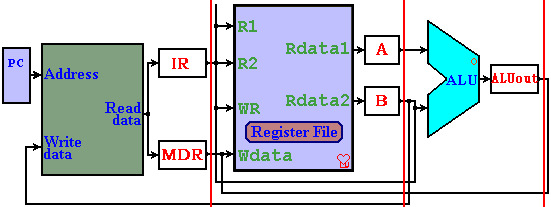

  - 本数据通道基于如下假设——和单时钟基本一样

    - 等长的指令结构，每条指令都是32-bit，最高的六位是操作码
    - 内存以字节编址，32位的寻址空间是4GB，有32个32位的寄存器
    - Memory，Register File和ALU的操作分别需要2，1，2个时间，其他的忽略不计
    - 微指令有七个字段，分别是ALU，Reg，Mem，PC等等

  - 多周期CPU的数据通道(第二张需要**刻在DNA里的图**) 

    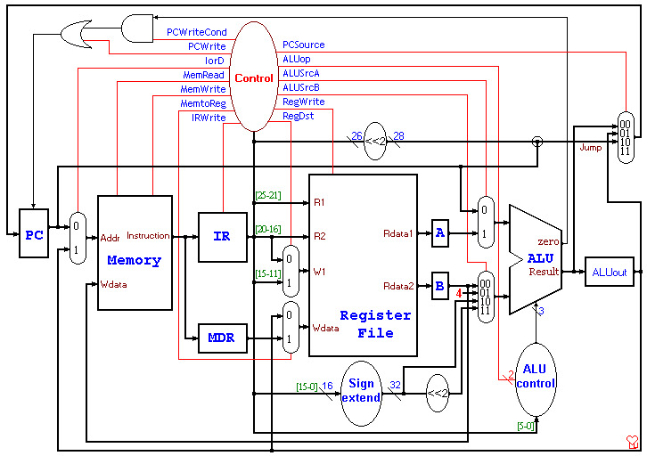


### 3.5.2 基本指令的多周期运行过程

- 多时钟周期的五个执行阶段：每个指令需要**3-5个周期**

  - IF阶段：Instruction Fetch 获取指令,具体的步骤如下

    - 使用PC来获取需要执行的指令，放到指令寄存器中
    - PC+4然后把结果返回给PC(上面两步基本上是同步进行的
    - 第一阶段所有的指令基本都是一样的
  - 其Register-Transfer Language(RTL) 是
  
    ```c
    IR = Memory[PC];
    PC = PC + 4;
    ```
  
- ID：指令得而**译码**和register fetch
  
    - 在需要的时候，读取寄存器rs和rt中的内容
  - 如果是分支指令就需要计算分支的地址
  
    ```c
    A = Reg[IR[25-21]];
    B = Reg[IR[20-16]];
    ALUOut = PC + (sign-extend(IR[15-0]) << 2);
    ```
  
- EX(BC)：执行，内存地址计算或者分支选择完成
  
    - ALU根据指令类型执行一种指令
    - 对于内存调用 `ALUOut = A + sign-extend(IR[15-0]);` 
    - 对于R型指令，`ALUOut = A op B;` 
    - 对于分支指令：`if (A == B) PC = ALUOut;` 
  - 对于jump指令，`PC = PC[31-28] + IR[25-0] << 2;` 
  
- MEM(WB)：**内存访问**或者R型指令的完成
  
    - 对于lw，`MDR = Memory[ALUOut];` 
    - 对于sw，`Memory[ALUOut] = B;` 
  - 对于R型的指令，`Reg[rd] = Reg[IR[15-11]] = ALUOut;` 
  
- WB：write-back步骤
  
  - 对于lw指令，`Reg[rt]=Reg[IR[20-16]]= MDR;`
  
- 总结：
  
  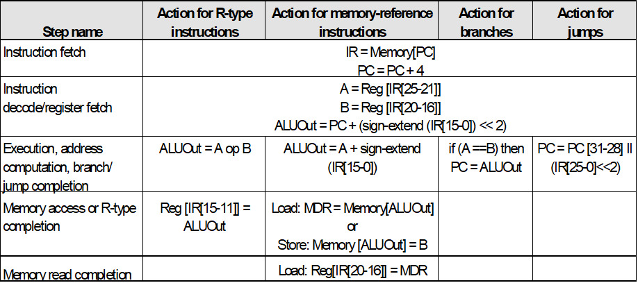
  
    - 所以R型指令4割周期，J型指令和分支指令都是3个周期，内存读写都是5个周期


### 3.5.3 控制信号和有限状态机

- 重要的控制信号和其作用

  | 信号        | 设置为0时的作用                  | 设置为1时的作用                          |
  | ----------- | -------------------------------- | ---------------------------------------- |
  | RegDst      | 设置目标寄存器为rt(20:16)        | WB阶段设置目标寄存器为rd(15:11)          |
  | RegWrite    | None                             | 目标寄存器的输入时Write data input的值   |
  | ALUScrA     | 第一个ALU的操作数是PC            | ALU的操作数来自A寄存器                   |
  | MemRead     | None                             | 内存中输入地址指定的内容作为输出         |
  | MemWrite    | None                             | 内存中输入地址指定的位置的值变为输入的值 |
  | MemtoReg    | 写入寄存器中的输入数据来自ALUout | 写入寄存器的数据来自MDA                  |
  | IorD        | PC向内存单元提供地址             | ALUOut提供地址                           |
  | IRWrite     | None                             | 内存的输出被写入IR                       |
  | PCWrite     | None                             | PC被改变，被PCSource控制                 |
  | PCWriteCond | None                             | 如果ALU的零输出active，PC被改变          |

  | 信号     | 值和对应的作用                                               |
  | -------- | ------------------------------------------------------------ |
  | ALUOp    | 00：加法运算，01减法运算，10按照funct来决定ALU操作           |
  | ALUScrB  | 00：第二个输入ALU的是寄存器B<br /> 01：第二个输入是常数4<br /> 10：第二个输入是符号扩展的，IR的低16位<br /> 11：第二个输入是符号扩展的，IR的低16位移位了2位的结果 |
  | PCSource | 00：ALU的输出(PC+4)被写回PC<br /> 01：分支目标地址被写回PC<br /> 10：J指令被写回PC |

- 有限状态机(Finte State Machine)

  - 表示各个阶段控制信号需要设置的值
  - 第三张需要刻在DNA里的图
- 第一个阶段都一样
  
  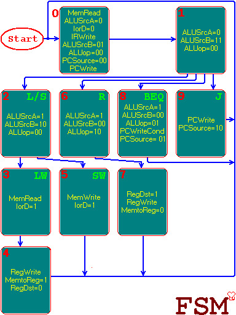

## 3.6 微指令

- 把FSM所有的控制信号预先存储在存储器中，每次只要从存储器中读到控制寄存器中，由控制存储器作为控制信号，接到相应的组件中

  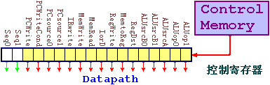

  - 存储控制信号的存储器叫做控制存储器control memory

  - 核心是空间换时间，用一个存储器存储各类信号来缩短工作时间

  - 有寄存控制器的多周期CPU数据通道

    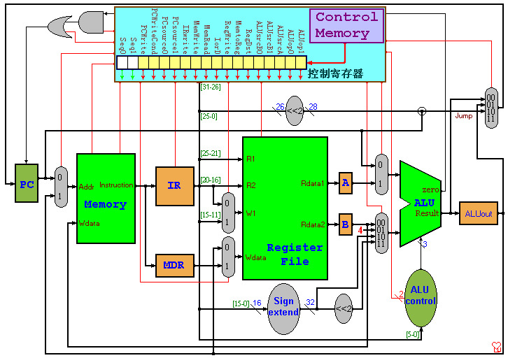

  - 微程序控制器：

    - 控制寄存器：每一位接相应的控制信号
    - 控制存储器：存放所有的控制信号
    - 地址转移逻辑：决定下一条微指令的地址

  - 微程序控制逻辑

    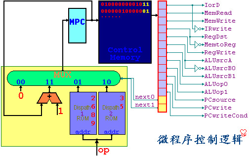

    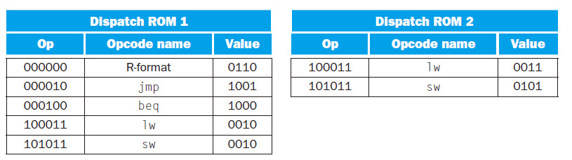

- 微指令编程

  - 为了便于微程序的编写，把控制信号分成了若干组：存储器，寄存器组，ALU，PC等七个字段

    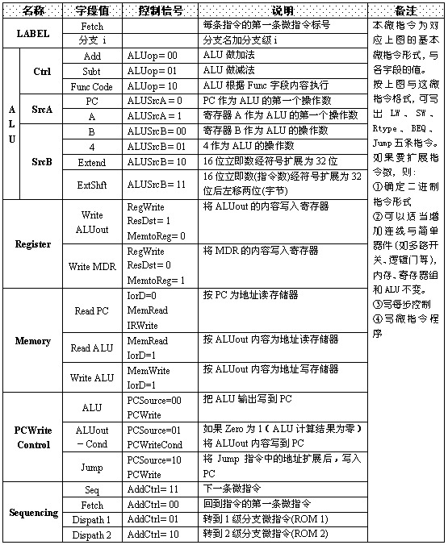

  - 为了实现微程序的选择转移，增加标号和下一步指令两个字段

## 3.7 流水线(pipline)和冒险(hazard)

- 这一部分虽然上课没讲过但是历年卷里出现了选择题

### 3.7.1 流水线的基本原理

- CPU的流水线技术本质上利用了时间的并行性，将原本需要串行的处理一定程度上并行化了，使得CPU的效率提高，原理如下图

  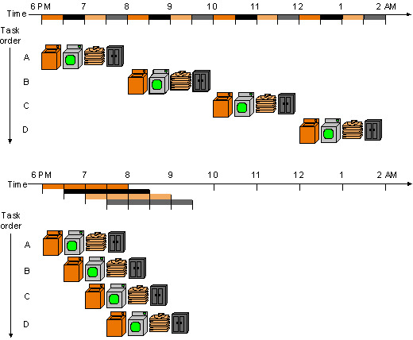

  - 转换成指令的运行的原理如下

  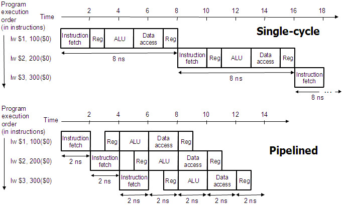

### 3.7.2 冒险 hazard

- 在流水线中我们希望当前每个时钟周期都有一条指令进入流水线可以执行，但是某些情况下下一条指令无法按照预期的开始执行，这种情况就是冒险hazard
- 冒险有三种：
  - 结构冒险：如果一条指令需要的**硬件**还在为之前的指令工作，而无法为这条指令提供服务
  - 数据冒险：如果一条指令需要的数据正在被之前的指令操作，那么这条指令就无法执行
    - 解决方法：Forward data if possible
  - 控制冒险：如果需要执行的指令是由之前的运行结果决定的，而运行的结果还没有产生，就是控制冒险
    - 解决方法：stall the pipeline，Predict branch outcome， Delayed branch
  - 总结：硬件——结构冒险，数据——数据冒险，控制指令——控制冒险


