# 4. 存储器

## 4.0 存储器的分类

- 按照存储介质来分
  - 半导体: SRAM,DRAM,ROM,FLASH
  - 磁介质: 磁带和磁盘
  - 光介质: CDROM
- 按照读写功能
  - 只读内存：ROM/CDROM
  - 读写：FLASH,磁盘和磁带,RAM(随机内存，就是平时说的内存)
- 按存储的易失性
  - 易失：RAM
  - 非易失：ROM, 磁介质, CDROM
- 按照在计算机系统中的作用分类
  - 主存储器：计算机运行的主要存储器，存放运行的程序和数据
  - 辅助存储器：如外存
  - 缓冲存储器：作为一些I/O的数据缓存
  - 控制存储器：存放控制程序和数据
- 存储器的**分级结构** 
  - 快村：多级Cache
  - 主存：RAM,ROM
  - 外存：磁盘，磁带，CDROM

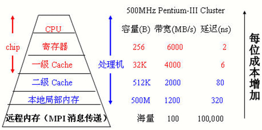

## 4.1 存储器基础&存储器管理

- 这一部分感觉就是了解一下，考试看起来不太会来考

- 存储器的存储结构

  - 位bit--位线--位面--字word--字扩展(条)--存储器(多条)

  - 存储器的基本原理，通过X,Y地址译码在电容中存储，由于没有电源供电，反向漏电会导致保存的信息丢失，所以必须不断刷新

  - 动态存储单元

    - 由于没有电源供电，存在的反向泄漏电流会使得保存的信息丢失，必须不断刷新

      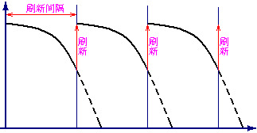

  - **动态存储器(DRAM)**：需要定时刷新

    - 刷新周期：连续两次对整个存储器全部刷新的间隔时间
    - 刷新的方式分为：集中刷新，分散刷新，异步刷新

### 4.1.1 芯片和存储器

- 存储器的地址

  - 二四译码器：用两位的0-1信号控制四个数据的选择，对应每一组输入只有一个输出和别的输出不同，则可以将该输出选中

    

  - 地址译码：

    - 利用译码器将多个**一位的存储单元**组成一个整体
    - 所有的存储单元接在同一条数据线上，但是由于译码器的控制，只有一个单元没选中可以进行数据的读写，这时输入数据即为地址

    

  - 二维地址译码：以二维存储单元阵列组成一个整体，可以减少驱动

    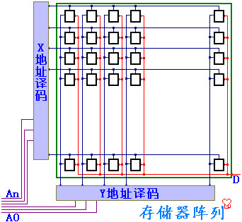

  - 位扩展: 

    - 在二位地址译码的基础上，将若干个存储单元阵列以相同的地址译码器选中

    - 每个二维的阵列对应不同的数据线，则相同地址译码在不同二维阵列上对应的单元，合并为存储器，从位--->字

      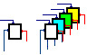

    - 这图有点抽象，给我看晕了

      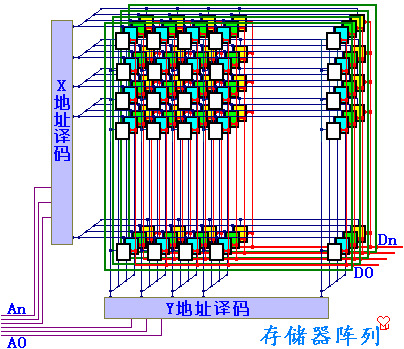

    - 存储芯片：

      - 地址线：决定可寻址的范围

      - 数据线：决定数据的位数

      - 控制线：包括电源、读写控制、片选

        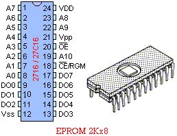

  - 字扩展

    - 从一个最基本的一位存储单元通过双译码器得到一个一位的存储位阵列面，将同样地址线的若干相同的位平面，接不同的数据线，封装得到一个存储芯片

    - 地址高位交叉：

      - 高位的地址作片选，同一芯片的地址**连续**

      - 但是读取连续的地址单元需要多次读写

        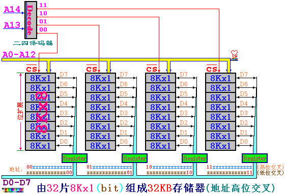

    - 地址低位交叉，同一芯片的地址不连续，但读取连续地址单元只需要一次

      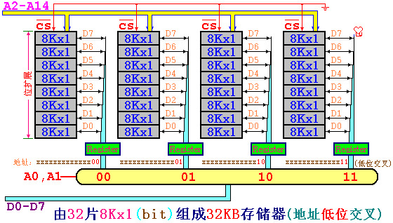

    - DOS系统的芯片

      - 只有1MB，由RAM,BIOS,ROM 组成

        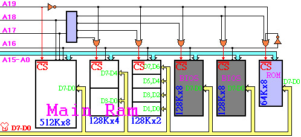
  
- 一个关于芯片计算的题目

  ```C
  Assume an 8Kx8bits memory is composed of 2Kx4bit chips. The first address of the chip which contains the address 0B1Fh is (____).
  A：0700h
  B：0800h
  C：0600h
  D：0000h
  ```

  - 这道题应该这样分析，首先可以计算出需要**8块芯片**，而8K*8bits的内存需要13位地址，其中**最高的三位是片选地址**，低的十位是片内的地址，而0B1F的最高三位是010，对应第二片，因此其起始地址就是0000100000000000，也就是0x0800
  - 这种题目的一般方法：先算需要几片，再算地址一共有几位，取最高的几位来看就行
  - 字扩展和位扩展的分别：
    - 位扩展是指需要多少位来扩展成一个字，字扩展是指扩展成字之后扩展出更大的存储空间
    - 上面这题中2K*4bit的芯片需要2片一起才能作为一个字，所以位扩展是2，又需要4个这样的组成8K/*8bits的，所以字扩展是4


### 4.1.2 对齐和不对齐


- 计算机一般以字节作为寻址单位，即每一个字节一个地址
  
    - 对**字(4字节)**或者半字(2字节，short)寻址的时候，最低位字节地址为整个字或者半字的地址
      
        - 比如一个字的4个字节地址分别是10，11，12，13，则这个字的地址是10
    - 大端:一个字或半个字的高位字节位于地址小的字节为大端,BigEndian
  - 小端:一个字或半字的高位字节位于地址大的字节为小端,LittleEndian
  - 即高位在前为大端，低位在前为小端,例如，一个字0x12345678的地址为10，即要将这个字写到地址10，11，12，13中
    - 大端 0x12,0x34,0x56,0x78
    - 小端 0x78,0x56,0x34,0x12
  - 对齐：当系统要访问存储器的一个字，刚好在硬件存储中是一个字，就是对齐访问。
  
      - 不对齐就是访问的时候不是一个硬件字，需要硬件多次读写
  - 16位zjie对齐与不对齐
    - 为了避免读写一个数据，不得不多次访问存储器，可以将存储器按低位交叉方式编址，也就是译码时用低位地址线来做片选信号
    - 这样一来，地址连续的存储器单元，将对应于不同的存储器芯片(bank)，当系统要求读写连续地址数据时，就可以从不铜存储器同时读出到寄存器，然后由总线传送
  - 内存条：从一个最基本的一位存储单元，通过双译码器得到一个一位的存储位阵列面，将接同样地址线的若干相同的位平面，接不同的数据线封装得到一个存储芯片

## 4.2 Cache的基本原理

- 存储器的层次结构 memory hierarchy
  - 最顶层是register 直接和CPU进行通信
  
  - 下面是各级的memory
  
  
- 程序运行的两个局部性原理
  - 时间局部性：如果每个数据或者指令被引用了，那么不久之后可能将被再次引用
  - 空间局部性：如果一个数据被引用了，那么邻近的单元也可能被引用
  
- **Cache(高速缓存)的原理**

  - 计算机只能按照既定的地址来确定一个数据的意义，而地址在转换存储器的时候要进行对应的转换

    - 计算机中的运算都是通过逻辑运算实现的，逻辑运算速度快，因此应该多使用逻辑运算

    - 在地址转换中我们都把2的幂作为数量单位，比如块的大小，Cache的容量，Cache分组和页


  - cache技术的基础：SRAM和DRAM

  - cache根据两个局部性的原理，将程序中**正在运行的部分**调入cache中，来提高指令和数据的访问速度，物理存储和cache都被分成相同大小的块(block)作为最小的管理单元，从物理地址到cache地址的转换,有这样几种方法：(考试必考点)

    - **直接映射**：物理地址按照一定的方式固定映射到cache的某一块上，但是物理地址比cache中的地址要大，所以会有**很多物理地址映射到同一个cache块上**，为了标记是哪个物理块，假设cache一共有M块，则：

      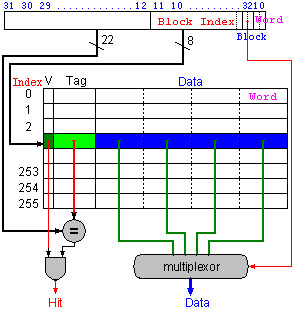

      - cache中有一位**有效位**，1表明数据有效，0表名数据无效
      - 物理块号：j=物理地址/块的大小
      - cache块号(索引号)：i=j mod M
      - TAG = j/M 要来记录区分不同的内存块
      - 当cache中恰好有$2^n$ 个block的时候，对应的cache**索引**就是内存地址的最低n位 
      - cache中地址的形式：`TAG+Index+ByteOffset`
        - 其中TAG+index构成cache块的地址
        - TAG就是物理地址的最高几位，cache块序位中间几位，最低的几位是块内的地址
      - 主存地址映射到cache中时，最高的几位是TAG，中间的几位地址是索引，最后几位地址是块内存储的信息

      > 例题1：对于能存储16KB数据的**直接映射**cache，块的大小为4word，地址为32位，需要多少大的存储空间？
      >
      > - 数据的总大小是$2^{14}$字节， 而一个块的大小是$2^4$ 字节，因此一共有$2^{10}$ 个块
      > - 一个块的数据量是128bits(一次4个字，一个字是32bits，需要128位)
      > - Tag需要的bits数量=address - index -block size = 32 - 10 -4 = 18bits
      >   - 其中4word需要16bits，因此block size是4
      > - 有效位是1bit，一共需要19bits
      > - 所以cache的总的size就是 $2^{10}/times(128+18+1)=147000$ bits = 18.4 KB

      > 例题2：一个64块的cache，块的大小是16bytes，则字节地址为1200应该直接映射到哪里？
      >
      > - 这种情况的答案(block address) modulo (number of cache blocks)
      > - 而block的地址计算方式是 字节地址/每个块的大小 = 75
      > - 所以答案就是11

      > 这里记录例1类型的题目的**通用解法**：
      >
      > - 条件是32位的字节地址，直接映射的cache，有$2^n$个block，一个block的大小是$2^m$ word，因此需要n位作为index，m位用于查找块中的字，2位是字节的偏移信息
      > - 则TAG的大小是32-(n+m+2)
      > - cache需要的总位数是block数量*(block的大小+有效位的大小+TAG大小)也就是
      >   - $2^{n}(2^{m+2}/times 8+(32-m-n-2) +1)$ 
      > - 关于block size的计算：假设block是$2^m$个word的大小
      >   - 常识：word是计算机中存取的基本单位
      >   - 为了定位是哪一个word，需要m位
      >   - 而在word里面，为了定位是哪个字节，需要2位，所以一共需要m+2位，block size就是m+2 bits

    - 全相联：
      
      
      - 直接映射每个物理块有固定的cache块很容易判断命中与否(比较TAG)，但造成cache块的闲置
      - 考虑**不固定的映射方式**，当需要替换的时候就**遍历cache中所有的块**，覆盖今后**最不可能用到的块**，这样可以提高cache的**命中率**
        - 类似于ads中装箱问题的best fit算法
        - 理论上存在的替换方法：LRU,FIFO,RAND
        - 虽然提高了命中率，但是时间效率降低了
        - 大量TAG判断是否命中会使得硬件的设计非常复杂，如果采用顺序判断，由于在cache中，Cache与主存存取速度的差别在1-2个数量级，确定是否命中的时间太长，cache就失去意义了
      - 块地址：按照块确定的地址，把原地址除以块的大小即可，块内部分为块内地址
      - 主存地址/块大小=TAG 余数作为block-offset
      
    - 组相联：组相连把cache中的块分成若干组，每一块和主存直接进行映射，当主存快映射到组里之后，具体替换组里的哪一块，通过全相联的方法来选择

      - 缝合怪


      - 组相联是全相联和直接映射的折中，直接映射是一种n个组的组相联，全相联是1个组的组相联
      - 主存块号/cache组数的商是TAG，余数是index(组的位置)
      - 组相联和直接映射的区别：
        - 组相联分成了若干组直接映射，因此在每一组里，Index的位数减少了，而TAG的位数增加了
        - 同样大小的cache，如果分成了$2^n$路组相联，那么相比于直接映射，index减少了n位，TAG增加了n位，实际上原理就是同样多的m个block分成了若干组，在每个组里面进行直接映射，所以块数相比于直接映射减少了，所以index的位数也变少了

    - 楼教授有言曰：**直接映射是个人承包，全相联是共产主义，组相联是家庭联产承包责任制** 

  - 不同映射方式的比较

    - 全相联的cache**效率最好**，但是块数多了就**难以判断是否命中**
    - 直接映射的cache效率低，但是命中率高，组相联的各项水平处于二者之间
    - 其实就是因为直接映射和全相联是两种组相联的特殊情况，直接映射是1路组相联，全相联是m路组相联

  - 多级cache
    - L1:一级cache，在**处理器的内部**，以核心频率工作
    - L2:以**处理器一半的频率工作**，和CPU一起封装
    - L3:在**主板**上，以总线频率工作

- cache的命中和失配

  - cache的命中(hit)：指CPU要访问的数据存储在了cache中
  - cache的失配(miss)：指CPU要访问的数据不在cache中，此时需要将这个数据所在的整个block放入cache中
    - 主要的失配种类
      - compulsory misses 强制失配，第一次启动时总是失配
        - 可以通过加大块的大小降低失配率
      - capacity misses 容量失配，cache的容量比主存小引起失配
        - 可以通过**多级cache**降低失配率
      - conflict misses 相联失配，由于映射关系影响命中率
        - 可以把组相联改成全映射
    - **块越大则命中率越高**，但是当cache容量较小的时候，块增大可能使得块数太少而减小命中率
      - 在**cache总容量不变**的时候，块越大则命中率更高，块的大小取决于**硬件** 
    - 不同的替换策略
      - cache失配需要读入新的数据到cache时，可以在几个块之间选择进行数据替换，选择的依据就是程序访问的局部性原理，有这样一些替换策略
      - LRU 最近最少使用的优先替换
      - LFU 使用频率最低的优先替换
      - FIFO 先进先出
      - Random 随机替换
  - 命中率和失配率(miss rate)：命中和失配的信息所占的比例 

- 保持cache-主存数据**一致性**的方式
  - 写通 Write-Through，在改写存储器内容时，主存和cache要一起改写
    - 优点是简单，缺点是写的速度很慢
  - 写回 Write-back 写数据的时候只写在cache中，在块替换的时候再将数据写道主存中
    - 优点是对同一个块多次读写的时候，最后一次才写入主存，速度快
    - 缺点是**控制比较复杂**，可以设置dirty位改进
  - 写缓冲 Write-buffer 改写的时候先写到缓冲区中，避免速度过慢
  
- cache效率的衡量

  - 存取时间的计算：通常使用AMAT(平均内存访问时间)来检测cache的效率
    - AMAT = (time for a hit) + (miss rate x miss penalty)
    - 计算方法1：
      - Tc是cache访问的时间，Tm是主存的访问时间，H是命中率
      - T=Tc+(1-H)Tm
    - 计算方法2：指令+数据
      - Tc是cache访问的时间，Tm是主存的访问时间，Hi是指令的命中率，Hd是data的命中率，P是程序中LW/SW指令的比例
      - T=Ti+Td/*p=(Tc+(1-Hi)Tm)+(Tc+(1-Hd)Tm)*p
  - CPU时间的计算
    - CPU时间 = (CPU执行的周期数 + Memory-stall 时钟周期) * 一个时钟周期的时间
      - $CPU_{time}=I/times CPI/times Clock$ 
    - Memory-stall 时钟周期 = 指令的数量 * 失配率 * 失配的penalty = read-stall cycles + write-stall cycles
      - 而read-stall cycles = program中read的次数 * 失配率 /* 失配的penalty
      - write-stall cycles = program中write的次数 * 失配率 * 失配的penalty + write buffer stalls
      - 因此其实Memory-stall的时钟周期 = 存储访问的次数 * 失配率 /* penalty
      - 这一部分感觉公式比较多，直接抄在A4纸上好了


## 4.3 虚拟存储

- 实际上就是把主存当作磁盘的cache来使用

- 虚拟存储器是根据存储器访问的**局部性原理**，将内存中正在使用的调入真正的内存，而暂时不用的存入磁盘

  - 内存也叫**物理存储器** 
  - 假设对于32位的CPU，寻址空间为4G，设lw指令为`LW srd dat(srs)` 则直接寻址的模拟为`srd=Memory[srs+Dat]` 

  - 设内存的大小为16K，如果地址范围限定在16K内则可以直接寻址，而当访问的地址超过物理存储器时，理论上会出错，访问应该改成`srd=getMemory(srs+Dat)`,即为虚拟存储器的模拟函数
  
    - page fault：内存中没有找到数据，需要从disk中检索
    - 会产生巨大的miss penalty，一般选用write-back策略维持一致性
  
- 为了尽可能提高命中率，虚拟存储采取的是**全相联**的策略
  
- 虚拟存储器的几种实现方式
  
    - 单页映射：整个物理存储器为一页，则需要有标志表明物理存储器的4k为4G寻址中的哪一部分


      

    - 反向页表：整个**物理存储器为一页** 

      - 页数太少会使得命中率降低，为了提高命中率可以增加页数，相应减小每页的大小
    - 设每一页为1K，在物理存储器端建立页表，记录物理页和虚拟页的对应关系
      - 页表的数量为 物理存储器的大小/每页的大小=4K/1K=4


    - 正向页表：页表也可以建立在虚拟地址段
    
      - 页表也可以建立在虚拟地址端，则页表的规模为为4G/1k
    

  - 页表的优化

    - 页表实际上也存储在存储器中，设有**页表地址寄存器PTR**来保存页表的基地址
    - 为了提高页表的访问速度，可以设置**页表的cache：TLB** 
    - 为了减小页表的的大小，可以：设置段界、使用分级页表 

- 虚拟存储的原理

  - 根据局部性原理，可以把程序需要用到的整个存储空间划分成一个个大小相同的页，把其中一些页放在主存中，而其他的页在需要的时候再建立或者放在磁盘中

    - 分页管理是因为**硬件上容易实现** 
    - 建立页表来管理页，如果该页在主存中，就记录下地址，如果不在，则在页表上标记不存在
    - 当程序需要调用某个存储单元的内容时，先根据线性地址，算出所在的页，然后查询页表，如果在主存中就直接存取，如果不在就是一个page fault，要把主存中的某一页存入磁盘，再把要访问的页调入主存中使用(该过程使用LRU算法)

  - 几个重要的计算公式

    - 页表的大小 = 表的项数 * 每个表项需要的位数

    - 表的项数 = 虚拟地址的空间 / 每页的大小

    - 每个表项的位数 = log(物理地址空间 / 每页的大小) + 适当控制位数(很多时候是4位)，但是一般凑成整字(32bits)

      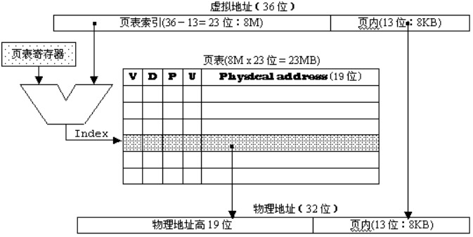

  - 虚拟地址的换算

    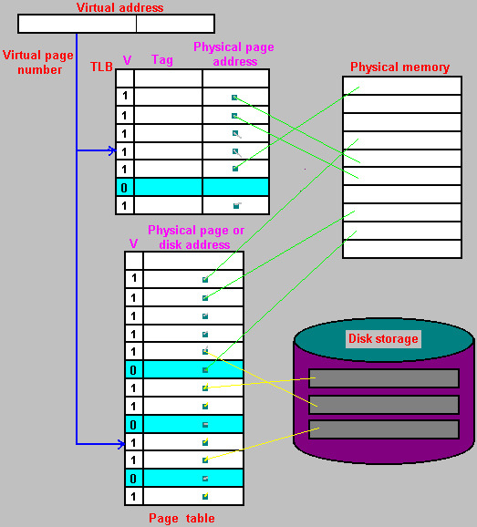

  - TLB原理

    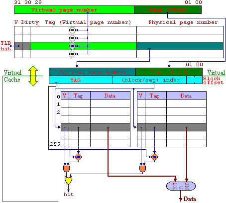

    - 在4G的存储空间中，如果按照4K来分页，则可以分出1M页，每个页表项为4B，则一个页表的大小为4MB
  - 但是由于局部性原理，页表在某个时刻使用的也只有仅仅几页，因此可以把经常用的一些虚拟页号和对应的物理地址写到cache中，即为TLB
    
    - 则程序在调用某个存储单元的同时，根据线性地址算出所在的页，先查TLB，如果有就直接获取物理地址进行存取，如果没有则说明没有写在TLB中，需要去查页表，按照page fault的情况进行
  
- 虚拟存储的整体逻辑


## 4.4 保护模式

- cache和虚拟存储的比较

  |          | cache                    | 虚拟存储                        |
  | -------- | ------------------------ | ------------------------------- |
  | 实现     | 硬件                     | 操作系统+少量硬件支持           |
  | 写策略   | write-back/write-through | write back                      |
  | 替换策略 | LRU/FIFO/LFU/Random      | LRU                             |
  | 交换单元 | block                    | page                            |
  | 映射方式 | 直接映射，全相联，组相联 | 全相联                          |
  | 寻址方式 | 全硬件，相联存储器       | Page-Table页表/TLB快表/分级页表 |

  - 原理上讲二者差不多，差距主要在存储存取的速度上
    - 虚拟存储中存储器和磁盘的差距在6个数量级以上
    - cache和主存储器的存取速度相差1-2个数量级

- 实模式和保护模式下的地址转换：
  - 物理地址：机器中真正具有的存储空间，程序只有在物理存储器中才能被执行
  - 页表项：32位，高20位是页基地址的最高20位，由于按照页来交换，因此页的基地址的低12位都是0，所以低的12位都被用作属性控制
    - 第11-9位是AVL，记录页的使用情况，比如LRU
    - 第7位是D，表示是否该写过
    - 第1位是R的时候表示读写，0的时候表示只读
    - 第0位是P，第6位是A
  - 逻辑地址：
    - 在程序中使用的地址，在intel中由段和偏移组成，段和便宜可以转换成线性地址
    - 没有虚拟存储的话，线性地址就是物理地址，转换方式是
      - 物理地(20位)  = 段(16位) * 16 + 偏移16位
    - 286以后段寄存器中的高13位就是表钟的索引，低的三位中TI一位描述所在的表，RPL两位描述特权级
      - 段在线性地址中的基地址在8字节的段描述里给出，根据段寄存器的值，在段描述表中找到对应的段描述
      - 线性地址 32位 = 段基地址 32 位 + 偏移32位
      - 每个8字节段描述的：分成4条，每条2字节
        - 第1条第1个字节和第2条的第2字节，第3条的2个字节加起来是32位段基地址
        - 其他的都是一些控制位数，具体的太细了
  - 线性地址(虚拟地址)
    - 在MIPS结构中，基本为程序中的地址(lw, sw) ，在PC中就是存储器的物理地址
    - 在286以后，线性地址为虚拟地址，也就是程序中可以寻址的存储空间，一个程序的运行，并不一定要所有的内容同时调入存储器才能执行，往往在一个时间内，只需要其中的一部分在存储器中，而其他的部分可以存在磁盘上，需要时再调用
    - 虚拟存储技术使得程序员**不必考虑实际存储器的大小**，而**由OS来负责计题的存储器的使用** 


<span id="busuanzi_container_page_pv">本文总阅读量<span id="busuanzi_value_page_pv"></span>次</span>
