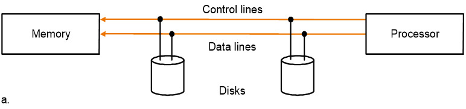
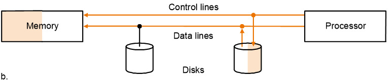
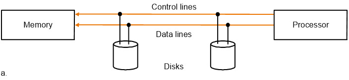
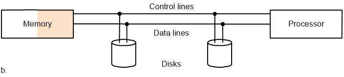
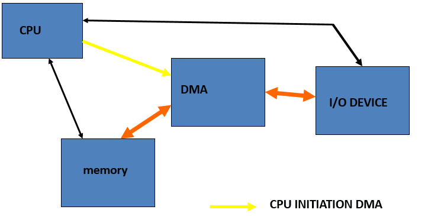
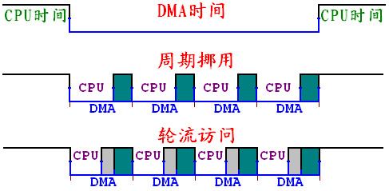

# 5. I/O系统

## 5.1 I/O系统的基本介绍

- I/O 设备的三个要素
  - behavior 表现：输入/输出/存储
  - partner 参与者：是人还是机器
  - data rate 数据速度：数据能在I/O设备和主存/处理器之间传输的**最大**速度

- I/O设备的评价标准
  - 带宽 banwidth——最重要的评价指标
  - 带宽可以从以下两个方面来评价
    - 一次可以move多少数据
    - 每个单位时间可以作多少次I/O操作
- 常见的I/O设备
  - 键盘，鼠标，音响，Scanner，打印机，显示屏，磁盘，磁带

## 5.2 磁盘

- 这一部分DBS里也有涉及到，不过DBS好像不太考这一部分的内容

- 磁盘的两种类型
  - floppy disk 软盘
  - hard disk 硬盘：容量更大，访问效率更高，有多个盘，由如下几个部分构成
    - platter 盘：每个盘的两个表面都是可以记录的
    - tracks 磁道：每个磁盘的表面被划分成若干磁道
    - sectors 扇区：每个磁道被划分为若干扇区
      - 扇区是磁盘读写的**基本单位** 
  - 磁盘的基本参数
    - 引导扇区：
      - 扇区1：BOOT区
      - 扇区2-10：FAT-1，11-19：FAT-2
      - 扇区20-31：目录区
      - 扇区32及以后是数据区
    - FAT表：每个磁盘有两个相同的FAT表，硬盘中一般为16位，现在往往是32位
      - 0000 未用簇
      - 0001-FFEF 下一个簇号
      - FFF0-FFF6 保留位
      - FFF7 坏簇
      - FFF8-FFFF 最后簇，表示文件结尾
- 磁盘的访问
  - 访问的过程
    - seek：把读写头放置到正确的磁道上面(寻道时间)
      - 相关的数据有最小访问时间，最大访问时间，平均访问时间
    - rotation latency：等待找到目标扇区的时间
      - 平均延迟是disk周期的一半
        - 计算公式：$latency = \frac{0.5}{RPM}$ 
      - RPM：每分钟的转数(rounds per minutes)，计算的时候需要将RPM转换成round per 毫秒
    - transfer：传输一个扇区的时间(1KB/sector) 和转速相关
    - disk controller：控制磁盘和内存之间的传输
  - 访问时间的计算：
    - seek+latency+transfer+controller 一般是毫秒的级别
  - 几个重要的评估标准
    - MTTF 平均failure时间
    - MTTR 平均repair时间
    - MTBF = MTTF + MTTR
    - 可用性 = MTTF / MTBF
  - 提高MTTF的方法
    - 避免错误的访问
    - 容忍错误：使用冗余来允许服务在出现故障的情况下遵守服务规范
    - 错误预报
- RAID：**廉价磁盘的冗余序列** 
  - 用一系列便宜的磁盘代替一个大磁盘，来提高磁盘的效率

## 5.3 总线 bus

### 5.3.1 基本概念

- 总线是构成计算机系统的互联机构，是多个系统功能部件之间进行数据传输的公共通路，分为

  - 控制线：用于传递各类**信号**和存储数据线中信息的信息
  - 数据线：传递信息(数据，地址，复杂的指令)
    - 细分的话可以分为地址线和数据线

- 总线和内存，I/O设备的数据交换方式有两种

  - 内存映射I/O方式：内存与I/O系统采用共用的控制、地址和数据线
    - 内存和接口部件共享一个地址空间，各自拥有不同的地址端，读写的指令和内存读写的指令也是一样的
  - 独立I/O编址：共享地址线和数据线，但是用不同的控制线

- 总线的工作原理：

  - input操作：

    - 控制线传输一个写的请求到内存，数据线传递地址

      

    - 内存主备好之后会给设备发送信号，然后在内存中写入数据，设备不需要等待数据的存储完成

      

  - output操作：

    - 处理器通过控制线发送read请求，数据线传递地址

      

    - 内存进行数据的访问

      

    - 通过控制线将数据传输出去，目标设备会存储总线上传递过来的数据

      

- 总线的分类：

  - 一个单处理器的总线分为如下三类
    - 内部总线：CPU内部连接各寄存器和运算部件之间的总线
      
    - 系统总线：CPU同计算机系统的其他**高速功能部件**(如存储器)等互相连接的总线
      
    - I/O总线：中低速I/O设备之间互相连接的总线，比如SCSI
  - backplane总线(高速，标准化的总线，我也不知道属于哪一类)，比如PCI
  - processor-memory总线(短而高速，自定义设计的)

- 总线的特性：

  - 物理特性：包括总线的根数，插头插座的形状，引脚线的排列方式
  - 功能特性：描述总线中每一根线的功能
  - 电气特性：定义每一根线上信号的传递方向和有效电平范围，输入CPU的信号是IN，CPU发出的是OUT
  - 时间特性：定义了每根线在什么时候有效，规定了总线上个信号的有效的时序关系

- 总线的标准化：下面是总线的一系列标准

  - SCSI(small computer system interface,，小型计算机系统接口)
  - PCI(peripheral component interconnect，外部组件互联)
  - IPI(intelligent peripheral interface，智能外部接口)
  - IBMPC-AT IBMPC-XT
  - ISA EISA

- 同步传输和异步传输

  - 同步传输：使用时钟和同步协议，每个设备必须在同一个速度和时钟下操作
  - 异步传输：使用握手协议(handshaking)或者选通(stubing)的策略
    - 此时CPU，接口和I/O设备有不同的时钟周期

### 5.3.2 总线的仲裁 **Arbitration** 

- 当多个主设备同时争夺总线的控制权的时候，由总线仲裁部件授权给其中一个主设备

  - bus master主设备：处理器总会是一个bus master(~~bus master的任务罢了~~)
- CAN采用优先级方式，TCP/IP采用CSMA/CD级制，而RS-485采用**主机轮询**的机制
  - 链式查询：所有的设备共用一条总线请求与相应，当总线控制器接到总线的请求之后，总线授权信号串行地在I/O接口之间传递，将控制权交给第一个有总线请求的I/O接口
    - 离中央仲裁器近的设备优先级高
    - 容易扩充设备
    - 对电路故障非常敏感
    - 优先级是固定的，如果优先级高的设备请求非常频繁，优先级低的可能一直不能使用总线
  - 计数器定时查询：总线控制器按顺序查询各个接口，如果有请求就响应请求并记录设备的地址
    - 每次查询可以从固定的地址开始(优先级固定)，也可以从上一次相应的设备开始(循环优先级)，每个设备使用总线有相同的优先级
    - 为传送设备地址需要增加的总线的数量是**log2 设备数** 
  - 独立请求：每一个共享总线的设备均有一对请求线和授权线，当需要使用的时候就发出请求信息，控制器独立决定响应哪个设备
    - 响应时间快，不用逐个查询
    - 优先级控制比较灵活
    - 可以屏蔽某些设备的请求

- 分布仲裁方式：
  
  - 不需要中央仲裁器，每个潜在的主方功能模块**都有自己的仲裁号和仲裁器**，当它们有总线请求的时候会把仲裁号发到仲裁总线上，每个仲裁器将得到的信号和自己的比较，如果仲裁总线上的号大，则不会响应这个仲裁器的请求，并撤销仲裁号，最后获胜的保留在总线上

## 5.4 数据传输和控制

- 程序查询的方式
  - 先检查外设的状态，允许时再进行数据的I/O传送
  - 缺点是外设一般比较慢，CPU必须不断检查外设状态，效率很低
- I/O设备的特性
  - 通过处理器，被多个程序共用
  - 使用中断来交流I/O操作的信息
  - 需要三种不同类型的交流
    - OS必须能够给I/O设备发送命令
      - 通过内存映射的I/O：发送地址给I/O设备
      - 特殊的I/O指令
      - 命令端口/数据端口：静态寄存器，指令
    - 当I/O设备完成一个操作或者抛出异常的时候，设备必须通知OS
    - 数据必须在内存和I/O设备之间传输

### 5.4.0 数据传输的控制

- I/O系统的数据传输的控制：

  - 三种模式

    - polling 轮询：处理器定期检查设备的**状态位**，来确定是否到了下一次I/O操作的时间
    - interrupt 中断：当一个设备想要告知处理器需要完成一些操作时，让处理器中断
        - ​	
    - DMA：设备**直接从内存**中进行数据传输，绕过处理器
          
    
  - 三种模式的比较：

    - 轮询的缺点：**耗时**，当CPU周期性地轮询I/O设备的时候，I/O设备可能没有请求或者还没有准备好
    - 如果I/O操作是中断驱动的，OS可以在数据被读写的时候进行别的task
      - 中断驱动的优点就是可以进行**并行** 
    - DMA不需要处理器的控制，所以比较省时间
    - 轮询，中断和DMA中，对**硬件支持要求最低的是轮询** 

### 5.4.1 中断

- 中断 Interrupt
  - 中断的类型：
    - 内部中断
      - 软件中断：指令中断，是按照中断的级制进行的此程序调用
      - 硬件异常：内部出错产生的异常中断
    - 外部中断：I/O设备请求产生的中断
  - 屏蔽中断和非屏蔽中断 NMI：外设中断可以屏蔽
  - 中断服务程序：中断发生的时候，系统中处理中断事件的程序
  - 中断向量：中断服务程序在内存中的入口地址，实模式下分段：偏移，共四个字节，保护模式下是8字节终端描述
  - 中断向量表：PC系统共有256个中断，中断向量表就是所有中断向量的集合
    - 实模式下一共有4*256=1KB
    - 保护模式下是中断描述表的形式
- 中断的优先级
  - 多个I/O设备发起中断请求的时候，需要确定设备的优先级，优先级高的设备的中断请求先响应
  - 一般来说数据传输率高的设备(比如磁盘)的优先级比较高，数据传输率比较低的设备的优先级比较低(比如键盘)
  - 判断优先级的方法：
    - 硬件方法：中断优先级判别电路
      - 菊花链(daisy chain)方法：将所有的终端设备串行连接构成优先级电路
    - 软件方法：采用轮询的方式来确定优先级，中断源的

### 5.4.2 DMA

- DMA方式

  - DMA：直接存储器存取 Direct Memory Access，不需要经过处理器，由DMA控制器控制，在外设和主存储器之间进行数据传送，CPU通过DMA控制器对传输方式进行设置，不直接控制传输的过程

  - DMA传送过程：

    - 预处理：由CPU对DMA控制器进行设置，确定数据传送的方式，存储器地址和传送的数据量
  - DMA：由DMA控制器接管总线和存储器的读写控制，进行外设和存储器之间的直接数据传送
    
  - DMA结束：DMA控制通过中断通知CPU DMA结束了，通过执行中断服务程序对DMA结果进行检查，确定是否继续DMA
  
- DMA时期的CPU工作方式：
  
  - 停止总线和存储器的访问：DMA控制器接管了总线和存储器的控制，CPU停止对于总线和存储器的访问
  
    - 控制比较简单，但是CPU效率很低
  
  - 周期挪用：DMA大部分时间用在外部设备的读写中，总线和存储器有相当的时间处于等待状态，CPU利用这段时间访问总线和存储器
  
    - 效率提高，控制复杂
  
  - 轮流访问：两者的折中，将DMA过程划分成较小的周期，由CPU和DMA控制器交替进行总线和存储器的访问
  
      

结语：**计算机总是有一种方法，是最简单和最理想方式的妥协** 

